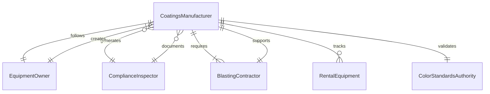
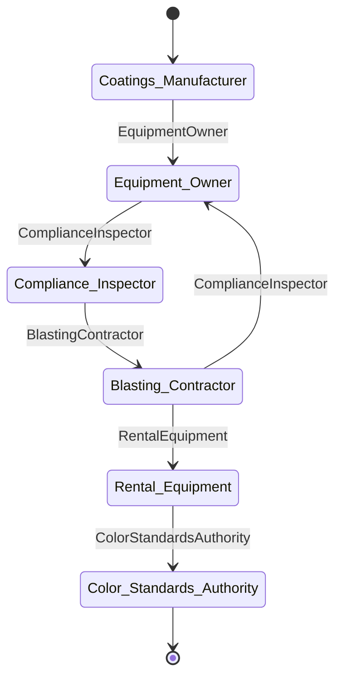
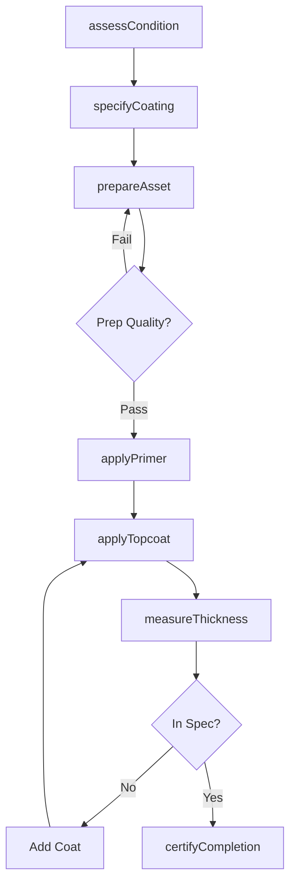
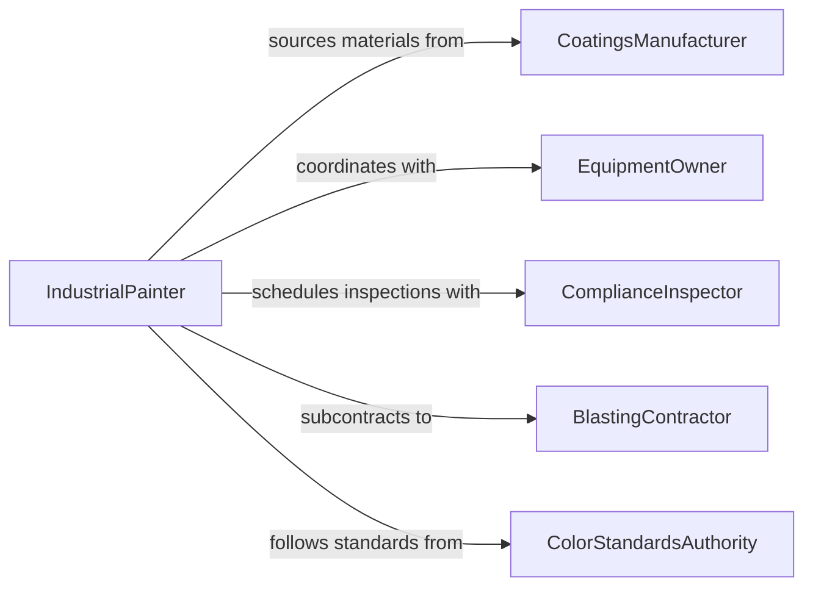

# Paint Surfaces Equipment

> Business-as-Code definition for industrial equipment and surface painting. Models painting operations for machinery, structures, and infrastructure from preparation through coating and inspection.

## Overview

Industrial equipment and surface painting protects assets from corrosion and weathering while providing visual identification and branding. This definition supports facility maintenance, equipment refurbishment, and infrastructure protection programs with proper surface preparation, coating selection, and quality control.

## Actors

| Actor | Description |
|-------|-------------|
| CoatingsManufacturer | Supplies industrial paints and protective coatings |
| EquipmentOwner | Authorizes painting projects and budgets |
| ComplianceInspector | Verifies adherence to safety and environmental standards |
| BlastingContractor | Provides surface preparation services |
| RentalEquipment | Supplies sprayers, lifts, and containment systems |
| ColorStandardsAuthority | Defines equipment identification color codes |

## Roles

| Role | Description |
|------|-------------|
| IndustrialPainter | Executes painting of equipment and surfaces |
| SurfacePreparationSpecialist | Removes rust, scale, and old coatings |
| CoatingInspector | Measures film thickness and adhesion |
| ProjectCoordinator | Schedules painting around production downtime |

## Entities

| Entity | Description |
|--------|-------------|
| PaintingProject | An equipment or surface painting initiative |
| AssetToCoat | Machinery, structure, or surface requiring paint |
| IndustrialCoating | High-performance paint or protective finish |
| SurfacePreparation | Blasting, grinding, or chemical cleaning process |
| ApplicationSpecification | Film thickness, coat count, and drying requirements |
| InspectionCertificate | Quality verification document |

## Actions

| Action | Description |
|--------|-------------|
| assessCondition | Evaluate existing coating and substrate state |
| specifyCaoting | Define coating system and performance requirements |
| prepareAsset | Execute surface preparation to coating standards |
| applyPrimer | Apply corrosion-inhibiting base coat |
| applyTopcoat | Execute finish coat application |
| measureThickness | Verify coating film build with gauge |
| certifyCompletion | Document coating system and quality |

## Events

| Event | Description |
|-------|-------------|
| conditionAssessed | Asset evaluation is complete |
| coatingSpecified | Coating system has been selected |
| assetPrepared | Surface preparation meets standards |
| primerApplied | Base coat has been applied |
| topcoatApplied | Finish coat has been applied |
| thicknessMeasured | Film build has been verified |
| completionCertified | Project documentation is complete |

## Searches

| Search | Description |
|--------|-------------|
| findProjects | List painting work by status or asset type |
| getAssets | Retrieve equipment by coating condition |
| getCoatings | Find coating systems by environment or use |
| getCertificates | Access quality documentation and compliance records |
## Entity Relationships




## State Diagram




## Workflow



## Actor Relationships



## Usage

### Calling Actions

```typescript
import { paintSurfacesEquipment } from '@headlessly/paint-surfaces-equipment'

const painting = paintSurfacesEquipment()

// Assess and specify coating for production equipment
const assessment = await painting.assessCondition({
  assetId: 'conveyor-system-3',
  currentCoating: 'epoxy-deteriorated',
  corrosionLevel: 'moderate-rust'
})

const coating = await painting.specifyCoating({
  assetId: 'conveyor-system-3',
  environment: 'indoor-industrial',
  exposure: 'moisture-chemicals',
  colorCode: 'ANSI-Z535-safety-yellow'
})

// Prepare and paint
await painting.prepareAsset({
  assetId: 'conveyor-system-3',
  method: 'abrasive-blast',
  standard: 'SSPC-SP10-near-white'
})

await painting.applyPrimer({
  assetId: 'conveyor-system-3',
  primer: 'epoxy-zinc-rich',
  thickness: { target: 3, unit: 'mils' }
})

await painting.applyTopcoat({
  assetId: 'conveyor-system-3',
  coating: 'epoxy-urethane-safety-yellow',
  coats: 2,
  thickness: { target: 5, unit: 'mils' }
})
```

### Event-Driven Automation

```typescript
// Auto-measure thickness after each coat
painting.topcoatApplied(async ({ assetId, coating, coatNumber }) => {
  await painting.measureThickness({
    assetId,
    locations: ['top-surface', 'side-panels', 'support-legs'],
    gauge: 'magnetic-pull-off'
  })
})

// Schedule re-coating based on warranty
painting.completionCertified(async ({ assetId, coating, timestamp }) => {
  const recoatDate = new Date(timestamp)
  recoatDate.setFullYear(recoatDate.getFullYear() + coating.warrantyYears)
  await scheduleTask({
    type: 'recoat-inspection',
    assetId,
    scheduledFor: recoatDate
  })
})
```
