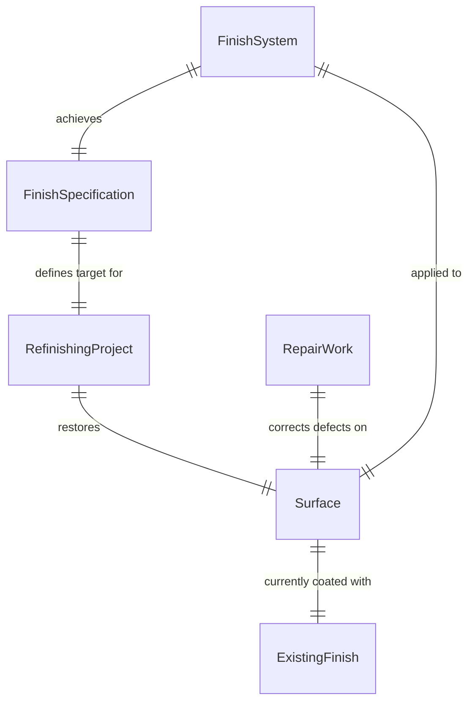
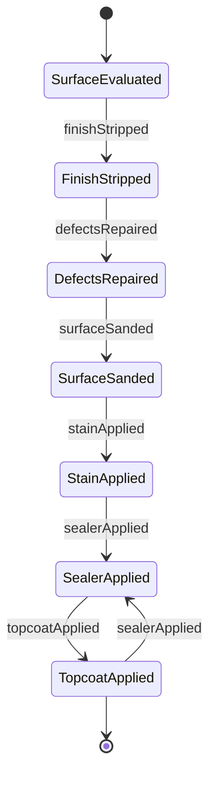
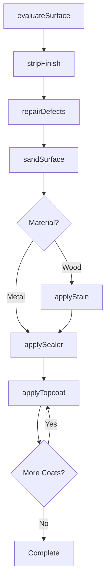
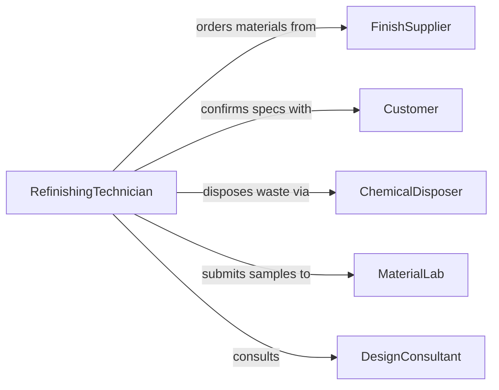

# Refinish Wood Metal Surfaces

> Business-as-Code definition for wood and metal refinishing operations. Models restoration workflows from surface assessment through stripping, preparation, and finish application.

## Overview

Wood and metal refinishing restores worn, damaged, or outdated surfaces to functional and aesthetic standards through removal of old finishes, repair of defects, and application of new protective coatings. This definition supports furniture restoration, architectural millwork, and metal fixture refurbishment with material-specific techniques and quality verification.

## Actors

| Actor | Description |
|-------|-------------|
| FinishSupplier | Provides stains, varnishes, lacquers, and metal finishes |
| Customer | Owns item and approves finish specifications |
| ChemicalDisposer | Handles waste from stripping and cleaning |
| MaterialLab | Tests finish compatibility and durability |
| ToolProvider | Supplies sanders, spray equipment, and stripping tools |
| DesignConsultant | Advises on period-appropriate finishes and colors |

## Roles

| Role | Description |
|------|-------------|
| RefinishingTechnician | Executes stripping, preparation, and finishing |
| ColorMatcher | Matches stains and finishes to specifications |
| QualityInspector | Verifies finish appearance and durability |
| ShopManager | Schedules refinishing projects and resources |

## Entities

| Entity | Description |
|--------|-------------|
| RefinishingProject | A surface restoration initiative |
| Surface | Wood or metal item requiring refinishing |
| ExistingFinish | Current coating to be removed or modified |
| FinishSpecification | Desired color, sheen, and protection level |
| RepairWork | Filling, sanding, or metalworking before finishing |
| FinishSystem | Multi-coat sequence of stain, sealer, and topcoat |

## Actions

| Action | Description |
|--------|-------------|
| evaluateSurface | Assess current finish and substrate condition |
| stripFinish | Remove existing coating using chemical or mechanical methods |
| repairDefects | Fill cracks, dents, and damaged areas |
| sandSurface | Smooth substrate to receive new finish |
| applyStain | Color wood or metal with pigment or dye |
| applySealer | Apply barrier coat for protection and adhesion |
| applyTopcoat | Execute final protective finish |

## Events

| Event | Description |
|-------|-------------|
| surfaceEvaluated | Condition assessment is complete |
| finishStripped | Old coating has been removed |
| defectsRepaired | Surface damage has been corrected |
| surfaceSanded | Smoothing is complete |
| stainApplied | Color has been applied to substrate |
| sealerApplied | Barrier coat has been applied |
| topcoatApplied | Final finish has been applied |

## Searches

| Search | Description |
|--------|-------------|
| findProjects | List refinishing work by item type or status |
| getSurfaces | Retrieve items by material or finish condition |
| getFinishes | Find finish systems by material or appearance |
| getRepairs | Access repair records and techniques used |
## Entity Relationships




## State Diagram




## Workflow



## Actor Relationships



## Usage

### Calling Actions

```typescript
import { refinishWoodMetalSurfaces } from '@headlessly/refinish-wood-metal-surfaces'

const refinishing = refinishWoodMetalSurfaces()

// Evaluate and strip antique table
const evaluation = await refinishing.evaluateSurface({
  itemId: 'mahogany-table-1920s',
  material: 'hardwood',
  existingFinish: 'shellac-deteriorated',
  defects: ['water-rings', 'scratches', 'finish-crazing']
})

await refinishing.stripFinish({
  itemId: 'mahogany-table-1920s',
  method: 'chemical-stripper',
  product: 'methylene-chloride-free',
  applications: 2
})

// Repair and refinish
await refinishing.repairDefects({
  itemId: 'mahogany-table-1920s',
  repairs: [
    { type: 'fill-water-rings', material: 'shellac-stick' },
    { type: 'fill-scratches', material: 'colored-putty' }
  ]
})

await refinishing.sandSurface({
  itemId: 'mahogany-table-1920s',
  grits: [120, 180, 220],
  method: 'orbital-sander'
})

await refinishing.applyStain({
  itemId: 'mahogany-table-1920s',
  stain: 'oil-based-mahogany',
  coats: 1,
  wipeTime: 5
})

await refinishing.applySealer({
  itemId: 'mahogany-table-1920s',
  sealer: 'dewaxed-shellac',
  coats: 2
})
```

### Event-Driven Automation

```typescript
// Track drying time between coats
refinishing.sealerApplied(async ({ itemId, sealer, timestamp }) => {
  const dryTime = sealer.dryTimeHours * 3600000
  setTimeout(async () => {
    await notify({
      to: 'refinishing-team',
      message: `Item ${itemId} ready for topcoat application`
    })
  }, dryTime)
})

// Auto-schedule sanding between coats
refinishing.topcoatApplied(async ({ itemId, coatNumber, totalCoats }) => {
  if (coatNumber < totalCoats) {
    await scheduleTask({
      type: 'sand-between-coats',
      itemId,
      grit: 320,
      scheduledFor: new Date(Date.now() + 4 * 3600000)
    })
  }
})
```
