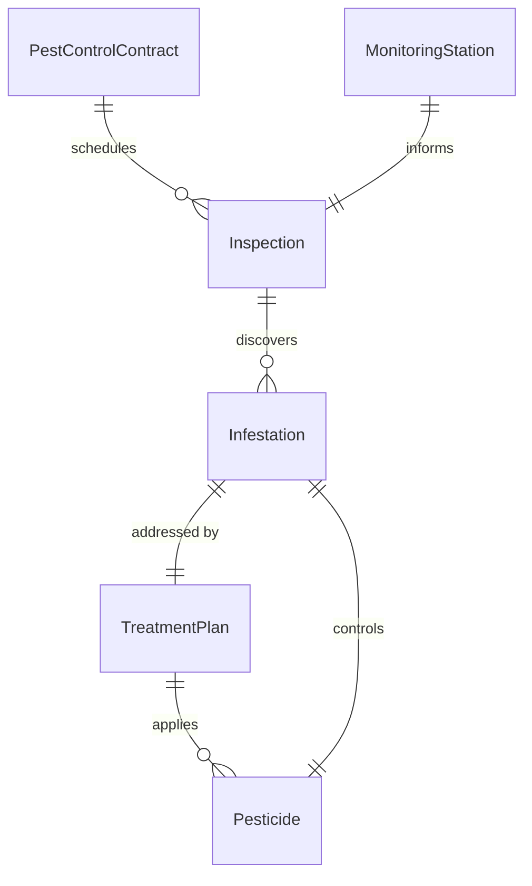
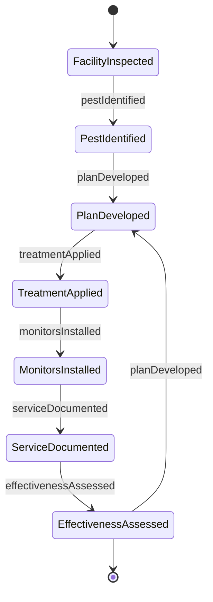
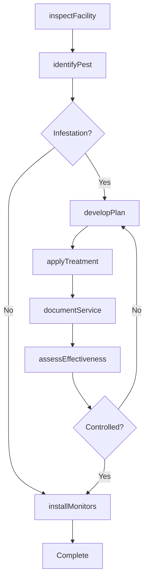
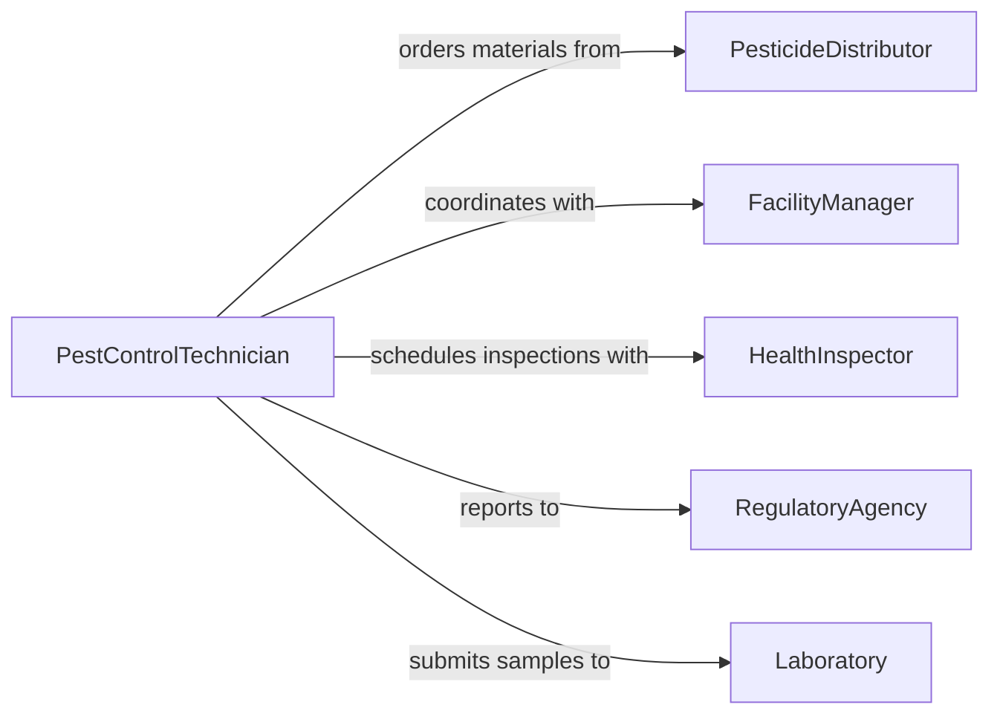

# Treat Facilities Eliminate Pests

> Business-as-Code definition for facility pest control operations. Models integrated pest management from inspection through treatment application and monitoring.

## Overview

Facility pest treatment eliminates infestations of insects, rodents, and other pests through targeted application of pesticides, baits, and physical controls. This definition supports commercial, industrial, and residential pest management programs with inspection protocols, treatment planning, regulatory compliance, and effectiveness tracking.

## Actors

| Actor | Description |
|-------|-------------|
| PesticideDistributor | Supplies chemical treatments and application equipment |
| FacilityManager | Authorizes pest control services and access |
| HealthInspector | Verifies pest control meets sanitation standards |
| RegulatoryAgency | Licenses applicators and approves pesticide use |
| Laboratory | Identifies pest species and resistance patterns |
| TenantOccupant | Reports pest sightings and cooperates with treatment |

## Roles

| Role | Description |
|------|-------------|
| PestControlTechnician | Inspects, treats, and monitors pest activity |
| LicensedApplicator | Applies restricted-use pesticides |
| ServiceCoordinator | Schedules treatments and customer communication |
| QualityManager | Audits treatment effectiveness and compliance |

## Entities

| Entity | Description |
|--------|-------------|
| PestControlContract | Agreement for ongoing pest management services |
| Inspection | Systematic facility assessment for pest evidence |
| Infestation | Active pest problem requiring treatment |
| TreatmentPlan | Strategy for eliminating specific pest |
| Pesticide | Chemical or biological control agent |
| MonitoringStation | Bait station, trap, or inspection point |

## Actions

| Action | Description |
|--------|-------------|
| inspectFacility | Survey for pest evidence and conducive conditions |
| identifyPest | Determine pest species and infestation severity |
| developPlan | Create integrated pest management strategy |
| applyTreatment | Execute chemical, biological, or physical control |
| installMonitors | Place bait stations and traps |
| documentService | Record treatment details for compliance |
| assessEffectiveness | Evaluate pest reduction after treatment |

## Events

| Event | Description |
|-------|-------------|
| facilityInspected | Inspection is complete |
| pestIdentified | Species and severity have been determined |
| planDeveloped | Treatment strategy has been created |
| treatmentApplied | Control measures have been executed |
| monitorsInstalled | Bait stations and traps are in place |
| serviceDocumented | Treatment records have been filed |
| effectivenessAssessed | Post-treatment evaluation is complete |

## Searches

| Search | Description |
|--------|-------------|
| findContracts | List pest control agreements by facility or status |
| getInspections | Retrieve inspection records by location or date |
| getInfestations | Find active pest problems by species or severity |
| getTreatments | Access treatment history and chemical usage |
## Entity Relationships




## State Diagram




## Workflow



## Actor Relationships



## Usage

### Calling Actions

```typescript
import { treatFacilitiesEliminatePests } from '@headlessly/treat-facilities-eliminate-pests'

const pestControl = treatFacilitiesEliminatePests()

// Inspect and identify pest problem
const inspection = await pestControl.inspectFacility({
  facilityId: 'warehouse-b',
  areas: ['loading-dock', 'storage-area', 'break-room'],
  inspectorId: 'tech-145'
})

const pest = await pestControl.identifyPest({
  inspectionId: inspection.id,
  species: 'german-cockroach',
  severity: 'moderate',
  evidence: ['live-insects', 'droppings', 'egg-cases']
})

// Develop and execute treatment plan
const plan = await pestControl.developPlan({
  pestId: pest.id,
  strategy: 'integrated-pest-management',
  methods: ['gel-bait', 'insect-growth-regulator', 'crack-and-crevice']
})

await pestControl.applyTreatment({
  planId: plan.id,
  locations: ['under-sinks', 'wall-voids', 'equipment-bases'],
  pesticide: 'fipronil-gel-bait',
  quantity: 30,
  unit: 'grams'
})

await pestControl.documentService({
  facilityId: 'warehouse-b',
  planId: plan.id,
  pesticidesUsed: ['fipronil-gel-bait', 'hydroprene-igr'],
  timestamp: new Date()
})
```

### Event-Driven Automation

```typescript
// Schedule follow-up inspection after treatment
pestControl.treatmentApplied(async ({ planId, timestamp }) => {
  const followUpDate = new Date(timestamp.getTime() + 14 * 24 * 3600000)
  await scheduleTask({
    type: 'follow-up-inspection',
    planId,
    scheduledFor: followUpDate
  })
})

// Alert if treatment is ineffective
pestControl.effectivenessAssessed(async ({ facilityId, pest, reduction }) => {
  if (reduction < 0.8) {
    await notify({
      to: 'pest-control-supervisor',
      message: `Facility ${facilityId} treatment for ${pest} only ${reduction * 100}% effective`
    })
  }
})
```
