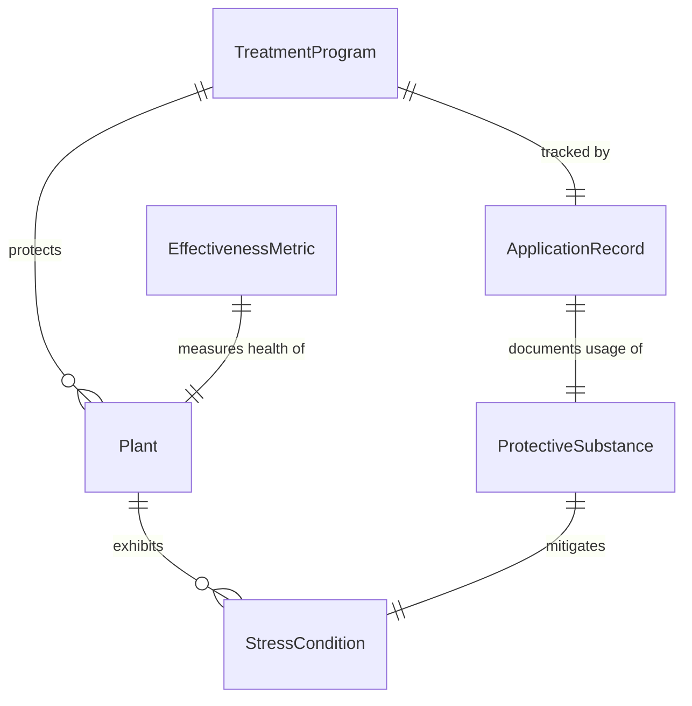
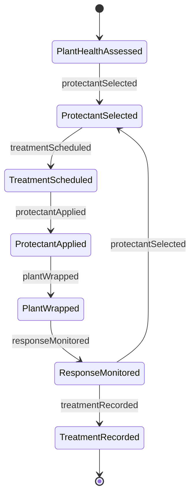
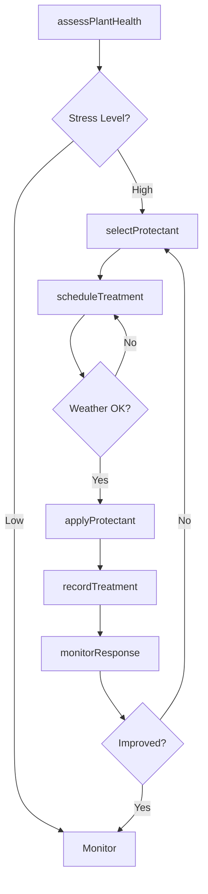
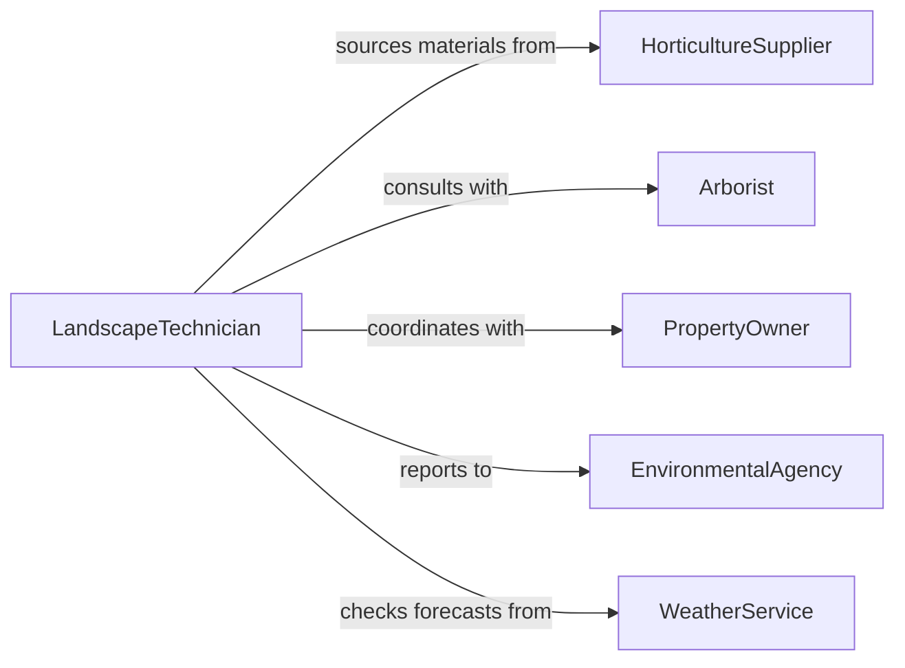

# Treat Greenery Surfaces Protective Substances

> Business-as-Code definition for landscape and greenery protection. Models plant care programs from health assessment through protective treatment application and monitoring.

## Overview

Protective treatment of greenery and landscaped surfaces includes application of anti-desiccants, wound dressings, protective wraps, and growth regulators to trees, shrubs, and turf. This definition supports landscape maintenance, urban forestry, and grounds management with treatment scheduling, application techniques, and plant health tracking.

## Actors

| Actor | Description |
|-------|-------------|
| HorticultureSupplier | Provides anti-desiccants, wound sealants, and protectants |
| Arborist | Recommends tree and shrub treatment protocols |
| PropertyOwner | Authorizes landscape protection programs |
| EnvironmentalAgency | Regulates pesticide and chemical use in landscapes |
| WeatherService | Provides conditions affecting treatment timing |
| NurseryConsultant | Advises on plant-specific care requirements |

## Roles

| Role | Description |
|------|-------------|
| LandscapeTechnician | Applies protective treatments to plants |
| PlantHealthSpecialist | Diagnoses stress conditions and treatment needs |
| IrrigationCoordinator | Manages water delivery around treatments |
| ComplianceOfficer | Ensures regulatory adherence |

## Entities

| Entity | Description |
|--------|-------------|
| TreatmentProgram | Scheduled protective care for landscape areas |
| Plant | Tree, shrub, or turf receiving treatment |
| ProtectiveSubstance | Anti-desiccant, sealant, wrap, or growth regulator |
| StressCondition | Drought, winter injury, or environmental damage |
| ApplicationRecord | Documentation of treatment timing and materials |
| EffectivenessMetric | Plant health measurement after treatment |

## Actions

| Action | Description |
|--------|-------------|
| assessPlantHealth | Evaluate stress conditions and protection needs |
| selectProtectant | Choose appropriate substance for plant and condition |
| scheduleTreatment | Set timing based on plant stage and weather |
| applyProtectant | Execute treatment application |
| wrapPlant | Install physical protection against weather or pests |
| monitorResponse | Track plant recovery and health improvement |
| recordTreatment | Document application for compliance and tracking |

## Events

| Event | Description |
|-------|-------------|
| plantHealthAssessed | Stress evaluation is complete |
| protectantSelected | Treatment substance has been chosen |
| treatmentScheduled | Application timing has been set |
| protectantApplied | Treatment has been applied |
| plantWrapped | Physical protection has been installed |
| responseMonitored | Plant health tracking is complete |
| treatmentRecorded | Documentation has been filed |

## Searches

| Search | Description |
|--------|-------------|
| findPrograms | List treatment schedules by area or plant type |
| getPlants | Retrieve plants by health status or treatment needs |
| getProtectants | Find substances by plant species or condition |
| getRecords | Access treatment history and effectiveness data |
## Entity Relationships




## State Diagram




## Workflow



## Actor Relationships



## Usage

### Calling Actions

```typescript
import { treatGreenerySurfacesProtectiveSubstances } from '@headlessly/treat-greenery-surfaces-protective-substances'

const landscape = treatGreenerySurfacesProtectiveSubstances()

// Assess winter stress on evergreens
const assessment = await landscape.assessPlantHealth({
  area: 'north-courtyard-evergreens',
  species: 'boxwood',
  conditions: ['winter-desiccation', 'salt-spray-exposure'],
  severity: 'moderate'
})

const protectant = await landscape.selectProtectant({
  plantType: 'broadleaf-evergreen',
  condition: 'winter-desiccation',
  product: 'anti-transpirant'
})

// Schedule and apply treatment
await landscape.scheduleTreatment({
  area: 'north-courtyard-evergreens',
  protectantId: protectant.id,
  preferredDate: '2026-11-15',
  weatherConstraints: { minTemp: 40, maxWindSpeed: 15 }
})

await landscape.applyProtectant({
  area: 'north-courtyard-evergreens',
  protectantId: protectant.id,
  coverage: 'leaf-surfaces-top-and-bottom',
  method: 'backpack-sprayer'
})

await landscape.wrapPlant({
  area: 'north-courtyard-evergreens',
  material: 'burlap-screen',
  purpose: 'wind-and-salt-protection'
})
```

### Event-Driven Automation

```typescript
// Re-apply anti-desiccant if effectiveness period expires
landscape.protectantApplied(async ({ area, protectantId, timestamp }) => {
  const protectant = await getProtectant(protectantId)
  const reapplyDate = new Date(timestamp.getTime() + protectant.effectiveDays * 24 * 3600000)
  await scheduleTask({
    type: 'reapply-protectant',
    area,
    protectantId,
    scheduledFor: reapplyDate
  })
})

// Alert on continued plant decline after treatment
landscape.responseMonitored(async ({ area, healthChange }) => {
  if (healthChange < 0) {
    await notify({
      to: 'arborist',
      message: `Plants in ${area} declining despite treatment - consultation needed`
    })
  }
})
```
