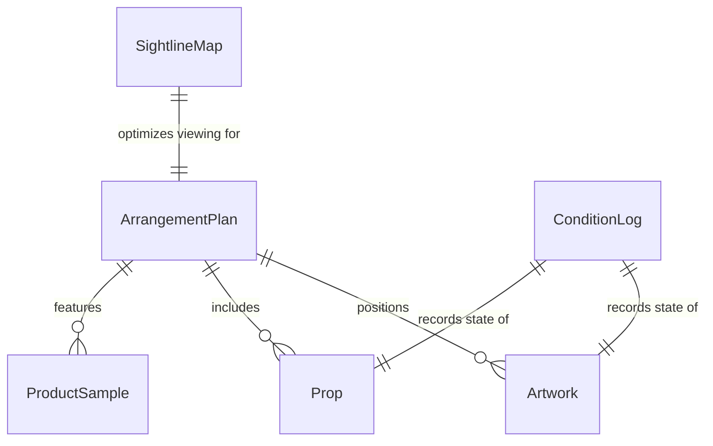
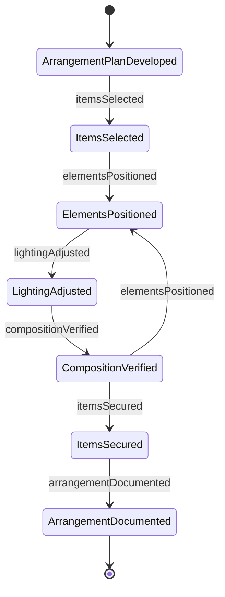
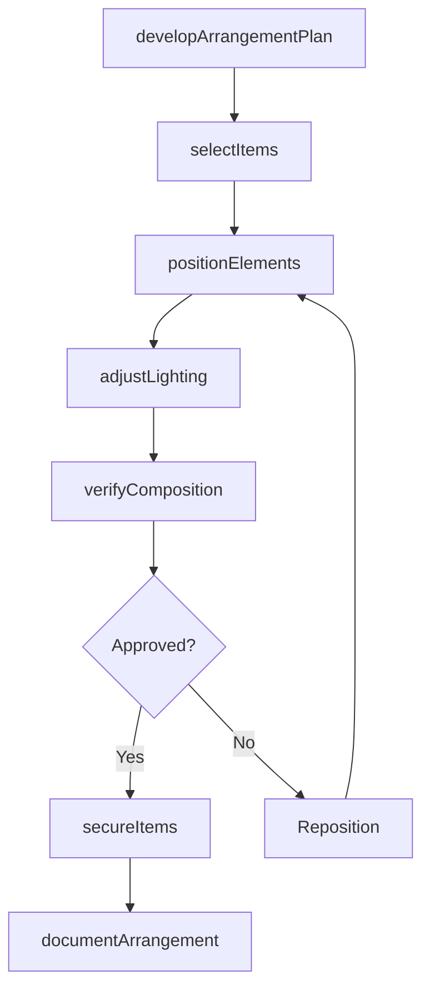
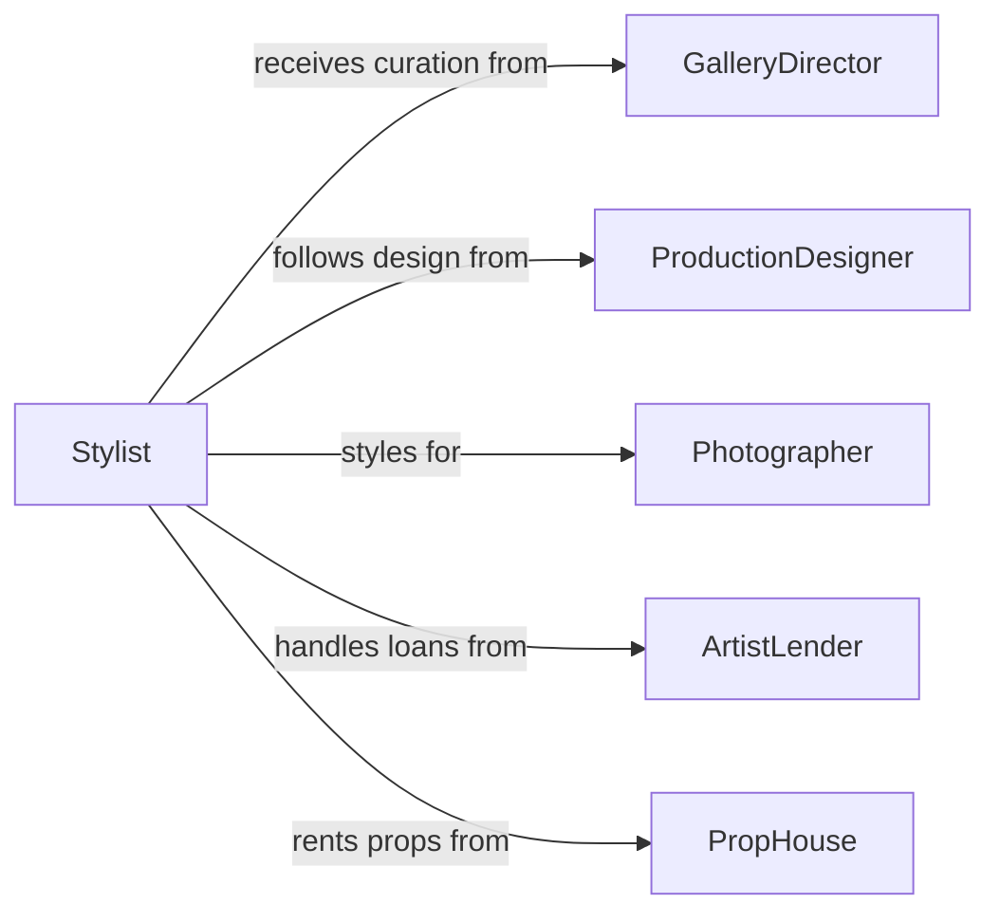

# Arrange Artwork Products Props

> Business-as-Code definition for arranging artwork, products, or props. Models the process of positioning, grouping, and styling visual elements for exhibitions, photo shoots, stage productions, and retail presentations.

## Overview

Arranging artwork, products, and props involves selecting items from inventory, determining optimal placement based on visual composition principles, and physically positioning elements within a defined space such as a gallery, stage set, photo studio, or showroom. Stylists and preparators consider lighting angles, sightlines, thematic groupings, and safety requirements when composing arrangements. Effective arrangement enhances visual storytelling, supports commercial objectives, and ensures that each item is presented in its best context.

## Actors

| Actor | Description |
|-------|-------------|
| GalleryDirector | Curates exhibitions and approves the placement of artwork in gallery spaces |
| ProductionDesigner | Specifies prop placement for film, television, or theatrical productions |
| Photographer | Directs product and prop styling for commercial and editorial photo shoots |
| ArtistLender | Loans artwork for exhibition and specifies handling and display conditions |
| PropHouse | Supplies rental props, furniture, and set dressing items |

## Roles

| Role | Description |
|------|-------------|
| Stylist | Selects and positions items to achieve the desired visual composition |
| Preparator | Handles the physical placement, mounting, and securing of artwork and objects |
| ArtHandler | Transports and unpacks fragile items using conservation-grade techniques |
| SetDresser | Arranges props and furnishings on stage or set according to the production design |

## Entities

| Entity | Description |
|--------|-------------|
| ArrangementPlan | A layout document showing the intended position of each item in the space |
| Artwork | A painting, sculpture, print, or mixed-media piece placed for exhibition |
| Prop | An object used to dress a scene for production or photography |
| ProductSample | A physical unit of merchandise arranged for display or photography |
| SightlineMap | A diagram showing viewer perspectives and optimal viewing angles |
| ConditionLog | A before-and-after record of each item's physical state during arrangement |

## Actions

| Action | Description |
|--------|-------------|
| developArrangementPlan | Create a layout specifying each item's position, height, and grouping |
| selectItems | Choose artwork, products, or props from inventory for the arrangement |
| positionElements | Physically place items in their designated locations within the space |
| adjustLighting | Aim spotlights and adjust ambient light to complement the arrangement |
| verifyComposition | Step back and evaluate the visual balance, spacing, and sightlines |
| secureItems | Anchor, wire, or brace items to prevent movement or damage |
| documentArrangement | Photograph and record the final placement for reference and insurance |

## Events

| Event | Description |
|-------|-------------|
| arrangementPlanDeveloped | The layout showing item positions has been created and approved |
| itemsSelected | Artwork, products, or props have been chosen from inventory |
| elementsPositioned | All items have been placed in their designated locations |
| lightingAdjusted | Spotlights and ambient lighting have been set to complement the display |
| compositionVerified | The visual balance and sightlines have been reviewed and approved |
| itemsSecured | All items have been anchored or braced for safety |
| arrangementDocumented | Photographs and placement records have been filed |

## Searches

| Search | Description |
|--------|-------------|
| findArrangementPlans | List arrangement plans by exhibition, production, or date |
| getAvailableItems | Retrieve artwork, products, or props available for arrangement by category |
| getConditionLogs | Look up condition records for items involved in a specific arrangement |
## Entity Relationships




## State Diagram




## Workflow



## Actor Relationships



## Usage

### Calling Actions

```typescript
import { arrangeArtworkProductsProps } from '@headlessly/arrange-artwork-products-props'

const arrange = arrangeArtworkProductsProps()

// Develop a layout for a gallery exhibition
const plan = await arrange.developArrangementPlan({
  exhibition: 'Contemporary Landscapes 2026',
  spaceId: 'GALLERY-EAST-WING',
  itemCount: 24,
  theme: 'pastoral-urban-contrast'
})

// Select and position artwork
const items = await arrange.selectItems({
  arrangementPlanId: plan.id,
  criteria: { medium: 'oil-on-canvas', sizeRange: { minInches: 24, maxInches: 60 } }
})

await arrange.positionElements({
  arrangementPlanId: plan.id,
  placements: [
    { itemId: items[0].id, wall: 'north', centerHeight: 60, position: 1 },
    { itemId: items[1].id, wall: 'north', centerHeight: 60, position: 2 }
  ]
})
```

### Event-Driven Automation

```typescript
// Notify gallery director when composition is verified
arrange.compositionVerified(async ({ arrangementPlanId, exhibition }) => {
  await notify({
    to: 'gallery-director',
    message: `Arrangement for ${exhibition} verified -- ready for opening`
  })
})

// Auto-generate condition logs after items are secured
arrange.itemsSecured(async ({ arrangementPlanId, itemIds }) => {
  for (const itemId of itemIds) {
    await createConditionLog({
      itemId,
      arrangementPlanId,
      phase: 'post-installation',
      inspectedAt: new Date()
    })
  }
})
```
