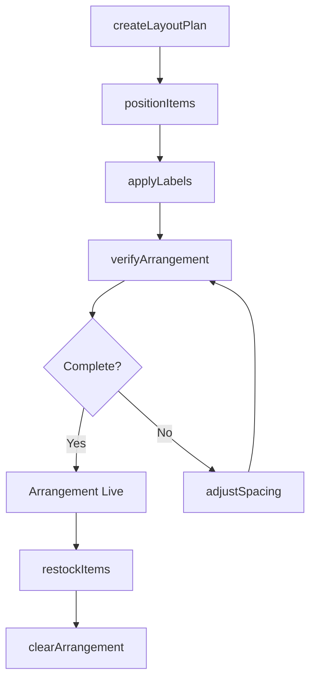
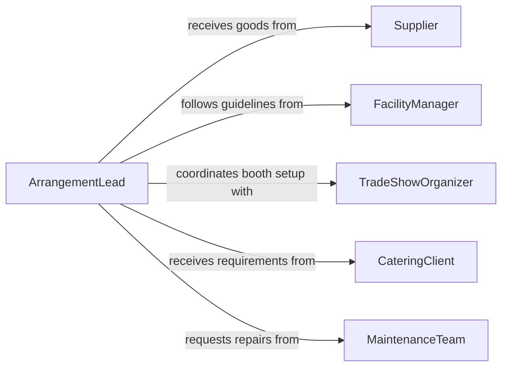

# Arrange Items Use Display

> Business-as-Code definition for arranging items for use or display. Models the process of organizing, positioning, and maintaining tools, equipment, supplies, and consumer goods for operational readiness or visual presentation.

## Overview

Arranging items for use or display involves organizing tools, supplies, equipment, and consumer goods into functional or visually appealing configurations. This activity spans retail shelf stocking, trade show booth setup, buffet and banquet service arrangement, workshop tool organization, and showroom presentation. Workers assess available space, group related items logically, apply labeling or pricing, and maintain the arrangement through regular restocking and tidying. Proper arrangement improves operational efficiency, customer experience, and inventory visibility.

## Actors

| Actor | Description |
|-------|-------------|
| Supplier | Delivers goods, tools, or supplies that need to be arranged at the destination |
| FacilityManager | Oversees the physical space and sets guidelines for item placement |
| TradeShowOrganizer | Coordinates booth assignments and provides setup specifications for exhibitors |
| CateringClient | Specifies food and beverage layout requirements for banquets or events |
| MaintenanceTeam | Ensures shelving, racks, and display surfaces are in serviceable condition |

## Roles

| Role | Description |
|------|-------------|
| ArrangementLead | Plans the layout and directs the placement of items within the space |
| StockingAssociate | Moves items from storage to their designated positions and replenishes as needed |
| ServiceAttendant | Maintains the arrangement during operations, tidying and restocking continuously |
| QualityChecker | Inspects the arrangement for completeness, labeling accuracy, and presentation standards |

## Entities

| Entity | Description |
|--------|-------------|
| LayoutPlan | A diagram specifying where each category of items should be placed |
| ShelfSection | A defined area on a rack, table, or counter allocated to specific items |
| ItemLabel | A price tag, description card, or identification marker attached to an item |
| RestockingSchedule | A timetable for replenishing items that have been consumed or purchased |
| ArrangementChecklist | A list of items and their expected positions used to verify completeness |
| ServiceStation | A designated area equipped with tools, supplies, or food items ready for use |

## Actions

| Action | Description |
|--------|-------------|
| createLayoutPlan | Design the spatial arrangement of items based on available space and purpose |
| positionItems | Place items in their designated locations according to the layout plan |
| applyLabels | Attach price tags, description cards, or identification markers to items |
| verifyArrangement | Check that all items are in their correct positions and properly labeled |
| restockItems | Replenish consumed or purchased items to maintain the intended arrangement |
| adjustSpacing | Redistribute items to fill gaps or accommodate new inventory |
| clearArrangement | Remove all items and restore the space to its empty state |

## Events

| Event | Description |
|-------|-------------|
| layoutPlanCreated | A spatial arrangement plan has been designed and approved |
| itemsPositioned | All items have been placed in their designated locations |
| labelsApplied | Price tags and identification markers have been attached |
| arrangementVerified | The arrangement has been inspected and confirmed complete |
| itemsRestocked | Depleted positions have been replenished with fresh inventory |
| spacingAdjusted | Items have been redistributed to fill gaps or accommodate changes |
| arrangementCleared | All items have been removed and the space has been restored |

## Searches

| Search | Description |
|--------|-------------|
| findLayoutPlans | List layout plans by space, event, or date |
| getRestockingSchedule | Retrieve upcoming restocking times and quantities for a specific area |
| getArrangementStatus | Check the current completeness and condition of an active arrangement |

## Workflow



## Actor Relationships



## Usage

### Calling Actions

```typescript
import { arrangeItemsUseDisplay } from '@headlessly/arrange-items-use-display'

const items = arrangeItemsUseDisplay()

// Create a layout plan for a trade show booth
const layout = await items.createLayoutPlan({
  spaceId: 'BOOTH-A14',
  event: 'National Hardware Show 2026',
  sections: [
    { name: 'Power Tools', shelfCount: 3, position: 'left-wall' },
    { name: 'Hand Tools', shelfCount: 2, position: 'center-table' },
    { name: 'Accessories', shelfCount: 2, position: 'right-wall' }
  ]
})

// Position items and apply labels
await items.positionItems({
  layoutPlanId: layout.id,
  placements: [
    { section: 'Power Tools', sku: 'DRL-1800', quantity: 4, shelf: 1 },
    { section: 'Hand Tools', sku: 'HMR-16OZ', quantity: 6, shelf: 1 }
  ]
})

await items.applyLabels({
  layoutPlanId: layout.id,
  labelType: 'price-card',
  currency: 'USD'
})
```

### Event-Driven Automation

```typescript
// Notify stocking associate when items need replenishment
items.arrangementVerified(async ({ layoutPlanId, depletedSections }) => {
  if (depletedSections.length > 0) {
    await notify({
      to: 'stocking-associate',
      message: `Sections need restocking in layout ${layoutPlanId}: ${depletedSections.join(', ')}`
    })
  }
})

// Auto-schedule teardown after event ends
items.itemsPositioned(async ({ layoutPlanId, eventEndDate }) => {
  await scheduleTask({
    action: 'clearArrangement',
    layoutPlanId,
    scheduledAt: eventEndDate
  })
})
```
