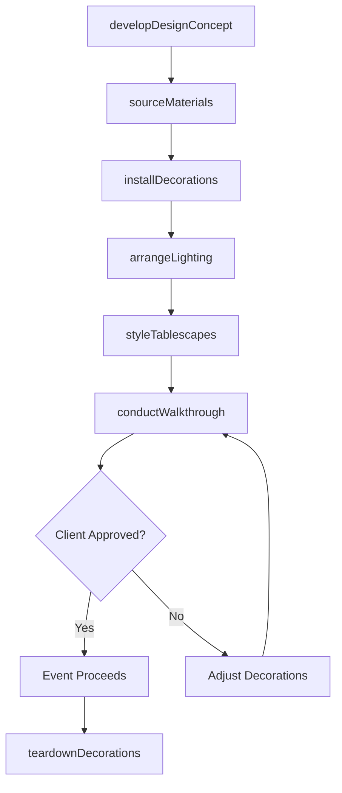
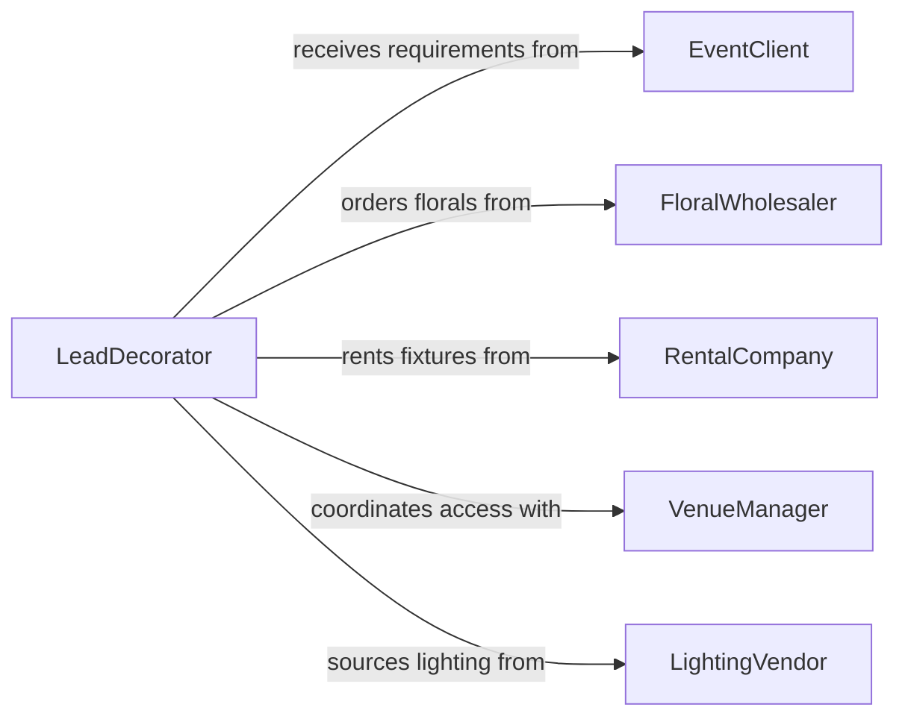

# Decorate Indoor Outdoor Spaces

> Business-as-Code definition for decorating indoor or outdoor spaces. Models the process of designing, installing, and managing decorative elements for events, commercial venues, and residential spaces.

## Overview

Decorating indoor and outdoor spaces involves planning decorative themes, sourcing materials such as florals, drapery, lighting, and furniture, and physically installing these elements to transform a space for events, retail environments, or residential settings. Decorators coordinate with venue managers, event planners, and clients to ensure the design matches the occasion, adheres to safety codes, and stays within budget. Post-event teardown and inventory management are integral to maintaining a sustainable decorating operation.

## Actors

| Actor | Description |
|-------|-------------|
| EventClient | Commissions the decoration and provides theme, color, and budget requirements |
| FloralWholesaler | Supplies fresh and preserved flowers, greenery, and botanical materials |
| RentalCompany | Provides furniture, drapery, tableware, and decorative fixtures on rental terms |
| VenueManager | Grants access to the space and enforces installation rules and safety codes |
| LightingVendor | Supplies decorative and ambient lighting fixtures, string lights, and controllers |

## Roles

| Role | Description |
|------|-------------|
| LeadDecorator | Designs the decorative concept and directs the installation team |
| InstallationCrew | Physically hangs, places, and secures decorative elements in the space |
| FloralDesigner | Creates floral arrangements, centerpieces, and botanical installations |
| EventCoordinator | Manages the timeline and ensures decorations are complete before the event |

## Entities

| Entity | Description |
|--------|-------------|
| DesignConcept | A visual plan including mood boards, color palettes, and layout diagrams |
| DecorationInventory | A catalog of owned and rented decorative items available for use |
| InstallationPlan | A schedule specifying what gets installed, where, and in what order |
| FlooringLayout | A diagram showing placement of rugs, runners, dance floors, or ground coverings |
| LightingScheme | A specification of fixture types, positions, and color temperature settings |
| TeardownChecklist | A list of items to remove, clean, and return after the event concludes |

## Actions

| Action | Description |
|--------|-------------|
| developDesignConcept | Create mood boards, color palettes, and spatial layouts for the decoration plan |
| sourceMaterials | Procure florals, drapery, lighting, and rental furniture for the project |
| installDecorations | Physically place, hang, and secure decorative elements throughout the space |
| arrangeLighting | Position and program ambient and accent lighting fixtures |
| styleTablescapes | Set tables with linens, centerpieces, place settings, and accent pieces |
| conductWalkthrough | Inspect the completed space with the client for final approval |
| teardownDecorations | Remove all decorative elements and restore the space to its original condition |

## Events

| Event | Description |
|-------|-------------|
| designConceptApproved | The client has approved the decorative plan and budget |
| materialsSourced | All decorative materials have been procured and inventoried |
| decorationsInstalled | Decorative elements have been placed and secured in the space |
| lightingArranged | Ambient and accent lighting has been positioned and tested |
| tablescapesStyled | All tables have been set with linens, centerpieces, and place settings |
| walkthroughCompleted | The client has inspected and approved the finished space |
| decorationsTornDown | All decorative elements have been removed and the space restored |

## Searches

| Search | Description |
|--------|-------------|
| findDesignConcepts | List design concepts by event type, theme, or date |
| getDecorationInventory | Retrieve available decorative items by category, color, or rental status |
| getInstallationPlans | Look up installation schedules by venue, date, or project |

## Workflow



## Actor Relationships



## Usage

### Calling Actions

```typescript
import { decorateIndoorOutdoorSpaces } from '@headlessly/decorate-indoor-outdoor-spaces'

const decor = decorateIndoorOutdoorSpaces()

// Develop a design concept for a corporate gala
const concept = await decor.developDesignConcept({
  eventType: 'corporate-gala',
  theme: 'Black Tie Garden',
  colorPalette: ['emerald', 'gold', 'ivory'],
  venueId: 'VENUE-GRAND-BALLROOM',
  budget: 45000
})

// Source materials based on the approved concept
await decor.sourceMaterials({
  designConceptId: concept.id,
  items: [
    { category: 'florals', description: 'White rose centerpieces', quantity: 30 },
    { category: 'drapery', description: 'Emerald velvet swags', quantity: 12 },
    { category: 'lighting', description: 'Warm white string canopy', quantity: 1 }
  ]
})

// Install decorations the day before the event
await decor.installDecorations({
  designConceptId: concept.id,
  installDate: '2026-06-14',
  crewSize: 8
})
```

### Event-Driven Automation

```typescript
// Notify event coordinator when installation is complete
decor.decorationsInstalled(async ({ designConceptId, venueId }) => {
  await notify({
    to: 'event-coordinator',
    message: `Decorations installed at ${venueId} -- schedule client walkthrough`
  })
})

// Auto-generate rental return orders after teardown
decor.decorationsTornDown(async ({ designConceptId, rentalItems }) => {
  await createReturnOrder({
    rentalCompany: rentalItems[0].vendor,
    items: rentalItems,
    pickupDate: addDays(new Date(), 1)
  })
})
```
