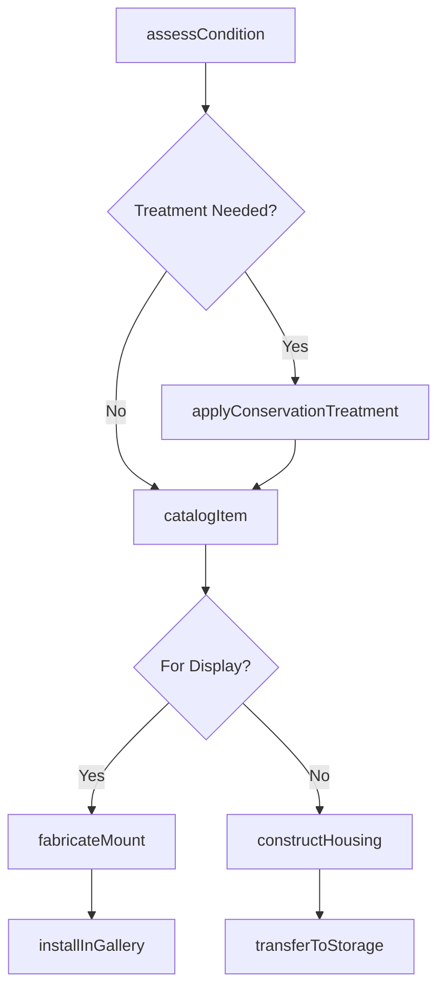
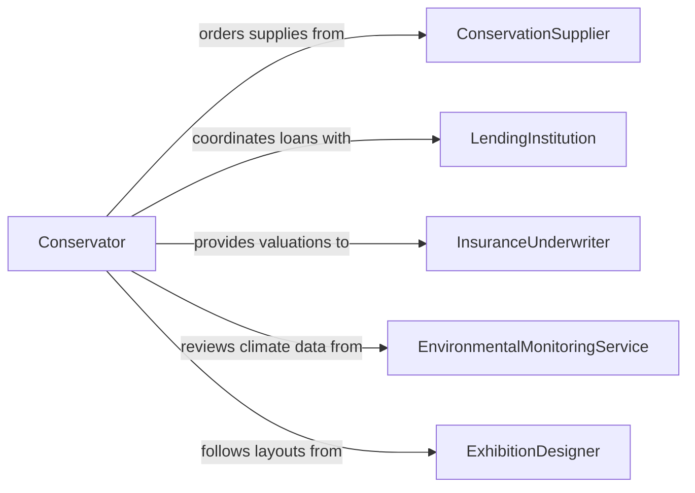

# Prepare Materials Preservation Storage Display

> Business-as-Code definition for preparing materials for preservation, storage, or display. Models the process of assessing, treating, housing, and cataloging artifacts, specimens, and archival materials for long-term conservation and public exhibition.

## Overview

Preparing materials for preservation, storage, or display involves assessing the condition of artifacts, specimens, or archival documents, then applying conservation treatments, constructing appropriate housing, and mounting items for exhibition or archival storage. This work spans museums, libraries, archives, and natural history collections where environmental controls, acid-free materials, and proper handling techniques protect items from deterioration. Thorough documentation ensures traceability and supports both scholarly research and public engagement.

## Actors

| Actor | Description |
|-------|-------------|
| ConservationSupplier | Provides acid-free materials, adhesives, and specialized preservation supplies |
| LendingInstitution | Loans artifacts or specimens for temporary exhibition under agreed conditions |
| InsuranceUnderwriter | Covers loss, damage, or deterioration of high-value collection items |
| EnvironmentalMonitoringService | Provides climate sensors and data logging for storage and gallery environments |
| ExhibitionDesigner | Creates display layouts and mounting specifications for gallery installations |

## Roles

| Role | Description |
|------|-------------|
| Conservator | Assesses condition, performs treatments, and oversees preservation protocols |
| CollectionsManager | Tracks catalog records, storage locations, and loan agreements |
| Preparator | Builds mounts, frames, and custom housings for display and storage |
| Registrar | Documents provenance, condition reports, and chain of custody for each item |

## Entities

| Entity | Description |
|--------|-------------|
| Artifact | A cultural, historical, or scientific object in the collection |
| ConditionReport | A detailed assessment of an item's physical state and any damage |
| StorageHousing | Custom enclosures such as archival boxes, padded trays, or specimen jars |
| ExhibitionMount | A bracket, stand, or frame designed to hold an item securely on display |
| CatalogRecord | Metadata describing the item's provenance, dimensions, and conservation history |
| EnvironmentalReading | Temperature, humidity, and light level data from the storage or gallery environment |

## Actions

| Action | Description |
|--------|-------------|
| assessCondition | Examine the item and document its current physical state |
| applyConservationTreatment | Perform cleaning, stabilization, or repair procedures on the item |
| constructHousing | Build acid-free boxes, padded trays, or climate-controlled enclosures |
| fabricateMount | Create a custom bracket, stand, or frame for exhibition display |
| catalogItem | Record provenance, dimensions, photographs, and conservation notes |
| installInGallery | Place the prepared item and its mount in the exhibition space |
| transferToStorage | Move the item into its designated long-term storage location |

## Events

| Event | Description |
|-------|-------------|
| conditionAssessed | The item's physical state has been examined and documented |
| treatmentApplied | Conservation procedures have been completed on the item |
| housingConstructed | A custom storage enclosure has been built for the item |
| mountFabricated | A display mount has been created and fitted for the item |
| itemCataloged | The item's metadata and conservation records have been entered |
| itemInstalledInGallery | The item has been placed on display in the exhibition space |
| itemTransferredToStorage | The item has been moved to its designated storage location |

## Searches

| Search | Description |
|--------|-------------|
| findArtifacts | List artifacts by collection, condition status, or storage location |
| getConditionReports | Retrieve condition reports by item, date range, or conservator |
| getEnvironmentalReadings | Look up climate data for a specific storage room or gallery zone |

## Workflow



## Actor Relationships



## Usage

### Calling Actions

```typescript
import { prepareMaterialsPreservationStorageDisplay } from '@headlessly/prepare-materials-preservation-storage-display'

const preservation = prepareMaterialsPreservationStorageDisplay()

// Assess the condition of a recently acquired artifact
const report = await preservation.assessCondition({
  artifactId: 'ART-2026-0198',
  examiner: 'conservator-jsmith',
  checkpoints: ['structural-integrity', 'surface-condition', 'pest-damage']
})

// Apply conservation treatment if needed
await preservation.applyConservationTreatment({
  artifactId: 'ART-2026-0198',
  conditionReportId: report.id,
  treatments: ['surface-cleaning', 'consolidation', 'lacuna-fill']
})

// Catalog the item with updated records
await preservation.catalogItem({
  artifactId: 'ART-2026-0198',
  provenance: 'Donated by Smith Estate, 2026',
  dimensions: { height: 24, width: 18, depth: 6, unit: 'inches' },
  photographs: ['front-view.jpg', 'detail-crack.jpg']
})
```

### Event-Driven Automation

```typescript
// Notify registrar when an item is installed in the gallery
preservation.itemInstalledInGallery(async ({ artifactId, galleryZone }) => {
  await notify({
    to: 'registrar',
    message: `Artifact ${artifactId} installed in ${galleryZone} -- update loan records`
  })
})

// Trigger environmental monitoring when items enter storage
preservation.itemTransferredToStorage(async ({ artifactId, storageLocation }) => {
  await activateClimateMonitoring({
    location: storageLocation,
    thresholds: { tempMaxF: 72, humidityMaxPct: 55, luxMax: 50 }
  })
})
```
