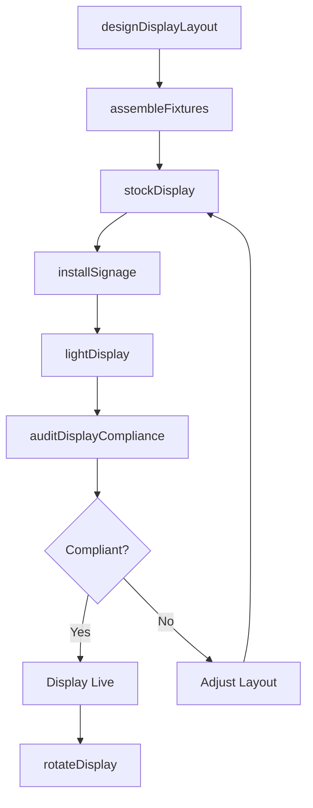
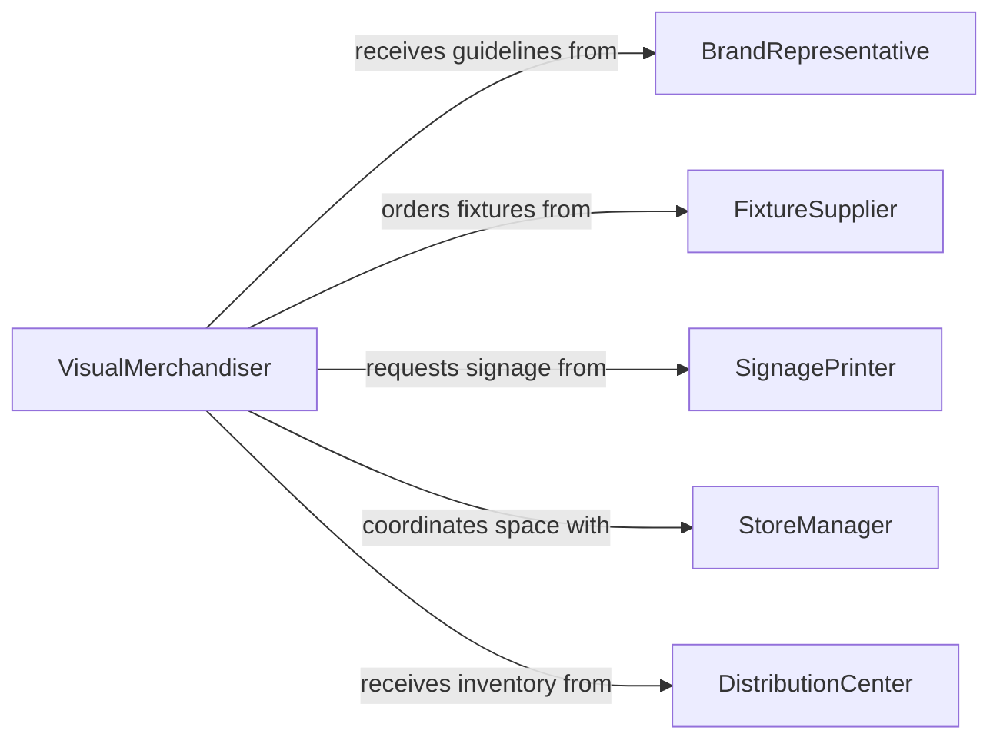

# Set Up Merchandise Displays

> Business-as-Code definition for setting up merchandise displays. Models the end-to-end process of planning, building, and maintaining product displays in retail environments to drive customer engagement and sales.

## Overview

Setting up merchandise displays involves planning product placement according to planograms and promotional calendars, assembling fixtures and signage, and arranging products to maximize visual appeal and customer accessibility. Visual merchandisers coordinate with store managers and brand representatives to ensure displays comply with corporate standards, highlight seasonal promotions, and support sell-through targets. Regular maintenance and rotation of displays keeps the retail floor fresh and responsive to changing inventory and marketing campaigns.

## Actors

| Actor | Description |
|-------|-------------|
| BrandRepresentative | Provides product display guidelines, branded fixtures, and promotional materials |
| FixtureSupplier | Manufactures and delivers shelving, mannequins, risers, and display hardware |
| SignagePrinter | Produces price cards, banners, and point-of-sale graphics |
| StoreManager | Approves display layouts and allocates floor space for promotional setups |
| DistributionCenter | Ships merchandise inventory to the store for display stocking |

## Roles

| Role | Description |
|------|-------------|
| VisualMerchandiser | Designs display layouts and directs the arrangement of products and fixtures |
| StockAssociate | Moves merchandise from the stockroom to the sales floor for display |
| DisplayInstaller | Assembles fixtures, mounts signage, and builds structural display elements |
| MerchandisingManager | Oversees planogram compliance and measures display performance metrics |

## Entities

| Entity | Description |
|--------|-------------|
| Planogram | A diagram specifying product placement on shelves and fixtures |
| DisplayFixture | A physical structure such as a gondola, endcap, or freestanding unit |
| Signage | Price cards, promotional banners, and branded graphics |
| PromotionalCalendar | A schedule of upcoming campaigns, seasonal changes, and markdown events |
| ProductAssortment | The specific SKUs and quantities allocated to a display |
| DisplayPerformanceReport | Sales and engagement metrics tied to a specific display setup |

## Actions

| Action | Description |
|--------|-------------|
| designDisplayLayout | Create a planogram specifying product positions, fixture types, and signage |
| assembleFixtures | Build and position shelving, risers, mannequins, and display structures |
| stockDisplay | Arrange merchandise on fixtures according to the planogram |
| installSignage | Mount price cards, promotional banners, and branded graphics |
| lightDisplay | Position and aim spotlights or accent lighting on the merchandise |
| auditDisplayCompliance | Verify that the display matches the planogram and brand guidelines |
| rotateDisplay | Refresh the display with new products, signage, or seasonal themes |

## Events

| Event | Description |
|-------|-------------|
| displayLayoutDesigned | A planogram has been created and approved for the display |
| fixturesAssembled | Shelving and display structures have been built and positioned |
| displayStocked | Merchandise has been arranged on fixtures per the planogram |
| signageInstalled | Price cards and promotional graphics have been mounted |
| displayLit | Accent lighting has been positioned and aimed at the merchandise |
| complianceAudited | The display has been verified against planogram and brand standards |
| displayRotated | The display has been refreshed with updated products or themes |

## Searches

| Search | Description |
|--------|-------------|
| findPlanograms | List planograms by department, brand, or promotional period |
| getDisplayPerformance | Retrieve sales and traffic metrics for a specific display fixture |
| getFixtureInventory | Look up available fixtures by type, size, or store location |

## Workflow



## Actor Relationships



## Usage

### Calling Actions

```typescript
import { setUpMerchandiseDisplays } from '@headlessly/set-up-merchandise-displays'

const displays = setUpMerchandiseDisplays()

// Design a display layout for a seasonal promotion
const layout = await displays.designDisplayLayout({
  department: 'Apparel',
  promotionId: 'PROMO-SUMMER-2026',
  fixtureType: 'endcap-4ft',
  productAssortment: ['SKU-4412', 'SKU-4413', 'SKU-4414']
})

// Assemble fixtures and stock the display
await displays.assembleFixtures({
  planogramId: layout.id,
  location: 'Aisle 7, Endcap A',
  fixtures: ['gondola-endcap', 'riser-3tier', 'mannequin-half']
})

await displays.stockDisplay({
  planogramId: layout.id,
  skuQuantities: [
    { sku: 'SKU-4412', quantity: 12 },
    { sku: 'SKU-4413', quantity: 8 },
    { sku: 'SKU-4414', quantity: 10 }
  ]
})
```

### Event-Driven Automation

```typescript
// Notify merchandising manager when compliance audit fails
displays.complianceAudited(async ({ planogramId, compliant, issues }) => {
  if (!compliant) {
    await notify({
      to: 'merchandising-manager',
      message: `Display ${planogramId} non-compliant: ${issues.join(', ')}`
    })
  }
})

// Auto-schedule display rotation based on promotional calendar
displays.displayStocked(async ({ planogramId, promotionEndDate }) => {
  await scheduleTask({
    action: 'rotateDisplay',
    planogramId,
    scheduledAt: promotionEndDate
  })
})
```
