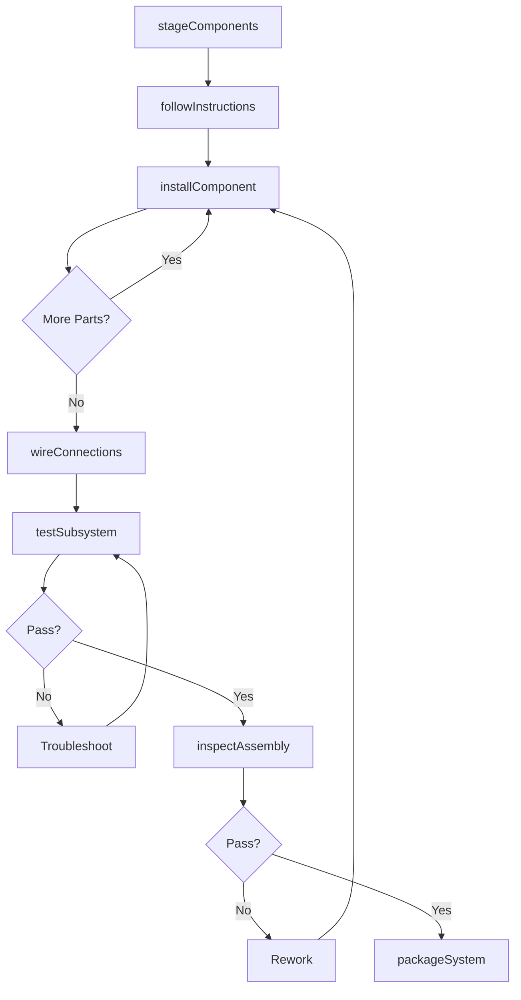
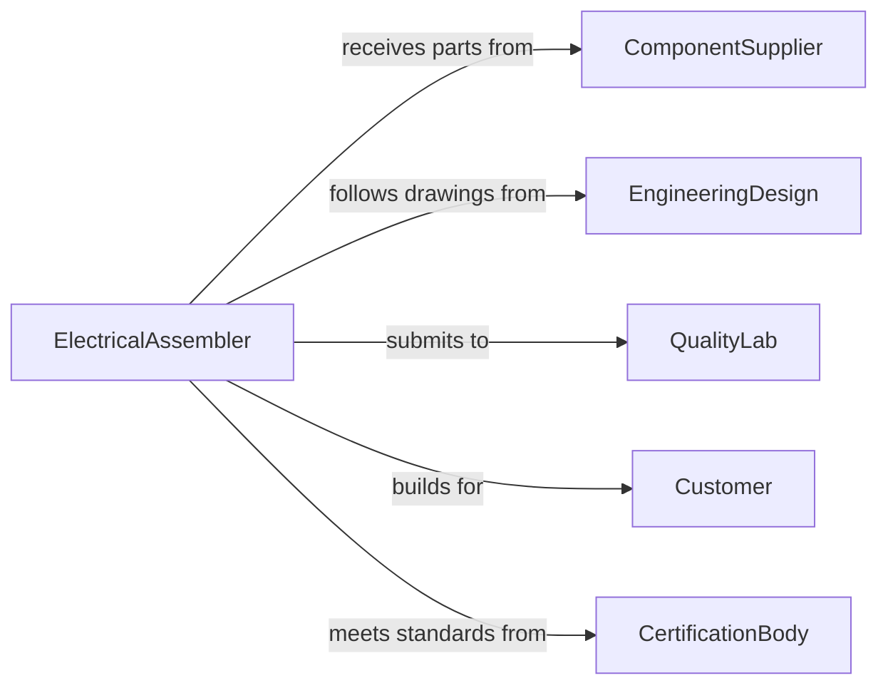

# Assemble Electrical Components Subsystems Systems

> Business-as-Code definition for electrical assembly operations. Models component integration workflows from parts staging through assembly, testing, and quality verification.

## Overview

Electrical component assembly integrates discrete parts into functional subsystems and complete systems including circuit boards, control panels, wiring harnesses, and electrical enclosures. This definition supports manufacturing operations with work instructions, quality checkpoints, testing protocols, and traceability.

## Actors

| Actor | Description |
|-------|-------------|
| ComponentSupplier | Provides resistors, capacitors, connectors, and parts |
| EngineeringDesign | Specifies assembly drawings and bill of materials |
| QualityLab | Tests electrical performance and safety compliance |
| Customer | Receives assembled systems and approves specifications |
| CertificationBody | Verifies compliance with electrical safety standards |
| ToolingVendor | Supplies assembly fixtures, soldering equipment, and testers |

## Roles

| Role | Description |
|------|-------------|
| ElectricalAssembler | Executes component assembly operations |
| TestTechnician | Performs electrical testing and troubleshooting |
| QualityInspector | Verifies assembly compliance with specifications |
| ProductionPlanner | Schedules assembly work and material flow |

## Entities

| Entity | Description |
|--------|-------------|
| AssemblyOrder | Work order for electrical system production |
| Component | Discrete electrical part for assembly |
| Subsystem | Assembled group of components with defined function |
| BillOfMaterials | List of components required for assembly |
| WorkInstruction | Step-by-step assembly procedure |
| TestResult | Electrical performance and safety measurements |

## Actions

| Action | Description |
|--------|-------------|
| stageComponents | Prepare parts and materials for assembly |
| followInstructions | Execute assembly steps per work order |
| installComponent | Mount and secure electrical part |
| wireConnections | Create electrical connections between components |
| testSubsystem | Verify electrical function of assembled group |
| inspectAssembly | Check workmanship and compliance |
| packageSystem | Prepare completed assembly for shipment |

## Events

| Event | Description |
|-------|-------------|
| componentsStaged | Parts are ready for assembly |
| instructionsFollowed | Assembly steps have been executed |
| componentInstalled | Part has been mounted and secured |
| connectionsWired | Electrical connections are complete |
| subsystemTested | Electrical testing is complete |
| assemblyInspected | Quality verification is complete |
| systemPackaged | Assembly is ready for delivery |

## Searches

| Search | Description |
|--------|-------------|
| findOrders | List assembly work by status or due date |
| getComponents | Retrieve parts by order or location |
| getSubsystems | Find assembled groups by test status |
| getTests | Access test results and failure data |

## Workflow



## Actor Relationships



## Usage

### Calling Actions

```typescript
import { assembleElectricalComponentsSubsystemsSystems } from '@headlessly/assemble-electrical-components-subsystems-systems'

const assembly = assembleElectricalComponentsSubsystemsSystems()

// Stage components for control panel assembly
await assembly.stageComponents({
  orderId: 'WO-55342',
  bomId: 'BOM-CP-1200',
  components: [
    { partNumber: 'PLC-AB-5069', quantity: 1 },
    { partNumber: 'RELAY-24VDC-10A', quantity: 8 },
    { partNumber: 'TERMINAL-BLOCK-20P', quantity: 4 }
  ],
  location: 'assembly-station-3'
})

// Execute assembly steps
await assembly.followInstructions({
  orderId: 'WO-55342',
  instructionId: 'WI-CP-1200-REV-C',
  workstation: 'assembly-station-3'
})

await assembly.installComponent({
  orderId: 'WO-55342',
  component: 'PLC-AB-5069',
  location: 'DIN-rail-center',
  fasteners: ['M4-screw-x4']
})

await assembly.wireConnections({
  orderId: 'WO-55342',
  connections: [
    { from: 'PLC-OUT-1', to: 'RELAY-1-COIL', wireGauge: 18 },
    { from: 'RELAY-1-NO', to: 'TB1-5', wireGauge: 14 }
  ]
})

// Test assembled subsystem
const test = await assembly.testSubsystem({
  orderId: 'WO-55342',
  tests: ['continuity', 'voltage-24VDC', 'relay-operation']
})
```

### Event-Driven Automation

```typescript
// Auto-request test equipment when wiring is complete
assembly.connectionsWired(async ({ orderId, workstation }) => {
  await reserveEquipment({
    type: 'multimeter-continuity-tester',
    workstation,
    duration: 30,
    unit: 'minutes'
  })
})

// Track test failures for quality analysis
assembly.subsystemTested(async ({ orderId, tests, passed }) => {
  if (!passed) {
    await recordDefect({
      orderId,
      defectType: 'electrical-test-failure',
      failedTests: tests.filter(t => !t.passed)
    })
  }
})
```
