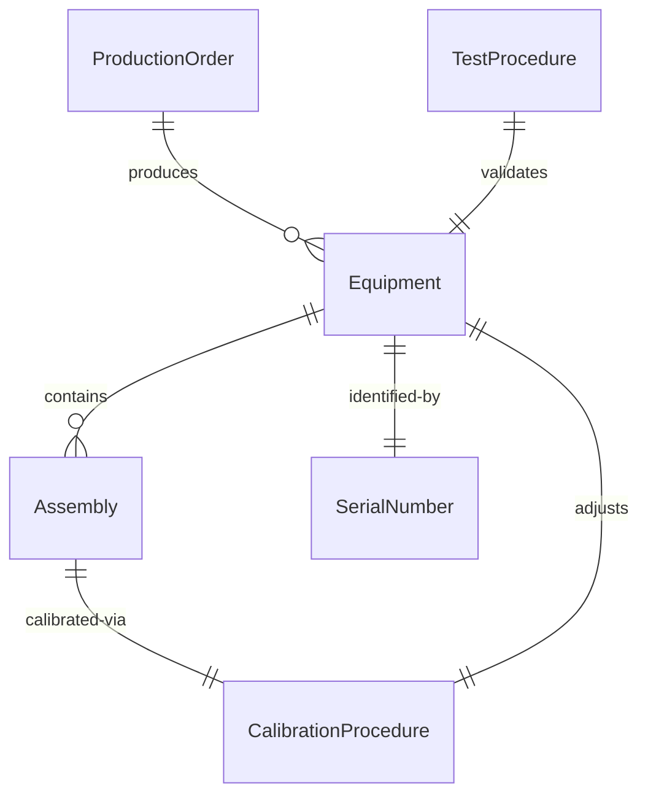
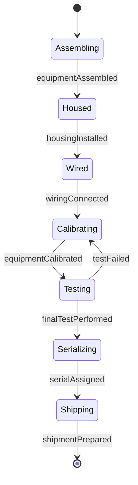
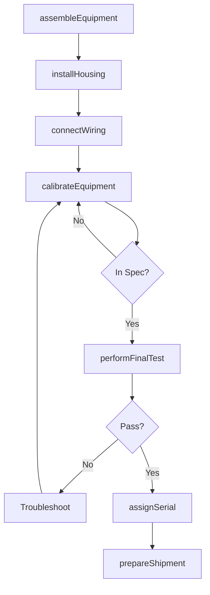
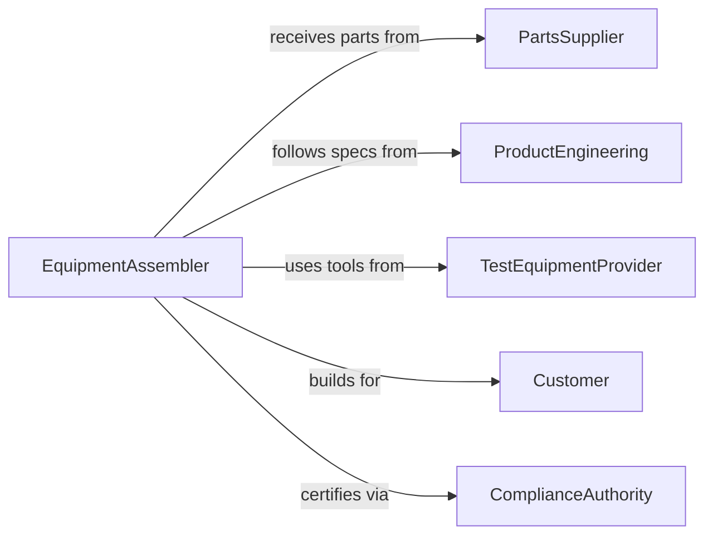

# Assemble Electrical Electronic Equipment

> Business-as-Code definition for electrical and electronic equipment assembly. Models complete product build workflows from initial assembly through calibration and final testing.

## Overview

Electrical and electronic equipment assembly produces finished products such as power supplies, instrumentation, communication devices, and control systems through component integration, wiring, calibration, and testing. This definition supports manufacturing operations with process control, quality gates, and serialized product tracking.

## Actors

| Actor | Description |
|-------|-------------|
| PartsSupplier | Provides electronic assemblies, enclosures, and hardware |
| ProductEngineering | Designs equipment and maintains specifications |
| TestEquipmentProvider | Supplies calibrators, load testers, and measurement tools |
| Customer | Purchases equipment and defines requirements |
| ComplianceAuthority | Certifies equipment for safety and EMC standards |
| CalibrationLab | Provides traceable calibration services |

## Roles

| Role | Description |
|------|-------------|
| EquipmentAssembler | Builds complete electrical and electronic products |
| Calibrator | Adjusts equipment to specification |
| FinalTestTechnician | Executes production acceptance testing |
| ShippingCoordinator | Prepares equipment for delivery |

## Entities

| Entity | Description |
|--------|-------------|
| ProductionOrder | Build instruction for equipment manufacturing |
| Equipment | Complete electrical or electronic product |
| Assembly | Major subassembly within equipment |
| CalibrationProcedure | Step-by-step adjustment protocol |
| TestProcedure | Acceptance test sequence and limits |
| SerialNumber | Unique identifier for traceability |

## Actions

| Action | Description |
|--------|-------------|
| assembleEquipment | Integrate subassemblies into complete product |
| installHousing | Mount equipment in enclosure or chassis |
| connectWiring | Create internal electrical connections |
| calibrateEquipment | Adjust performance to specification |
| performFinalTest | Execute production acceptance testing |
| assignSerial | Apply unique identifier for traceability |
| prepareShipment | Package and document for delivery |

## Events

| Event | Description |
|-------|-------------|
| equipmentAssembled | Product integration is complete |
| housingInstalled | Enclosure assembly is complete |
| wiringConnected | Internal connections are finished |
| equipmentCalibrated | Calibration adjustments are complete |
| finalTestPerformed | Acceptance testing is complete |
| serialAssigned | Traceability identifier has been applied |
| shipmentPrepared | Product is ready for delivery |

## Searches

| Search | Description |
|--------|-------------|
| findOrders | List production work by status or product type |
| getEquipment | Retrieve products by serial number or test status |
| getCalibrations | Find calibration records and due dates |
| getTests | Access test results and failure analysis |
## Entity Relationships




## State Diagram




## Workflow



## Actor Relationships



## Usage

### Calling Actions

```typescript
import { assembleElectricalElectronicEquipment } from '@headlessly/assemble-electrical-electronic-equipment'

const equipment = assembleElectricalElectronicEquipment()

// Assemble power supply unit
await equipment.assembleEquipment({
  orderId: 'PO-8821',
  productModel: 'PSU-48V-500W',
  assemblies: [
    { id: 'PCB-MAIN-REV-D', location: 'baseplate' },
    { id: 'PCB-CONTROL-REV-B', location: 'vertical-mount' },
    { id: 'HEATSINK-AL-150W', location: 'output-stage' }
  ]
})

await equipment.installHousing({
  orderId: 'PO-8821',
  enclosure: '19-inch-rack-2U',
  hardwareKit: 'HW-PSU-500W'
})

await equipment.connectWiring({
  orderId: 'PO-8821',
  connections: [
    { from: 'AC-INPUT-TERMINAL', to: 'PCB-MAIN-J1' },
    { from: 'PCB-MAIN-J2', to: 'DC-OUTPUT-TERMINAL' }
  ]
})

// Calibrate and test
await equipment.calibrateEquipment({
  orderId: 'PO-8821',
  procedure: 'CAL-PSU-48V',
  adjustments: [
    { parameter: 'output-voltage', target: 48.0, tolerance: 0.1 },
    { parameter: 'current-limit', target: 10.5, tolerance: 0.2 }
  ]
})

const test = await equipment.performFinalTest({
  orderId: 'PO-8821',
  procedure: 'TEST-PSU-FINAL',
  tests: ['output-voltage', 'ripple', 'efficiency', 'thermal']
})

await equipment.assignSerial({
  orderId: 'PO-8821',
  serialFormat: 'PSU48V{YYWW}{####}',
  labelLocation: 'rear-panel'
})
```

### Event-Driven Automation

```typescript
// Auto-generate calibration certificate
equipment.equipmentCalibrated(async ({ orderId, adjustments, timestamp }) => {
  await generateDocument({
    type: 'calibration-certificate',
    orderId,
    calibrationData: adjustments,
    date: timestamp,
    technician: getCurrentUser()
  })
})

// Track test failures by product model
equipment.finalTestPerformed(async ({ orderId, productModel, passed, failures }) => {
  if (!passed) {
    await recordMetric({
      type: 'test-failure',
      productModel,
      failures,
      timestamp: new Date()
    })
  }
})
```
