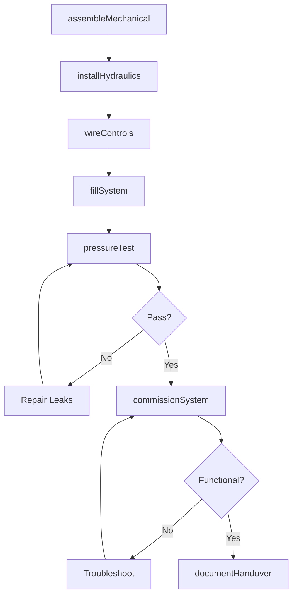
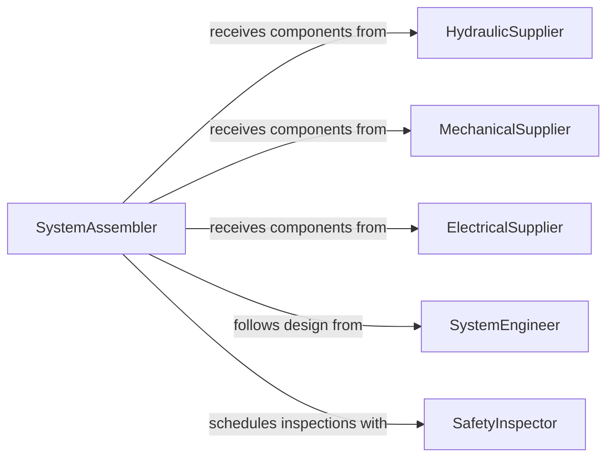

# Assemble Electromechanical Hydraulic Systems

> Business-as-Code definition for electromechanical and hydraulic system assembly. Models integration workflows from mechanical assembly through hydraulic plumbing and electrical controls to functional testing.

## Overview

Electromechanical and hydraulic system assembly combines mechanical structures, hydraulic power units, actuators, and electrical controls into integrated systems for industrial automation, mobile equipment, and manufacturing machinery. This definition supports complex assembly operations with multi-disciplinary coordination, pressure testing, and system commissioning.

## Actors

| Actor | Description |
|-------|-------------|
| HydraulicSupplier | Provides pumps, valves, cylinders, and hydraulic components |
| MechanicalSupplier | Supplies structural components and motion systems |
| ElectricalSupplier | Provides motors, sensors, and control components |
| SystemEngineer | Designs integrated system and specifications |
| SafetyInspector | Verifies pressure vessel and electrical safety |
| EndUser | Receives operational system and approves performance |

## Roles

| Role | Description |
|------|-------------|
| SystemAssembler | Integrates mechanical, hydraulic, and electrical subsystems |
| HydraulicTechnician | Assembles hydraulic circuits and tests pressure systems |
| ElectricalTechnician | Wires controls and interfaces electrical components |
| CommissioningEngineer | Tests and validates complete system operation |

## Entities

| Entity | Description |
|--------|-------------|
| SystemOrder | Build instruction for integrated system |
| MechanicalAssembly | Structural frame and motion components |
| HydraulicCircuit | Pump, valves, actuators, and fluid plumbing |
| ControlSystem | Electrical controls, sensors, and user interface |
| PressureTest | Hydraulic system leak and pressure verification |
| FunctionalTest | Complete system performance validation |

## Actions

| Action | Description |
|--------|-------------|
| assembleMechanical | Build structural frame and mount components |
| installHydraulics | Route hydraulic lines and mount actuators |
| wireControls | Connect electrical controls and sensors |
| fillSystem | Charge hydraulic system with fluid |
| pressureTest | Verify hydraulic system integrity |
| commissionSystem | Execute complete functional testing |
| documentHandover | Prepare system documentation for delivery |

## Events

| Event | Description |
|-------|-------------|
| mechanicalAssembled | Structural assembly is complete |
| hydraulicsInstalled | Hydraulic components are mounted and plumbed |
| controlsWired | Electrical integration is complete |
| systemFilled | Hydraulic fluid has been added |
| pressureTested | Hydraulic integrity has been verified |
| systemCommissioned | Functional testing is complete |
| handoverDocumented | System is ready for delivery |

## Searches

| Search | Description |
|--------|-------------|
| findOrders | List system builds by status or type |
| getSystems | Retrieve systems by test status or location |
| getTests | Access pressure test and functional test results |
| getDocumentation | Find assembly records and handover packages |

## Workflow



## Actor Relationships



## Usage

### Calling Actions

```typescript
import { assembleElectromechanicalHydraulicSystems } from '@headlessly/assemble-electromechanical-hydraulic-systems'

const systems = assembleElectromechanicalHydraulicSystems()

// Assemble hydraulic press system
await systems.assembleMechanical({
  orderId: 'SO-4412',
  systemType: 'hydraulic-press-100-ton',
  components: [
    { id: 'FRAME-STEEL-WELDMENT', location: 'base' },
    { id: 'COLUMN-GUIDE-4X', location: 'vertical' },
    { id: 'PLATEN-TOP', location: 'ram-mount' }
  ]
})

await systems.installHydraulics({
  orderId: 'SO-4412',
  circuit: 'hydraulic-press-circuit-A',
  components: [
    { id: 'PUMP-45GPM-3000PSI', location: 'power-unit' },
    { id: 'CYLINDER-100TON-12IN', location: 'platen-drive' },
    { id: 'VALVE-PROPORTIONAL-4W3P', location: 'control-manifold' }
  ],
  tubing: ['3/4-SAE-suction', '1/2-SAE-pressure', '3/8-SAE-return']
})

await systems.wireControls({
  orderId: 'SO-4412',
  controlPanel: 'PLC-BASED-HMI',
  sensors: [
    { id: 'PRESSURE-TRANSDUCER-5K', location: 'pump-outlet' },
    { id: 'POSITION-ENCODER', location: 'ram-cylinder' }
  ]
})

// Fill, test, and commission
await systems.fillSystem({
  orderId: 'SO-4412',
  fluid: 'ISO-VG46-hydraulic-oil',
  volume: 120,
  unit: 'gallons'
})

const pressureTest = await systems.pressureTest({
  orderId: 'SO-4412',
  testPressure: 3300,
  duration: 60,
  unit: 'psi-minutes'
})

await systems.commissionSystem({
  orderId: 'SO-4412',
  tests: ['no-load-cycle', 'rated-load-cycle', 'speed-control', 'safety-interlocks']
})
```

### Event-Driven Automation

```typescript
// Auto-schedule electrical inspection after wiring
systems.controlsWired(async ({ orderId, timestamp }) => {
  await scheduleInspection({
    type: 'electrical-safety',
    orderId,
    scheduledFor: new Date(timestamp.getTime() + 24 * 3600000)
  })
})

// Alert on pressure test failure
systems.pressureTested(async ({ orderId, passed, leaks }) => {
  if (!passed) {
    await notify({
      to: 'hydraulic-supervisor',
      message: `System ${orderId} pressure test failed - ${leaks.length} leaks detected`
    })
  }
})
```
