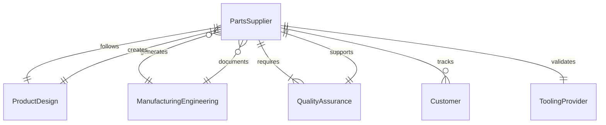
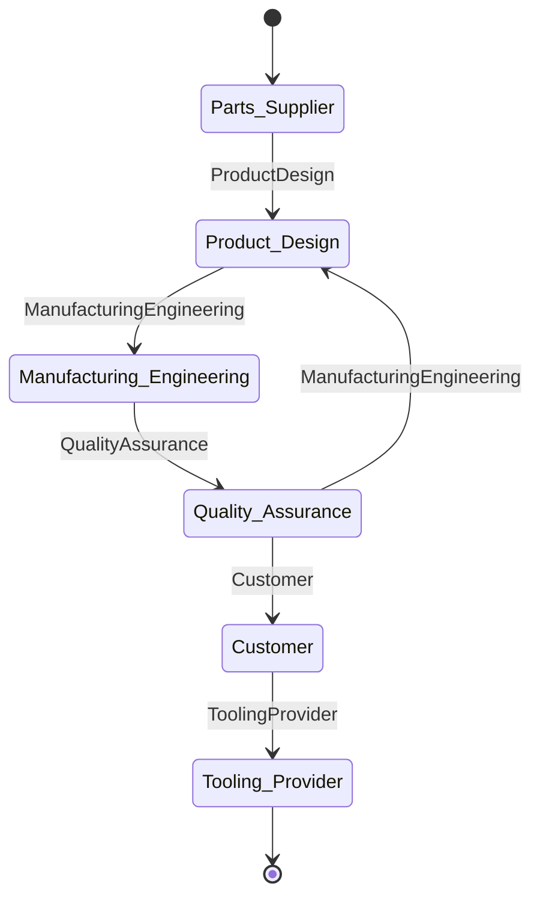
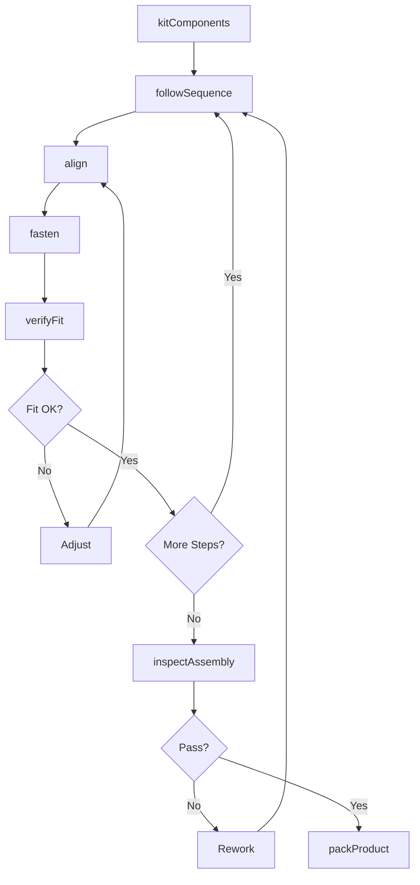
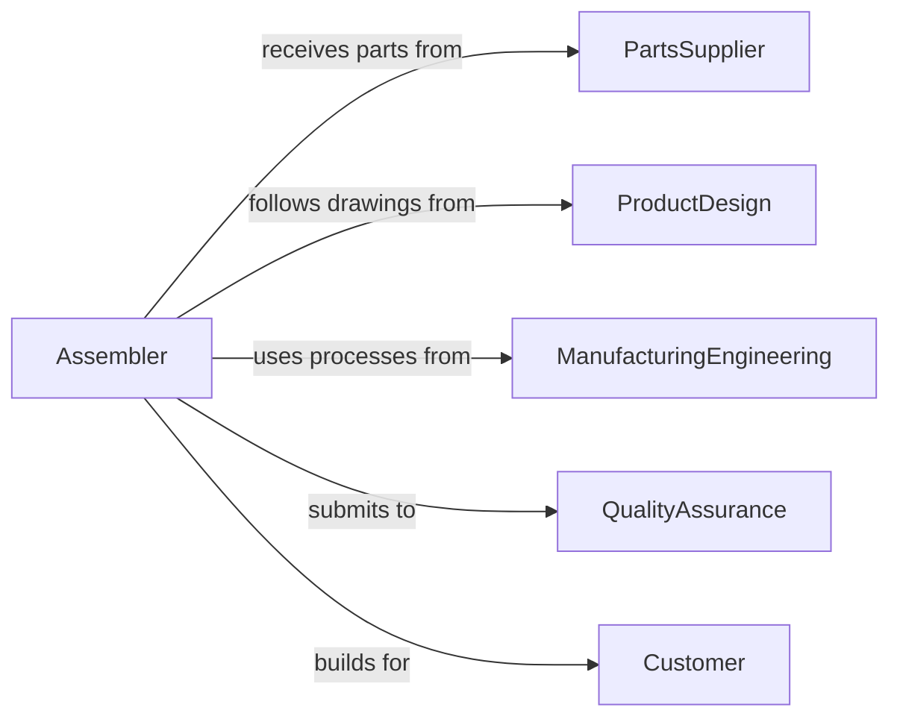

# Assemble Equipment Components

> Business-as-Code definition for general equipment and component assembly. Models manufacturing workflows from parts kitting through assembly operations and quality verification.

## Overview

Equipment and component assembly produces finished products through integration of discrete parts using fastening, joining, and installation techniques. This definition supports diverse manufacturing operations including mechanical assemblies, consumer products, and industrial equipment with work instructions, quality checkpoints, and production tracking.

## Actors

| Actor | Description |
|-------|-------------|
| PartsSupplier | Provides components and raw materials |
| ProductDesign | Creates assembly drawings and specifications |
| ManufacturingEngineering | Develops assembly processes and tooling |
| QualityAssurance | Defines inspection criteria and testing |
| Customer | Receives finished products and defines requirements |
| ToolingProvider | Supplies fixtures, fastening equipment, and gauges |

## Roles

| Role | Description |
|------|-------------|
| Assembler | Executes component assembly operations |
| Kitter | Prepares and stages parts for assembly |
| QualityInspector | Verifies assembly meets specifications |
| ProductionSupervisor | Coordinates assembly workflow and resources |

## Entities

| Entity | Description |
|--------|-------------|
| WorkOrder | Build instruction for product assembly |
| Component | Individual part for assembly |
| Kit | Collection of components staged for work order |
| AssemblyStep | Single operation in build sequence |
| Fixture | Tooling that holds components during assembly |
| InspectionPoint | Quality checkpoint during or after assembly |

## Actions

| Action | Description |
|--------|-------------|
| kitComponents | Gather and stage parts for assembly |
| followSequence | Execute assembly steps in specified order |
| fasten | Join components using mechanical fasteners |
| align | Position components to specified tolerances |
| verifyFit | Check proper component mating and clearances |
| inspectAssembly | Verify completed work meets quality standards |
| packProduct | Prepare finished assembly for storage or shipment |

## Events

| Event | Description |
|-------|-------------|
| componentsKitted | Parts are staged and ready for assembly |
| sequenceFollowed | Assembly steps have been executed |
| componentsFastened | Parts have been joined together |
| partsAligned | Component positioning meets tolerances |
| fitVerified | Clearances and mating have been checked |
| assemblyInspected | Quality verification is complete |
| productPacked | Finished assembly is ready for delivery |

## Searches

| Search | Description |
|--------|-------------|
| findOrders | List work orders by product, status, or priority |
| getKits | Retrieve staged component sets by location |
| getInspections | Access quality records and defect data |
| getProducts | Find finished assemblies by serial or batch |
## Entity Relationships




## State Diagram




## Workflow



## Actor Relationships



## Usage

### Calling Actions

```typescript
import { assembleEquipmentComponents } from '@headlessly/assemble-equipment-components'

const assembly = assembleEquipmentComponents()

// Kit parts for bicycle assembly
await assembly.kitComponents({
  orderId: 'WO-99234',
  product: 'mountain-bike-27.5',
  components: [
    { partNumber: 'FRAME-AL-17IN', quantity: 1 },
    { partNumber: 'FORK-SUSPENSION-120MM', quantity: 1 },
    { partNumber: 'WHEELSET-27.5-DISC', quantity: 1 },
    { partNumber: 'DRIVETRAIN-1X12', quantity: 1 }
  ],
  location: 'assembly-line-2-station-A'
})

// Execute assembly sequence
await assembly.followSequence({
  orderId: 'WO-99234',
  steps: [
    { seq: 1, description: 'Install headset bearings in frame' },
    { seq: 2, description: 'Insert fork steerer into headset' },
    { seq: 3, description: 'Install stem and handlebars' }
  ]
})

await assembly.align({
  orderId: 'WO-99234',
  component: 'fork',
  reference: 'frame-head-tube',
  tolerance: { axial: 0.5, angular: 1.0, unit: 'mm-degrees' }
})

await assembly.fasten({
  orderId: 'WO-99234',
  fasteners: [
    { type: 'headset-top-cap', torque: 5, unit: 'Nm' },
    { type: 'stem-bolts-x4', torque: 8, unit: 'Nm' }
  ]
})

// Verify and inspect
await assembly.verifyFit({
  orderId: 'WO-99234',
  checks: ['fork-rotation-smooth', 'no-bearing-play', 'brake-clearance']
})

const inspection = await assembly.inspectAssembly({
  orderId: 'WO-99234',
  inspectionPoints: ['torque-verification', 'alignment', 'functionality']
})
```

### Event-Driven Automation

```typescript
// Auto-request next kit when assembly completes
assembly.productPacked(async ({ orderId, workstation }) => {
  await assembly.kitComponents({
    orderId: getNextOrder(),
    location: workstation
  })
})

// Track cycle time for each work order
assembly.componentsKitted(async ({ orderId, timestamp }) => {
  await recordMetric({
    type: 'kit-time',
    orderId,
    startTime: timestamp
  })
})

assembly.productPacked(async ({ orderId, timestamp }) => {
  await recordMetric({
    type: 'assembly-complete',
    orderId,
    endTime: timestamp
  })
})
```
