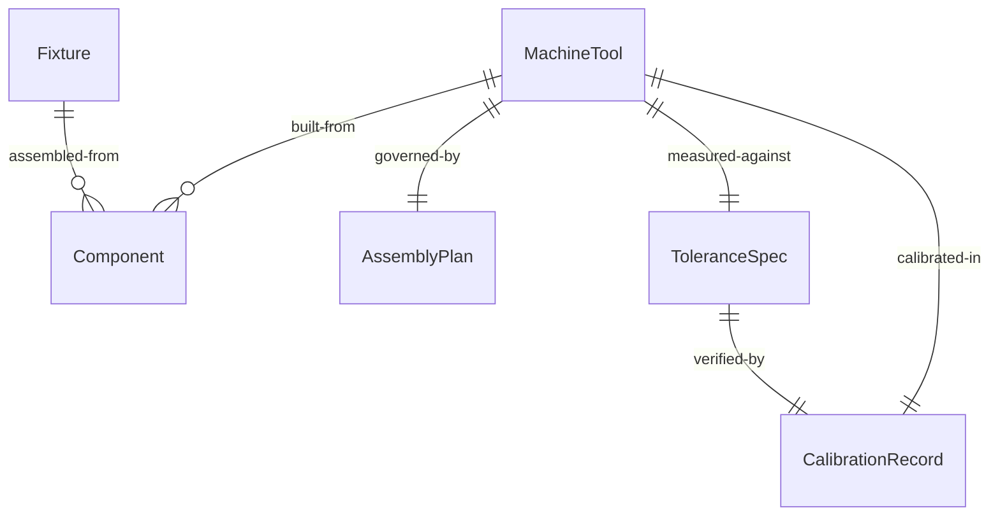
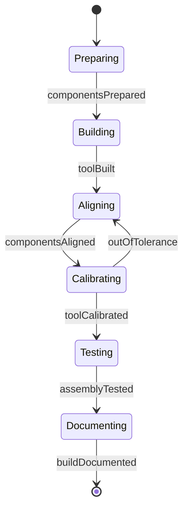
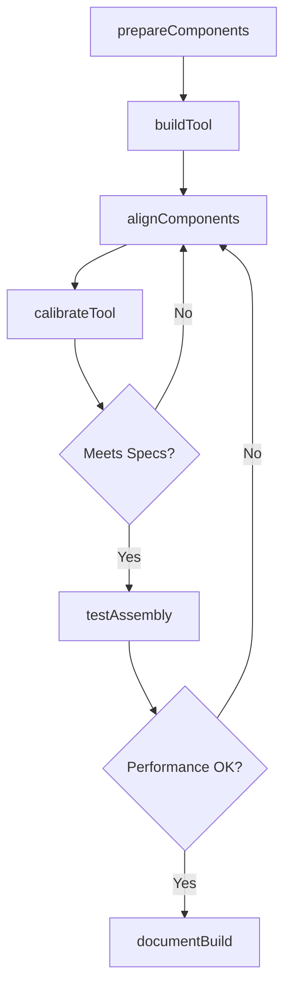
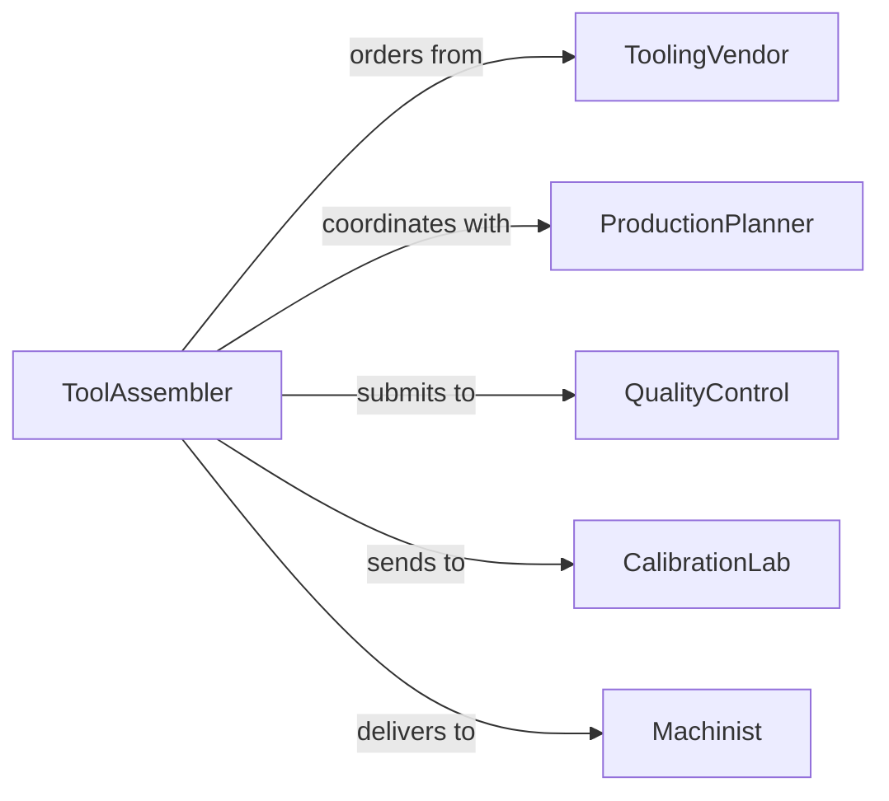

# Assemble Machine Tools Parts Fixtures

> Business-as-Code definition for assembling precision machine tools, tooling components, and fixtures used in manufacturing operations.

## Overview

Machine tool assembly involves constructing precision tooling equipment, work-holding fixtures, cutting tools, and related components. This definition models the complete assembly process from component preparation through final testing and calibration.

## Actors

| Actor | Description |
|-------|-------------|
| ToolingVendor | Supplies raw components and precision parts |
| QualityControl | Verifies dimensional accuracy and tolerances |
| ProductionPlanner | Schedules assembly based on manufacturing needs |
| Machinist | Uses completed tools in production operations |
| CalibrationLab | Performs precision measurement and adjustment |
| MaintenanceTeam | Services and repairs assembled tooling |

## Roles

| Role | Description |
|------|-------------|
| ToolAssembler | Constructs tools and fixtures from components |
| PrecisionMachinist | Creates custom parts for specialized tools |
| Inspector | Validates assembly quality and specifications |
| ToolEngineer | Designs tooling and provides technical guidance |

## Entities

| Entity | Description |
|--------|-------------|
| MachineTool | A precision device for cutting or shaping material |
| Fixture | A work-holding device that positions parts during machining |
| Component | An individual part used in tool assembly |
| AssemblyPlan | Instructions and specifications for tool construction |
| ToleranceSpec | Dimensional accuracy requirements for the tool |
| CalibrationRecord | Documentation of tool measurements and adjustments |

## Actions

| Action | Description |
|--------|-------------|
| prepareComponents | Clean, inspect, and stage parts for assembly |
| assembleFixture | Construct work-holding fixtures from components |
| buildTool | Assemble cutting tools or machine tool elements |
| alignComponents | Position parts to achieve specified tolerances |
| calibrateTool | Measure and adjust tool to meet precision requirements |
| testAssembly | Verify tool performance under operating conditions |
| documentBuild | Record assembly details and measurements |

## Events

| Event | Description |
|-------|-------------|
| componentsPrepared | Parts are ready for assembly |
| fixtureAssembled | Work-holding fixture construction is complete |
| toolBuilt | Machine tool assembly is finished |
| componentsAligned | Parts are positioned to specification |
| toolCalibrated | Tool measurements are verified and adjusted |
| assemblyTested | Tool has been validated under operating conditions |
| buildDocumented | Assembly records have been completed |

## Searches

| Search | Description |
|--------|-------------|
| findAssemblyPlans | Retrieve tooling specifications by part number or application |
| getToleranceSpecs | Find dimensional requirements for specific tools |
| getCalibrationHistory | View measurement records for assembled tools |
| findPendingAssemblies | List tools scheduled for construction |
## Entity Relationships




## State Diagram




## Workflow



## Actor Relationships



## Usage

### Calling Actions

```typescript
import { assembleMachineToolsPartsFixtures } from '@headlessly/assemble-machine-tools-parts-fixtures'

const tools = assembleMachineToolsPartsFixtures()

// Prepare components for a fixture assembly
await tools.prepareComponents({
  assemblyId: 'FIX-2026-0045',
  components: ['base-plate', 'clamp-assembly', 'guide-pins'],
  cleaningRequired: true
})

// Build a precision cutting tool
const tool = await tools.buildTool({
  toolNumber: 'CT-5500',
  type: 'boring-bar',
  specifications: {
    diameter: 25.0,
    length: 200.0,
    tolerance: 0.005
  }
})

// Calibrate the completed tool
await tools.calibrateTool({
  toolId: tool.id,
  measurements: ['runout', 'concentricity', 'length'],
  targetTolerance: 0.005
})
```

### Event-Driven Automation

```typescript
// Send to calibration after assembly
tools.toolBuilt(async ({ toolId, specifications }) => {
  if (specifications.tolerance < 0.01) {
    await tools.calibrateTool({
      toolId,
      priority: 'high',
      measurements: ['runout', 'concentricity']
    })
  }
})

// Alert on failed calibration
tools.toolCalibrated(async ({ toolId, measurements, status }) => {
  if (status === 'out-of-tolerance') {
    await notify({
      to: 'tool-engineering',
      message: `Tool ${toolId} failed calibration: ${measurements.join(', ')}`
    })
  }
})
```
