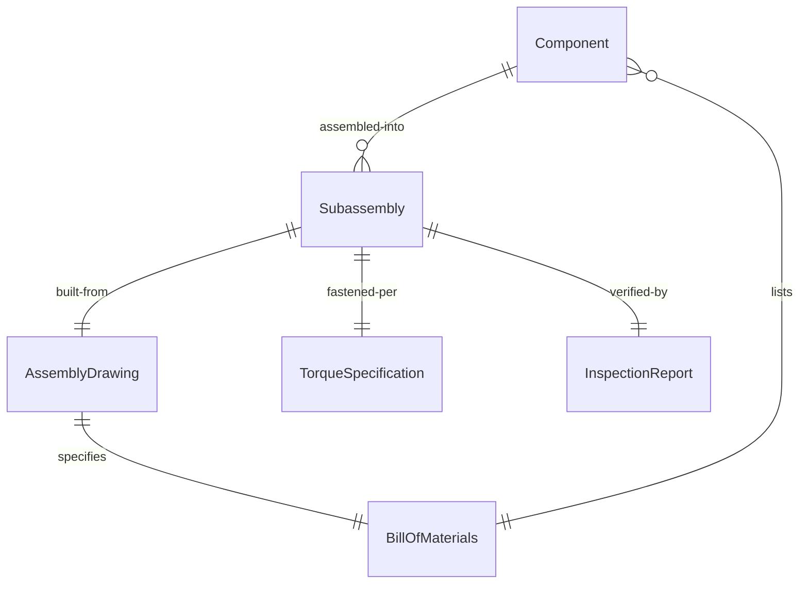
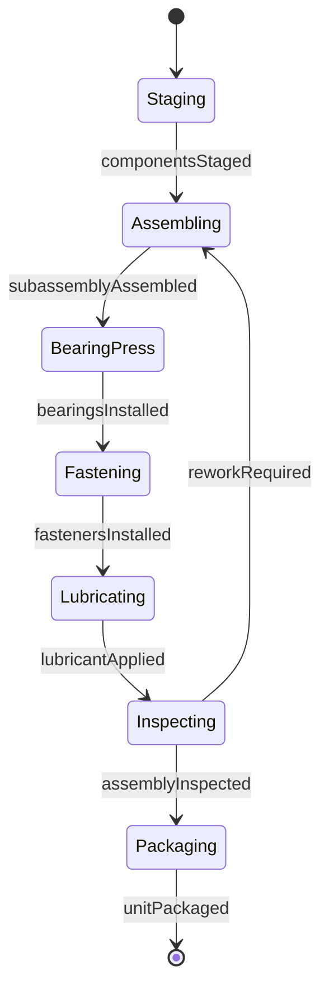
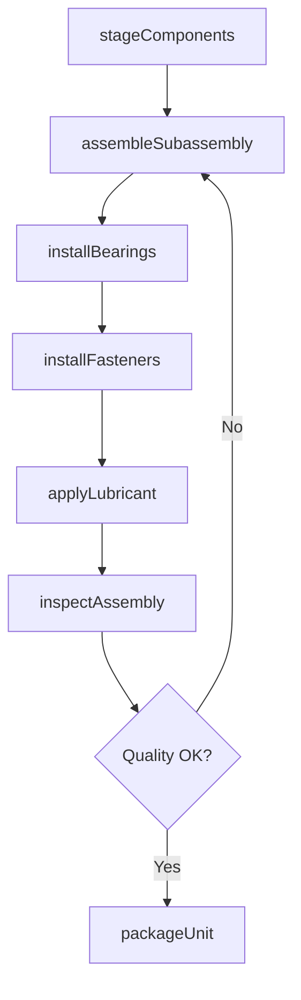
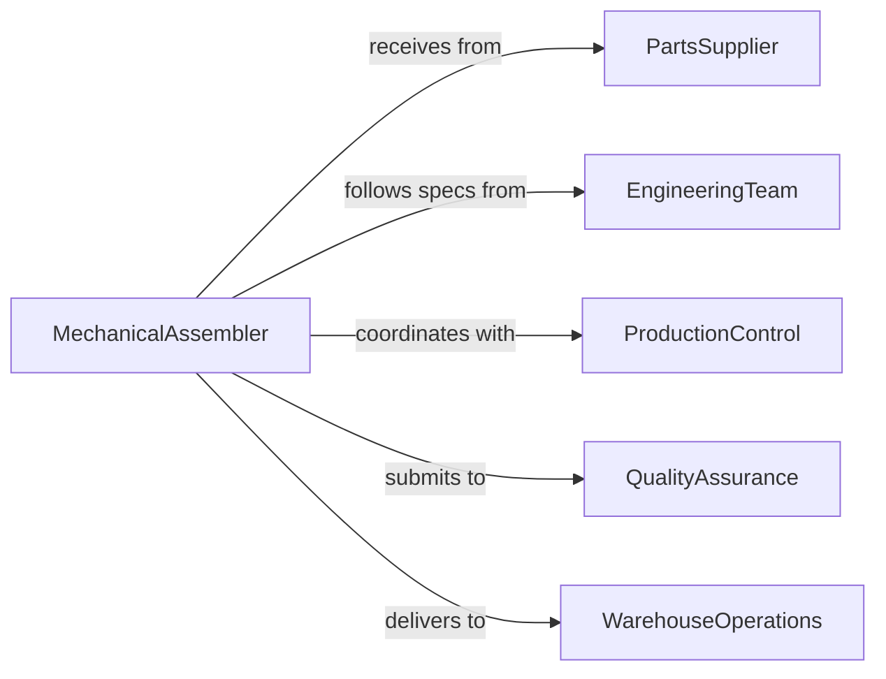

# Assemble Mechanical Components Machine Parts

> Business-as-Code definition for assembling mechanical components, machine parts, and subassemblies used in equipment manufacturing and maintenance.

## Overview

Mechanical component assembly involves constructing gears, bearings, shafts, housings, and other mechanical parts into functional subassemblies. This definition models the assembly workflow from parts preparation through final inspection and integration.

## Actors

| Actor | Description |
|-------|-------------|
| PartsSupplier | Provides mechanical components and hardware |
| EngineeringTeam | Supplies assembly drawings and specifications |
| ProductionControl | Schedules assembly work based on demand |
| QualityAssurance | Inspects completed assemblies for defects |
| EquipmentManufacturer | Uses completed parts in final products |
| WarehouseOperations | Stores finished assemblies until needed |

## Roles

| Role | Description |
|------|-------------|
| MechanicalAssembler | Constructs mechanical subassemblies from components |
| TechnicalLead | Provides assembly guidance and troubleshooting |
| QualityInspector | Verifies assembly quality and dimensional accuracy |
| MaterialHandler | Stages parts and moves completed assemblies |

## Entities

| Entity | Description |
|--------|-------------|
| Component | An individual mechanical part used in assembly |
| Subassembly | A group of components assembled into a functional unit |
| AssemblyDrawing | Technical documentation showing part relationships |
| BillOfMaterials | List of components required for assembly |
| TorqueSpecification | Fastener tightening requirements |
| InspectionReport | Quality verification documentation |

## Actions

| Action | Description |
|--------|-------------|
| stageComponents | Gather and organize parts for assembly |
| assembleSubassembly | Construct mechanical unit from components |
| installBearings | Press or mount bearing assemblies |
| installFasteners | Apply bolts, screws, or rivets to specification |
| applyLubricant | Add grease or oil to moving parts |
| inspectAssembly | Verify dimensions and functionality |
| packageUnit | Prepare completed assembly for storage or shipment |

## Events

| Event | Description |
|-------|-------------|
| componentsStaged | Parts are ready for assembly |
| subassemblyAssembled | Mechanical unit construction is complete |
| bearingsInstalled | Bearing assemblies are mounted and secured |
| fastenersInstalled | Fasteners are applied to torque specification |
| lubricantApplied | Moving parts are properly lubricated |
| assemblyInspected | Quality verification is complete |
| unitPackaged | Assembly is ready for delivery or storage |

## Searches

| Search | Description |
|--------|-------------|
| findAssemblyDrawings | Retrieve technical documentation by part number |
| getBillOfMaterials | List components required for specific assembly |
| getTorqueSpecs | Find fastener tightening requirements |
| getPendingWork | View assemblies scheduled for construction |
## Entity Relationships




## State Diagram




## Workflow



## Actor Relationships



## Usage

### Calling Actions

```typescript
import { assembleMechanicalComponentsMachineParts } from '@headlessly/assemble-mechanical-components-machine-parts'

const mechanical = assembleMechanicalComponentsMachineParts()

// Stage components for a gearbox assembly
await mechanical.stageComponents({
  assemblyNumber: 'GB-450',
  components: [
    { partNumber: 'GEAR-100', quantity: 3 },
    { partNumber: 'SHAFT-200', quantity: 2 },
    { partNumber: 'BEARING-300', quantity: 4 }
  ]
})

// Assemble the subassembly
const assembly = await mechanical.assembleSubassembly({
  assemblyNumber: 'GB-450',
  drawingRevision: 'C',
  workstation: 'AS-12'
})

// Install fasteners with torque specifications
await mechanical.installFasteners({
  assemblyId: assembly.id,
  fasteners: [
    { type: 'M8-bolt', quantity: 12, torque: 25 }
  ]
})
```

### Event-Driven Automation

```typescript
// Apply lubricant after bearings are installed
mechanical.bearingsInstalled(async ({ assemblyId, bearingTypes }) => {
  await mechanical.applyLubricant({
    assemblyId,
    lubricant: 'lithium-grease',
    locations: bearingTypes.map(b => b.location)
  })
})

// Trigger inspection after fasteners are installed
mechanical.fastenersInstalled(async ({ assemblyId }) => {
  await mechanical.inspectAssembly({
    assemblyId,
    checkpoints: ['torque', 'alignment', 'function']
  })
})
```
