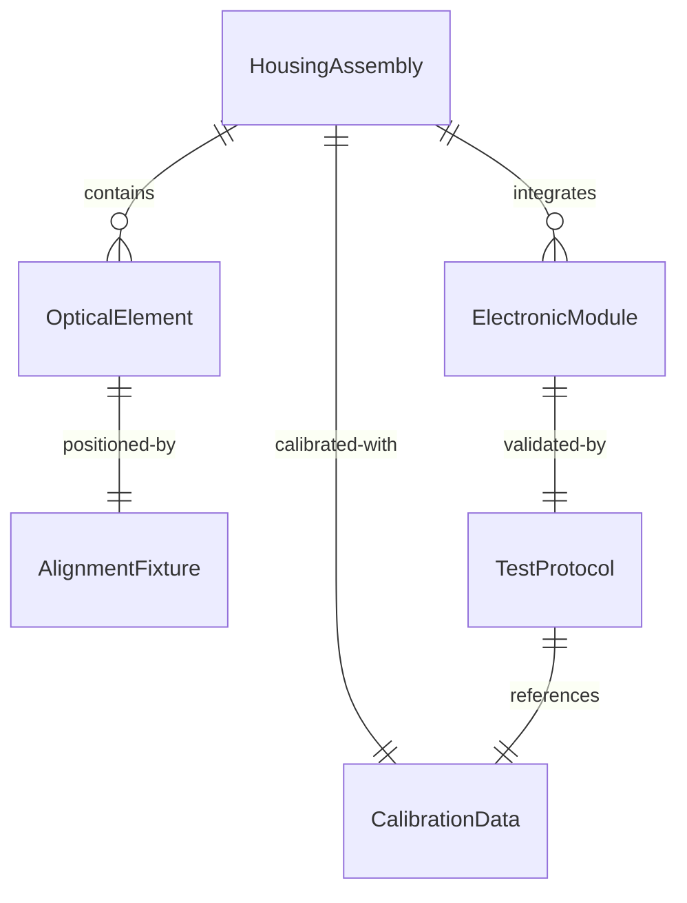
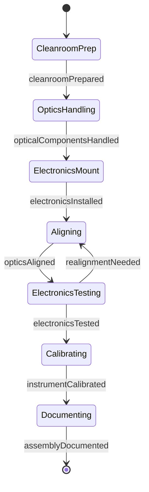
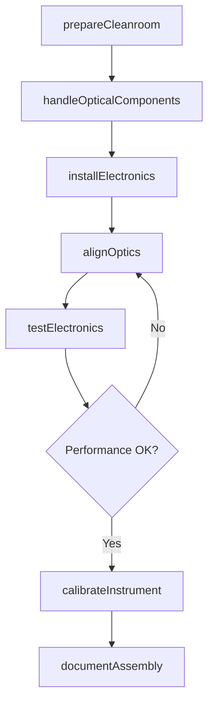
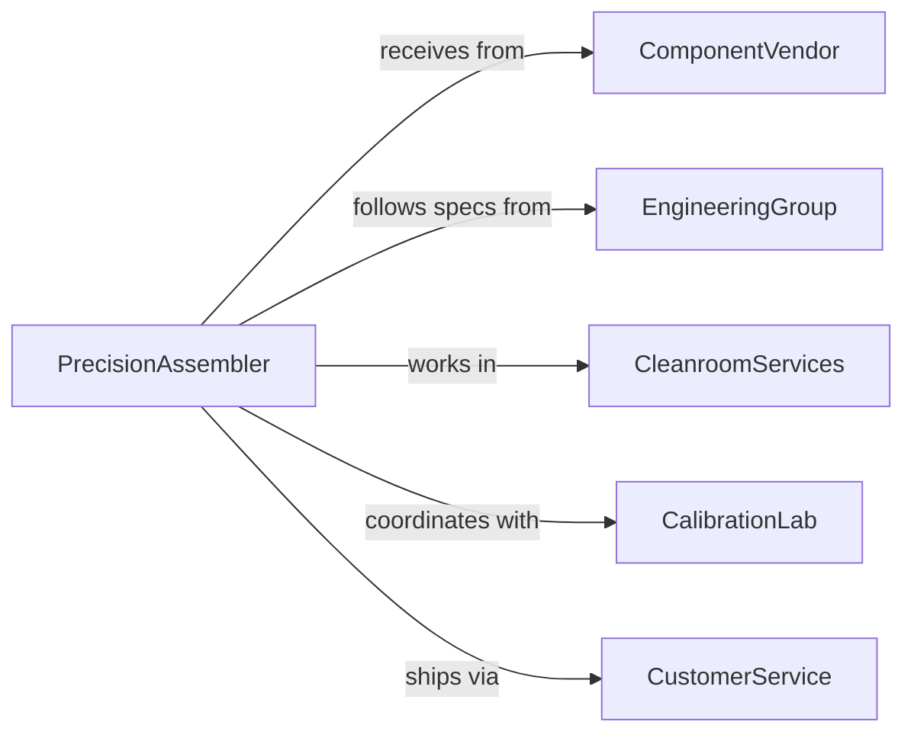

# Assemble Precision Electronics Optical Equipment

> Business-as-Code definition for assembling high-precision electronic and optical equipment including sensors, cameras, microscopes, and measurement instruments.

## Overview

Precision electronics and optical assembly involves constructing delicate components into functional instruments that require tight tolerances, clean environments, and careful handling. This definition models the specialized assembly workflow from component preparation through optical alignment and electronic testing.

## Actors

| Actor | Description |
|-------|-------------|
| ComponentVendor | Supplies optical elements and electronic components |
| EngineeringGroup | Provides assembly specifications and test procedures |
| CleanroomServices | Maintains controlled assembly environment |
| CalibrationLab | Performs optical alignment and electronic calibration |
| CustomerService | Coordinates delivery to end customers |
| RegulatorAgency | Verifies compliance with industry standards |

## Roles

| Role | Description |
|------|-------------|
| PrecisionAssembler | Constructs delicate electronic and optical assemblies |
| OpticalTechnician | Aligns and adjusts optical components |
| ElectronicsSpecialist | Tests and troubleshoots electronic circuits |
| QualityEngineer | Validates assembly performance and specifications |

## Entities

| Entity | Description |
|--------|-------------|
| OpticalElement | Lens, mirror, prism, or other light-manipulating component |
| ElectronicModule | Circuit board or electronic subassembly |
| HousingAssembly | Mechanical structure containing optical and electronic parts |
| AlignmentFixture | Precision jig for positioning optical components |
| TestProtocol | Procedures for validating equipment performance |
| CalibrationData | Measurements and adjustments made during assembly |

## Actions

| Action | Description |
|--------|-------------|
| prepareCleanroom | Establish controlled environment for assembly |
| handleOpticalComponents | Clean and position delicate optical elements |
| installElectronics | Mount and connect electronic modules |
| alignOptics | Adjust components to achieve optical specifications |
| testElectronics | Verify electronic circuit functionality |
| calibrateInstrument | Fine-tune equipment to meet performance standards |
| documentAssembly | Record all measurements and adjustments |

## Events

| Event | Description |
|-------|-------------|
| cleanroomPrepared | Controlled environment is ready for assembly |
| opticalComponentsHandled | Delicate elements are positioned in housing |
| electronicsInstalled | Electronic modules are mounted and connected |
| opticsAligned | Optical path is adjusted to specification |
| electronicsTested | Circuit functionality is verified |
| instrumentCalibrated | Equipment meets all performance requirements |
| assemblyDocumented | Complete assembly records are finalized |

## Searches

| Search | Description |
|--------|-------------|
| findAssemblyProcedures | Retrieve step-by-step instructions by product model |
| getTestProtocols | Find validation procedures for specific instruments |
| getCalibrationHistory | View adjustment records for completed units |
| findOpticalSpecs | Retrieve alignment tolerances for optical elements |
## Entity Relationships




## State Diagram




## Workflow



## Actor Relationships



## Usage

### Calling Actions

```typescript
import { assemblePrecisionElectronicsOpticalEquipment } from '@headlessly/assemble-precision-electronics-optical-equipment'

const precision = assemblePrecisionElectronicsOpticalEquipment()

// Prepare cleanroom for microscope assembly
await precision.prepareCleanroom({
  productType: 'confocal-microscope',
  particleClass: 'ISO-5',
  temperature: 21.0,
  humidity: 45
})

// Handle and position optical components
await precision.handleOpticalComponents({
  assemblyId: 'MICRO-2026-045',
  elements: [
    { type: 'objective-lens', magnification: 100 },
    { type: 'tube-lens', focalLength: 200 },
    { type: 'dichroic-mirror', wavelength: 488 }
  ]
})

// Align optical path
await precision.alignOptics({
  assemblyId: 'MICRO-2026-045',
  targetResolution: 0.2,
  wavelength: 550
})
```

### Event-Driven Automation

```typescript
// Trigger electronics test after optics are aligned
precision.opticsAligned(async ({ assemblyId }) => {
  await precision.testElectronics({
    assemblyId,
    tests: ['power-on', 'signal-path', 'noise-level']
  })
})

// Alert on calibration failure
precision.instrumentCalibrated(async ({ assemblyId, status, deviations }) => {
  if (status === 'out-of-spec') {
    await notify({
      to: 'optical-engineering',
      message: `Unit ${assemblyId} failed calibration: ${deviations.join(', ')}`
    })
  }
})
```
