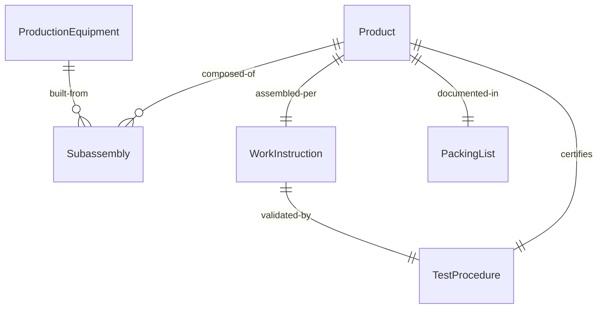
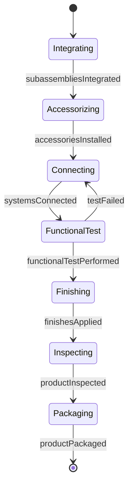
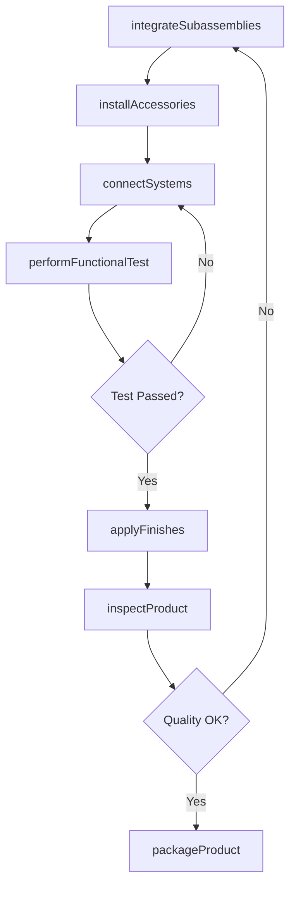
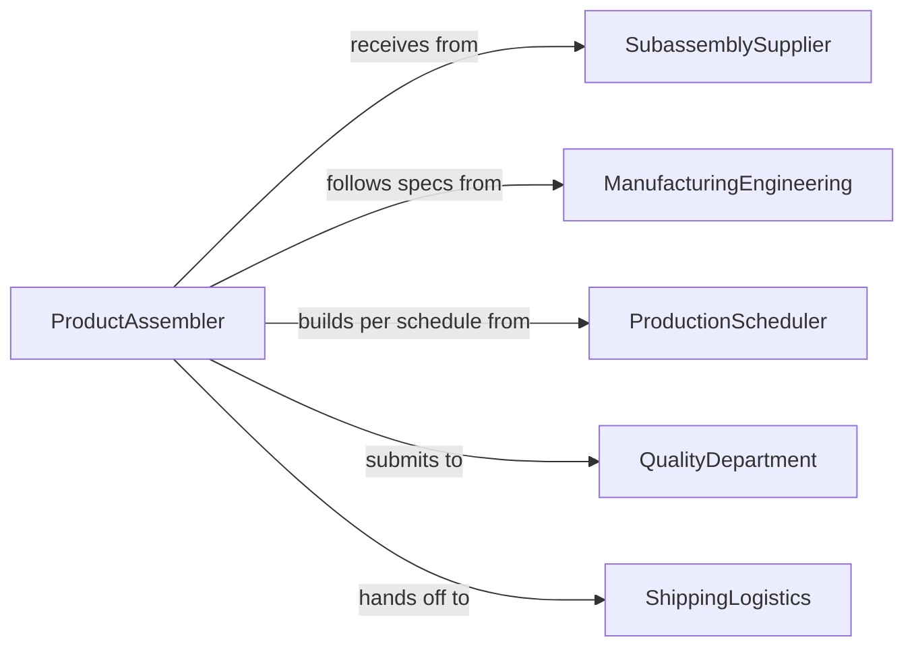

# Assemble Products Production Equipment

> Business-as-Code definition for assembling finished products and manufacturing equipment used in production operations.

## Overview

Product and production equipment assembly involves constructing complete units from subassemblies, components, and materials. This definition models the end-stage assembly process including final construction, functional testing, and quality validation before release to customers or production floors.

## Actors

| Actor | Description |
|-------|-------------|
| SubassemblySupplier | Provides major components and prefabricated parts |
| ManufacturingEngineering | Designs assembly processes and tooling |
| ProductionScheduler | Coordinates build sequence based on orders |
| QualityDepartment | Validates completed products against specifications |
| ShippingLogistics | Transports finished goods to customers |
| ServiceTeam | Installs and commissions production equipment |

## Roles

| Role | Description |
|------|-------------|
| ProductAssembler | Constructs final products from subassemblies |
| EquipmentBuilder | Assembles production machinery and equipment |
| TestTechnician | Validates product functionality and performance |
| PackagingSpecialist | Prepares finished products for shipment |

## Entities

| Entity | Description |
|--------|-------------|
| Product | A finished good ready for customer delivery |
| ProductionEquipment | Machinery used in manufacturing operations |
| Subassembly | Major component integrated into final product |
| WorkInstruction | Step-by-step assembly procedures |
| TestProcedure | Functional validation requirements |
| PackingList | Documentation of product contents and accessories |

## Actions

| Action | Description |
|--------|-------------|
| integrateSubassemblies | Combine major components into final product |
| installAccessories | Add supplementary parts and optional features |
| connectSystems | Join electrical, hydraulic, or pneumatic systems |
| performFunctionalTest | Validate product operates as designed |
| applyFinishes | Add paint, labels, or protective coatings |
| inspectProduct | Verify all specifications are met |
| packageProduct | Prepare finished product for shipment or use |

## Events

| Event | Description |
|-------|-------------|
| subassembliesIntegrated | Major components are combined into final product |
| accessoriesInstalled | Supplementary parts are added |
| systemsConnected | All subsystems are joined and operational |
| functionalTestPerformed | Product validation is complete |
| finishesApplied | Final coatings and markings are added |
| productInspected | Quality verification is finished |
| productPackaged | Product is ready for delivery |

## Searches

| Search | Description |
|--------|-------------|
| findWorkInstructions | Retrieve assembly procedures by product model |
| getTestProcedures | Find validation requirements for specific products |
| getBuildSchedule | View products scheduled for assembly |
| getQualityRecords | Retrieve inspection history for completed units |
## Entity Relationships




## State Diagram




## Workflow



## Actor Relationships



## Usage

### Calling Actions

```typescript
import { assembleProductsProductionEquipment } from '@headlessly/assemble-products-production-equipment'

const assembly = assembleProductsProductionEquipment()

// Integrate major subassemblies into final product
await assembly.integrateSubassemblies({
  productModel: 'CNC-5000',
  subassemblies: [
    { type: 'machine-base', serialNumber: 'BASE-2026-123' },
    { type: 'spindle-assembly', serialNumber: 'SPIN-2026-456' },
    { type: 'control-cabinet', serialNumber: 'CTRL-2026-789' }
  ]
})

// Connect all systems
await assembly.connectSystems({
  productId: 'CNC-5000-045',
  systems: ['electrical', 'hydraulic', 'coolant']
})

// Perform functional validation
const testResult = await assembly.performFunctionalTest({
  productId: 'CNC-5000-045',
  tests: ['axis-movement', 'spindle-speed', 'tool-change', 'accuracy']
})
```

### Event-Driven Automation

```typescript
// Trigger functional test after systems are connected
assembly.systemsConnected(async ({ productId }) => {
  await assembly.performFunctionalTest({
    productId,
    tests: ['power-on', 'communications', 'safety-interlocks']
  })
})

// Alert on test failure
assembly.functionalTestPerformed(async ({ productId, result }) => {
  if (result.status === 'failed') {
    await notify({
      to: 'production-engineering',
      message: `Product ${productId} failed test: ${result.failures.join(', ')}`
    })
  }
})
```
