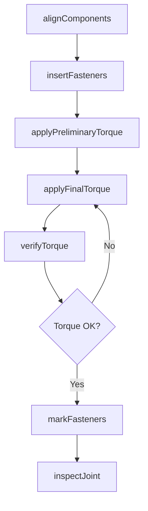
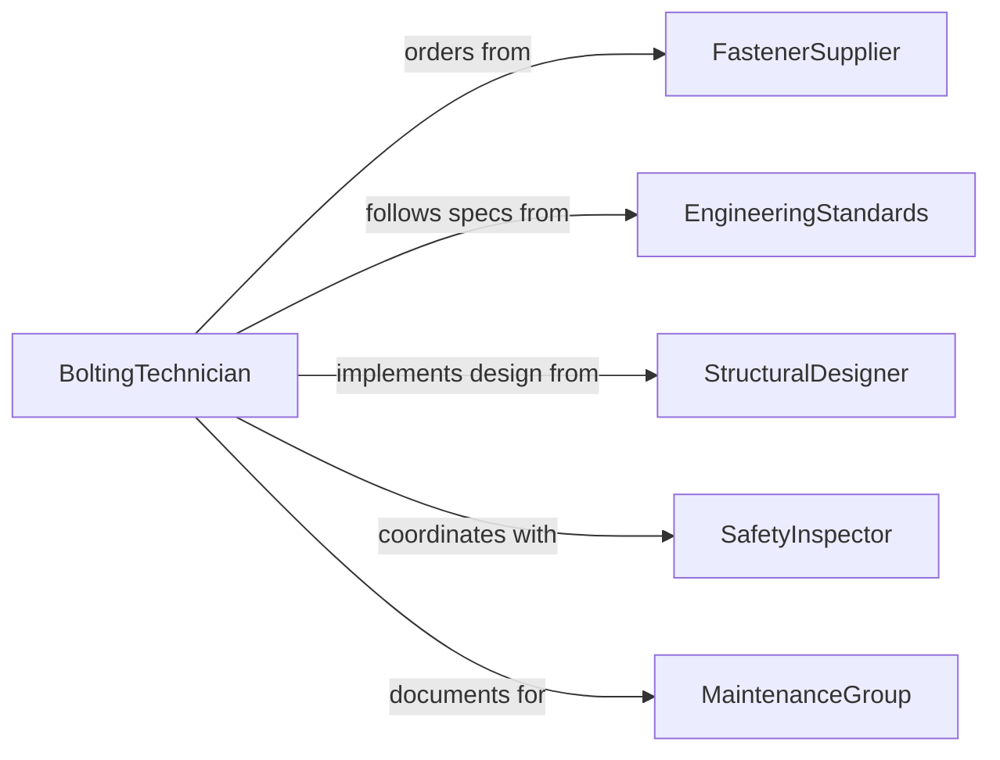

# Bolt Objects Into Place

> Business-as-Code definition for securing components, structures, and equipment using bolts, fasteners, and torque-controlled connections.

## Overview

Bolting operations involve attaching components using threaded fasteners that require precise positioning, torque application, and quality verification. This definition models the bolting workflow from preparation and alignment through torque application and inspection.

## Actors

| Actor | Description |
|-------|-------------|
| FastenerSupplier | Provides bolts, nuts, washers, and related hardware |
| EngineeringStandards | Defines torque specifications and fastener grades |
| StructuralDesigner | Specifies bolt patterns and connection details |
| SafetyInspector | Verifies critical bolted connections |
| MaintenanceGroup | Services bolted joints during equipment life |
| RegulatorBody | Enforces standards for structural connections |

## Roles

| Role | Description |
|------|-------------|
| BoltingTechnician | Installs and torques fasteners to specification |
| TorqueOperator | Applies calibrated tools to achieve required preload |
| QualityInspector | Verifies torque values and connection integrity |
| JointEngineer | Designs bolted connections and provides technical guidance |

## Entities

| Entity | Description |
|--------|-------------|
| BoltedJoint | A connection secured with threaded fasteners |
| Fastener | Bolt, nut, washer, or related hardware |
| TorqueSpecification | Required tightening value and method |
| BoltPattern | Arrangement of fasteners in a joint |
| TorqueRecord | Documentation of applied values |
| JointInspection | Quality verification of completed connection |

## Actions

| Action | Description |
|--------|-------------|
| alignComponents | Position parts for accurate bolt hole alignment |
| insertFasteners | Place bolts through holes and engage nuts |
| applyPreliminaryTorque | Tighten fasteners to initial setting |
| applyFinalTorque | Tighten fasteners to specified value |
| verifyTorque | Check applied torque with calibrated tool |
| markFasteners | Apply witness marks to indicate completion |
| inspectJoint | Verify connection quality and integrity |

## Events

| Event | Description |
|-------|-------------|
| componentsAligned | Parts are positioned for bolting |
| fastenersInserted | Bolts are placed in all holes |
| preliminaryTorqueApplied | Initial tightening is complete |
| finalTorqueApplied | Specified torque values are achieved |
| torqueVerified | Applied values are confirmed with calibrated tool |
| fastenersMarked | Witness marks are applied |
| jointInspected | Connection quality is verified |

## Searches

| Search | Description |
|--------|-------------|
| findTorqueSpecs | Retrieve tightening requirements by fastener size and grade |
| getBoltPatterns | Find fastener arrangements for specific connections |
| getTorqueRecords | View torque data for completed joints |
| getPendingWork | List connections scheduled for bolting |

## Workflow



## Actor Relationships



## Usage

### Calling Actions

```typescript
import { boltObjectsIntoPlace } from '@headlessly/bolt-objects-into-place'

const bolting = boltObjectsIntoPlace()

// Align components for a structural connection
await bolting.alignComponents({
  jointId: 'JOINT-450-A',
  components: ['beam-flange', 'column-face'],
  alignmentTolerance: 1.0
})

// Insert all fasteners
await bolting.insertFasteners({
  jointId: 'JOINT-450-A',
  fasteners: [
    { size: 'M20', grade: '8.8', quantity: 16 }
  ]
})

// Apply final torque
await bolting.applyFinalTorque({
  jointId: 'JOINT-450-A',
  torqueValue: 300,
  torqueUnit: 'Nm',
  pattern: 'star'
})
```

### Event-Driven Automation

```typescript
// Verify torque after final application
bolting.finalTorqueApplied(async ({ jointId }) => {
  await bolting.verifyTorque({
    jointId,
    sampleSize: '100%',
    method: 'torque-wrench'
  })
})

// Alert on torque verification failure
bolting.torqueVerified(async ({ jointId, result }) => {
  if (result.status === 'out-of-spec') {
    await notify({
      to: 'quality-engineering',
      message: `Joint ${jointId} torque verification failed: ${result.deviations.join(', ')}`
    })
  }
})
```
