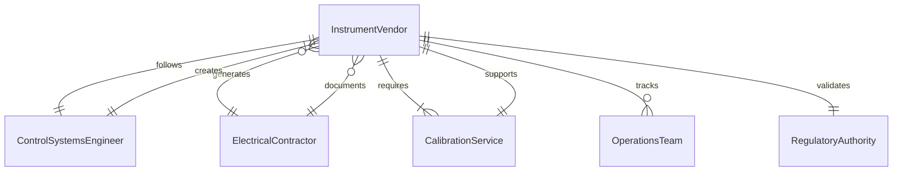
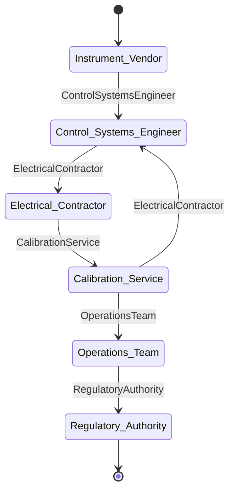
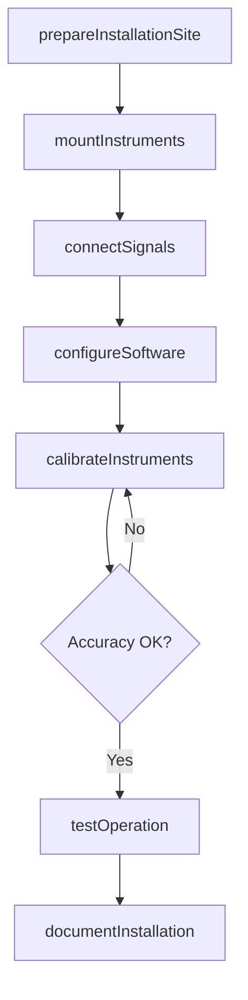
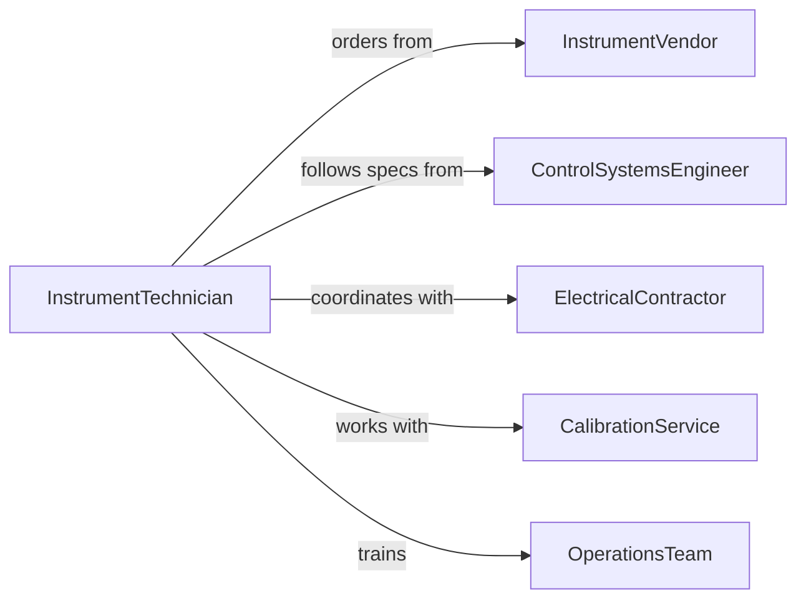

# Install Gauges Controls

> Business-as-Code definition for installing measurement gauges, control panels, instruments, and monitoring devices on equipment and systems.

## Overview

Gauge and control installation involves mounting, wiring, and configuring measurement instruments, operator interfaces, and control devices. This definition models the installation workflow from site preparation through calibration and commissioning.

## Actors

| Actor | Description |
|-------|-------------|
| InstrumentVendor | Supplies gauges, sensors, and control devices |
| ControlSystemsEngineer | Designs instrumentation and control schemes |
| ElectricalContractor | Provides wiring and power infrastructure |
| CalibrationService | Certifies instrument accuracy |
| OperationsTeam | Uses installed instruments to monitor processes |
| RegulatoryAuthority | Verifies compliance with measurement standards |

## Roles

| Role | Description |
|------|-------------|
| InstrumentTechnician | Installs and configures gauges and controls |
| ElectricalInstaller | Wires instruments to control systems |
| CalibrationTech | Adjusts instruments to meet accuracy requirements |
| CommissioningEngineer | Validates installed instruments in operation |

## Entities

| Entity | Description |
|--------|-------------|
| Gauge | A measurement instrument displaying process variables |
| ControlPanel | An operator interface with displays and controls |
| Sensor | A device that measures physical properties |
| SignalWiring | Electrical connections between instruments and systems |
| CalibrationCertificate | Documentation of instrument accuracy |
| InstallationDrawing | Technical documentation showing instrument locations |

## Actions

| Action | Description |
|--------|-------------|
| prepareInstallationSite | Ready mounting locations and infrastructure |
| mountInstruments | Physically attach gauges and control panels |
| connectSignals | Wire instruments to control systems |
| configureSoftware | Program control parameters and displays |
| calibrateInstruments | Adjust sensors and gauges to known standards |
| testOperation | Verify instruments respond correctly to process changes |
| documentInstallation | Record all settings and calibration data |

## Events

| Event | Description |
|-------|-------------|
| installationSitePrepared | Mounting locations are ready for instruments |
| instrumentsMounted | Gauges and controls are physically installed |
| signalsConnected | Wiring is complete and verified |
| softwareConfigured | Control parameters and displays are programmed |
| instrumentsCalibrated | Accuracy is verified against standards |
| operationTested | Instruments respond correctly to process conditions |
| installationDocumented | All records are complete |

## Searches

| Search | Description |
|--------|-------------|
| findInstallationDrawings | Retrieve instrument location plans |
| getCalibrationProcedures | Find adjustment methods for specific instruments |
| getWiringDiagrams | View signal connection details |
| getPendingInstallations | List instruments scheduled for installation |
## Entity Relationships




## State Diagram




## Workflow



## Actor Relationships



## Usage

### Calling Actions

```typescript
import { installGaugesControls } from '@headlessly/install-gauges-controls'

const instrumentation = installGaugesControls()

// Prepare site for pressure gauge installation
await instrumentation.prepareInstallationSite({
  location: 'reactor-vessel-01',
  instruments: ['pressure-gauge', 'temperature-sensor'],
  utilities: ['power', 'instrument-air']
})

// Mount instruments
await instrumentation.mountInstruments({
  location: 'reactor-vessel-01',
  instruments: [
    { type: 'pressure-gauge', range: '0-1000-psi', tag: 'PI-101' },
    { type: 'temperature-RTD', range: '0-500-C', tag: 'TI-101' }
  ]
})

// Calibrate installed instruments
await instrumentation.calibrateInstruments({
  instruments: ['PI-101', 'TI-101'],
  standardsUsed: ['deadweight-tester', 'dry-block-calibrator']
})
```

### Event-Driven Automation

```typescript
// Configure software after signals are connected
instrumentation.signalsConnected(async ({ location, instruments }) => {
  await instrumentation.configureSoftware({
    location,
    instruments,
    parameters: ['scaling', 'alarms', 'trending']
  })
})

// Alert on calibration failure
instrumentation.instrumentsCalibrated(async ({ instruments, results }) => {
  const failures = results.filter(r => r.status === 'out-of-tolerance')
  if (failures.length > 0) {
    await notify({
      to: 'instrumentation-engineering',
      message: `Calibration failed for: ${failures.map(f => f.tag).join(', ')}`
    })
  }
})
```
