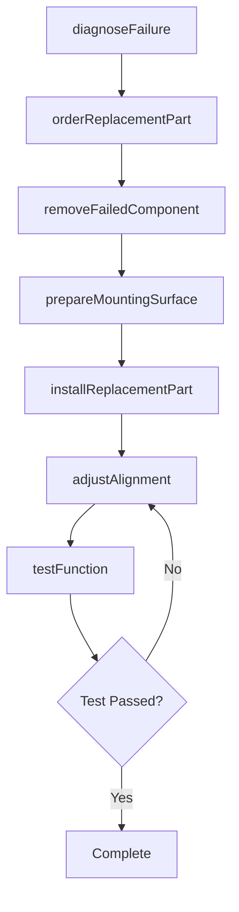
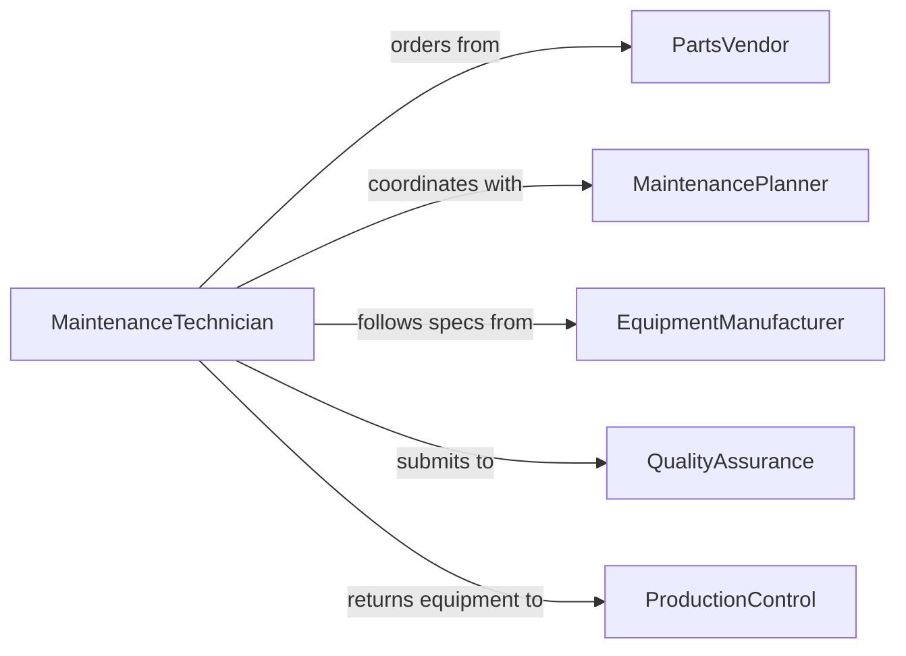

# Install Machine Equipment Replacement Parts

> Business-as-Code definition for replacing worn, damaged, or obsolete components in machinery and production equipment to restore or improve functionality.

## Overview

Replacement parts installation involves removing failed components, preparing mounting surfaces, installing new parts, and validating proper function. This definition models the parts replacement workflow from failure diagnosis through installation and testing.

## Actors

| Actor | Description |
|-------|-------------|
| PartsVendor | Supplies replacement components and assemblies |
| MaintenancePlanner | Schedules parts installation to minimize downtime |
| EquipmentManufacturer | Provides technical specifications and procedures |
| QualityAssurance | Verifies replacement parts meet requirements |
| ProductionControl | Coordinates equipment availability |
| WarehouseOperations | Manages replacement parts inventory |

## Roles

| Role | Description |
|------|-------------|
| MaintenanceTechnician | Removes and installs replacement parts |
| MechanicalSpecialist | Handles complex mechanical components |
| ElectricalTech | Replaces electrical and electronic parts |
| Inspector | Validates installation quality and function |

## Entities

| Entity | Description |
|--------|-------------|
| ReplacementPart | A new component to be installed in equipment |
| FailedComponent | A worn or damaged part requiring replacement |
| WorkOrder | Instructions for parts replacement activity |
| InstallationProcedure | Step-by-step replacement instructions |
| FunctionalTest | Validation of equipment after parts installation |
| MaintenanceRecord | Documentation of replacement activity |

## Actions

| Action | Description |
|--------|-------------|
| diagnoseFaillure | Identify component requiring replacement |
| orderReplacementPart | Procure new component from vendor or warehouse |
| removeFailedComponent | Disassemble and extract damaged part |
| prepareMountingSurface | Clean and inspect mounting location |
| installReplacementPart | Install and secure new component |
| adjustAlignment | Set proper positioning and clearances |
| testFunction | Verify equipment operates correctly with new part |

## Events

| Event | Description |
|-------|-------------|
| failureDiagnosed | Component requiring replacement is identified |
| replacementPartOrdered | New component is requested from supply chain |
| failedComponentRemoved | Damaged part is extracted from equipment |
| mountingSurfacePrepared | Installation location is ready |
| replacementPartInstalled | New component is mounted and secured |
| alignmentAdjusted | Proper positioning is achieved |
| functionTested | Equipment validation is complete |

## Searches

| Search | Description |
|--------|-------------|
| findInstallationProcedures | Retrieve replacement instructions by part number |
| getPartAvailability | Check inventory status for specific components |
| getMaintenanceHistory | View previous replacement activities |
| getPendingWorkOrders | List scheduled parts installations |

## Workflow



## Actor Relationships



## Usage

### Calling Actions

```typescript
import { installMachineEquipmentReplacementParts } from '@headlessly/install-machine-equipment-replacement-parts'

const parts = installMachineEquipmentReplacementParts()

// Diagnose failed component
const diagnosis = await parts.diagnoseFailure({
  equipmentId: 'CNC-450',
  symptoms: ['excessive-vibration', 'noise'],
  inspectionDate: '2026-02-05'
})

// Order replacement part
await parts.orderReplacementPart({
  equipmentId: 'CNC-450',
  partNumber: 'BEARING-2030',
  failedComponent: diagnosis.componentId,
  urgency: 'high'
})

// Install replacement part
await parts.installReplacementPart({
  equipmentId: 'CNC-450',
  partNumber: 'BEARING-2030',
  workOrder: 'WO-2026-1234',
  torqueSpec: 85
})
```

### Event-Driven Automation

```typescript
// Automatically test function after part installation
parts.replacementPartInstalled(async ({ equipmentId, partNumber }) => {
  await parts.testFunction({
    equipmentId,
    tests: ['vibration', 'noise', 'temperature'],
    duration: 3600
  })
})

// Alert on test failure
parts.functionTested(async ({ equipmentId, result }) => {
  if (result.status === 'failed') {
    await notify({
      to: 'maintenance-engineering',
      message: `Equipment ${equipmentId} failed post-installation test: ${result.failures.join(', ')}`
    })
  }
})
```
