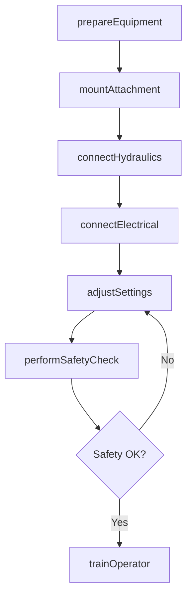
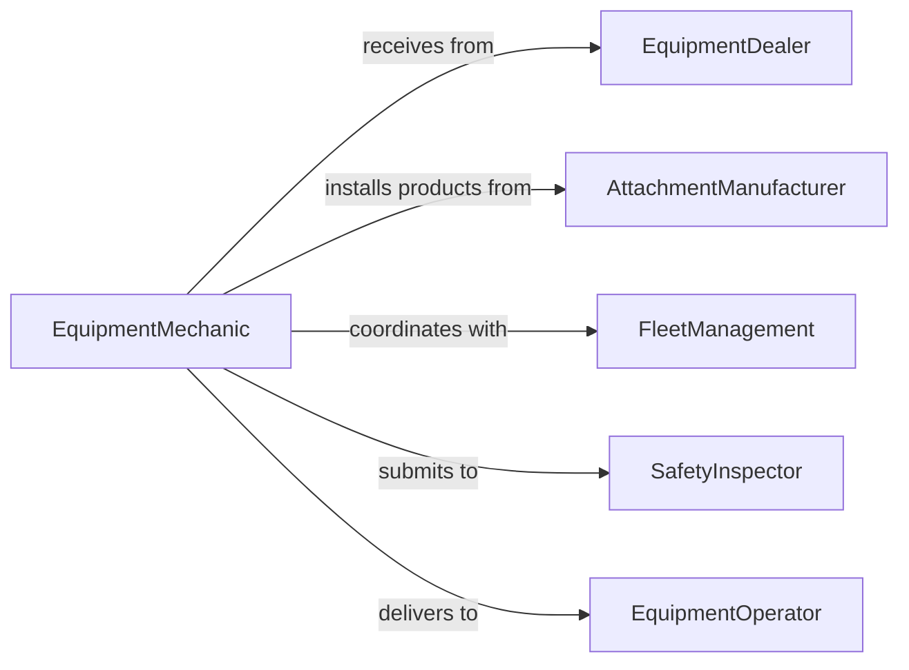

# Install Parts Assemblies Attachments Transportation

> Business-as-Code definition for installing components, assemblies, and attachments in transportation vehicles, material handling equipment, and mobile machinery.

## Overview

Transportation equipment installation involves mounting parts, assemblies, and attachments on vehicles, forklifts, cranes, and material handling systems. This definition models the installation workflow from equipment preparation through mounting, connection, and operational testing.

## Actors

| Actor | Description |
|-------|-------------|
| EquipmentDealer | Supplies vehicles and material handling equipment |
| AttachmentManufacturer | Provides specialized implements and accessories |
| FleetManagement | Manages vehicle and equipment inventory |
| SafetyInspector | Verifies installation meets safety standards |
| EquipmentOperator | Uses installed attachments in daily operations |
| RegulatorAgency | Enforces transportation and safety regulations |

## Roles

| Role | Description |
|------|-------------|
| EquipmentMechanic | Installs parts and assemblies on vehicles |
| HydraulicsTech | Connects hydraulic systems for powered attachments |
| ElectricalTech | Wires electrical and electronic components |
| SafetyInspector | Validates installation compliance and function |

## Entities

| Entity | Description |
|--------|-------------|
| TransportationEquipment | Vehicle or material handling machinery |
| Attachment | A detachable implement or accessory |
| MountingHardware | Brackets, fasteners, and connection components |
| HydraulicConnection | Couplings and hoses for powered attachments |
| SafetyCertification | Documentation of installation compliance |
| OperatorManual | Instructions for using installed attachments |

## Actions

| Action | Description |
|--------|-------------|
| prepareEquipment | Ready vehicle or machinery for installation |
| mountAttachment | Physically install implement or accessory |
| connectHydraulics | Join hydraulic lines to power attachment |
| connectElectrical | Wire controls and sensors |
| adjustSettings | Configure attachment parameters and limits |
| performSafetyCheck | Verify installation meets safety requirements |
| trainOperator | Instruct user on attachment operation |

## Events

| Event | Description |
|-------|-------------|
| equipmentPrepared | Vehicle is ready for installation |
| attachmentMounted | Implement is physically installed |
| hydraulicsConnected | Hydraulic system is joined and tested |
| electricalConnected | Wiring and controls are functional |
| settingsAdjusted | Attachment parameters are configured |
| safetyCheckPerformed | Installation is verified for safety compliance |
| operatorTrained | User is qualified to operate attachment |

## Searches

| Search | Description |
|--------|-------------|
| findInstallationGuides | Retrieve procedures for specific attachments |
| getCompatibility | Check if attachment fits equipment model |
| getSafetyCertifications | View compliance records for installations |
| getPendingInstallations | List scheduled attachment installations |

## Workflow



## Actor Relationships



## Usage

### Calling Actions

```typescript
import { installPartsAssembliesAttachmentsTransportation } from '@headlessly/install-parts-assemblies-attachments-transportation'

const installation = installPartsAssembliesAttachmentsTransportation()

// Prepare forklift for attachment installation
await installation.prepareEquipment({
  equipmentId: 'FORKLIFT-450',
  attachment: 'side-shift-carriage',
  preparationSteps: ['clean-mounting-surface', 'inspect-hydraulic-ports']
})

// Mount the attachment
await installation.mountAttachment({
  equipmentId: 'FORKLIFT-450',
  attachmentId: 'SSC-2026-045',
  hardware: ['mounting-pins', 'retaining-bolts'],
  torqueSpec: 150
})

// Connect hydraulic system
await installation.connectHydraulics({
  equipmentId: 'FORKLIFT-450',
  attachmentId: 'SSC-2026-045',
  connections: ['extend', 'retract'],
  testPressure: 2500
})
```

### Event-Driven Automation

```typescript
// Perform safety check after electrical connection
installation.electricalConnected(async ({ equipmentId, attachmentId }) => {
  await installation.performSafetyCheck({
    equipmentId,
    attachmentId,
    checks: ['emergency-stop', 'overload-protection', 'operator-presence']
  })
})

// Alert on safety check failure
installation.safetyCheckPerformed(async ({ equipmentId, attachmentId, result }) => {
  if (result.status === 'failed') {
    await notify({
      to: 'fleet-safety',
      message: `Safety check failed for ${equipmentId} with attachment ${attachmentId}: ${result.failures.join(', ')}`
    })
  }
})
```
