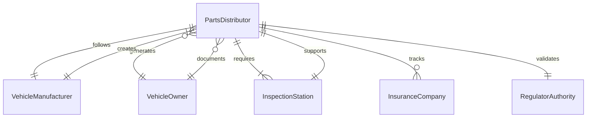
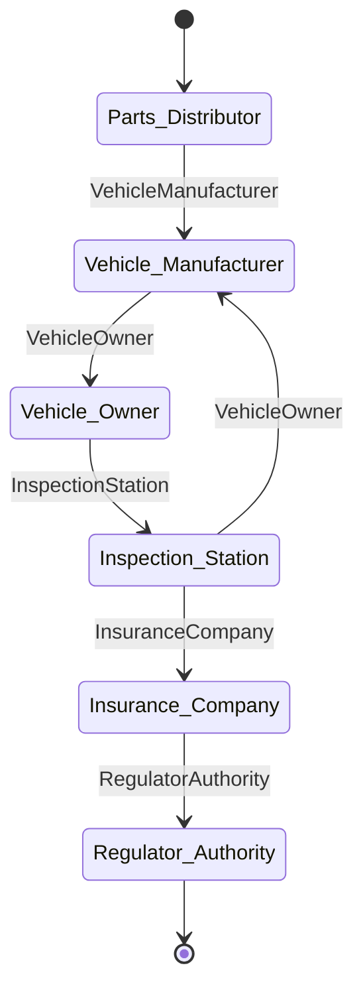
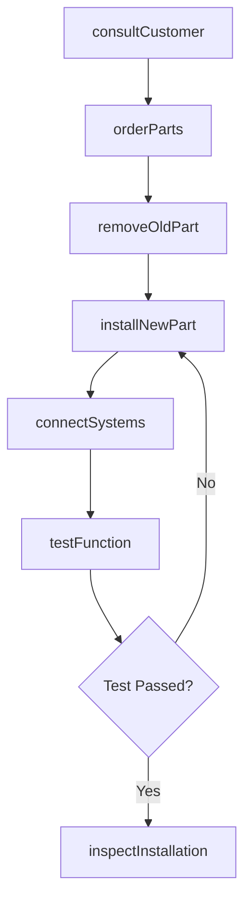
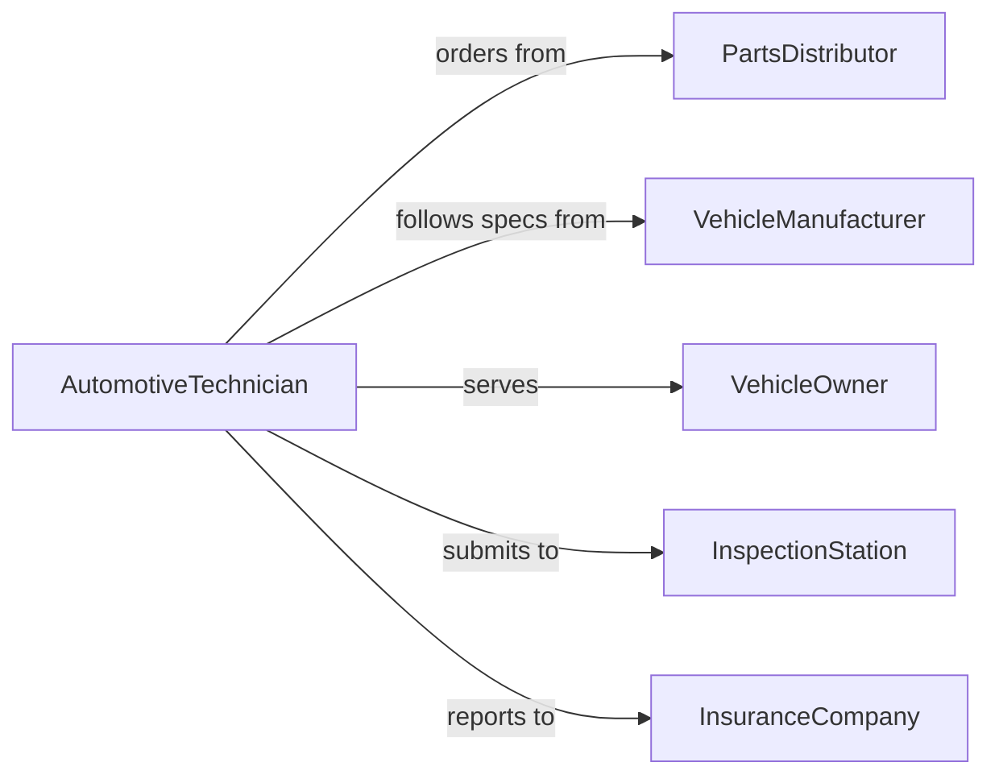

# Install Vehicle Parts Accessories

> Business-as-Code definition for installing replacement parts, aftermarket accessories, and optional equipment on automobiles, trucks, and other vehicles.

## Overview

Vehicle parts and accessory installation involves adding or replacing components on cars, trucks, and other road vehicles. This definition models the installation workflow from customer consultation through parts fitting, connection, and final inspection.

## Actors

| Actor | Description |
|-------|-------------|
| PartsDistributor | Supplies OEM and aftermarket vehicle parts |
| VehicleManufacturer | Provides specifications and installation procedures |
| VehicleOwner | Requests parts installation or upgrades |
| InspectionStation | Verifies installation meets safety standards |
| InsuranceCompany | Reviews modifications for coverage eligibility |
| RegulatorAuthority | Enforces vehicle safety and emissions standards |

## Roles

| Role | Description |
|------|-------------|
| AutomotiveTechnician | Installs parts and accessories on vehicles |
| ServiceAdvisor | Consults with customers on parts and installation |
| QualityInspector | Verifies installation quality and function |
| DiagnosticTech | Tests vehicle systems after installation |

## Entities

| Entity | Description |
|--------|-------------|
| Vehicle | The automobile or truck receiving parts installation |
| Part | A replacement component or new accessory |
| WorkOrder | Instructions and authorization for installation |
| InstallationKit | Hardware and instructions for specific parts |
| DiagnosticReport | Test results validating proper function |
| WarrantyRegistration | Documentation of parts coverage |

## Actions

| Action | Description |
|--------|-------------|
| consultCustomer | Discuss parts needs and installation options |
| orderParts | Procure components from supplier |
| removeOldPart | Extract existing component if replacement |
| installNewPart | Mount and secure new component |
| connectSystems | Join electrical, hydraulic, or mechanical systems |
| testFunction | Verify part operates correctly |
| inspectInstallation | Validate quality and compliance |

## Events

| Event | Description |
|-------|-------------|
| customerConsulted | Parts needs and options are discussed |
| partsOrdered | Components are requested from supplier |
| oldPartRemoved | Existing component is extracted |
| newPartInstalled | New component is mounted and secured |
| systemsConnected | All connections are complete and functional |
| functionTested | Part operation is verified |
| installationInspected | Quality and compliance are confirmed |

## Searches

| Search | Description |
|--------|-------------|
| findInstallationProcedures | Retrieve instructions by part number |
| getPartCompatibility | Check if part fits specific vehicle model |
| getWarrantyInfo | View coverage details for installed parts |
| getPendingWorkOrders | List scheduled installations |
## Entity Relationships




## State Diagram




## Workflow



## Actor Relationships



## Usage

### Calling Actions

```typescript
import { installVehiclePartsAccessories } from '@headlessly/install-vehicle-parts-accessories'

const installation = installVehiclePartsAccessories()

// Consult with customer on parts installation
await installation.consultCustomer({
  customerId: 'CUST-2026-789',
  vehicle: { vin: '1HGBH41JXMN109186', year: 2023, make: 'Honda', model: 'Accord' },
  partsRequested: ['backup-camera', 'tow-hitch']
})

// Install backup camera
await installation.installNewPart({
  workOrderId: 'WO-2026-456',
  vehicle: '1HGBH41JXMN109186',
  part: { number: 'CAM-HD-550', type: 'backup-camera' },
  location: 'rear-bumper'
})

// Connect camera to vehicle systems
await installation.connectSystems({
  workOrderId: 'WO-2026-456',
  connections: ['reverse-light-trigger', 'display-video', 'power']
})
```

### Event-Driven Automation

```typescript
// Test function after systems are connected
installation.systemsConnected(async ({ workOrderId, part }) => {
  await installation.testFunction({
    workOrderId,
    tests: ['power-on', 'image-quality', 'trigger-function']
  })
})

// Alert on test failure
installation.functionTested(async ({ workOrderId, result }) => {
  if (result.status === 'failed') {
    await notify({
      to: 'service-manager',
      message: `Work order ${workOrderId} failed test: ${result.failures.join(', ')}`
    })
  }
})
```
