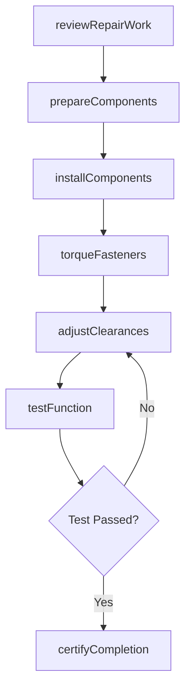
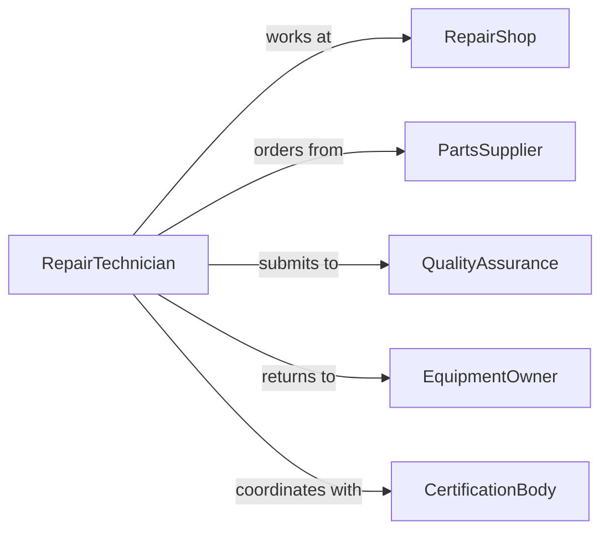

# Reassemble Equipment After Repair

> Business-as-Code definition for reconstructing equipment following maintenance, repair, or overhaul activities.

## Overview

Equipment reassembly involves reconstructing machinery after disassembly for repair, cleaning, inspection, or parts replacement. This definition models the reassembly workflow from component preparation through final assembly, testing, and return to service.

## Actors

| Actor | Description |
|-------|-------------|
| RepairShop | Performs maintenance and overhaul services |
| PartsSupplier | Provides replacement components |
| QualityAssurance | Verifies reassembly quality and function |
| EquipmentOwner | Receives repaired equipment |
| CertificationBody | Validates compliance with standards |
| InsuranceProvider | Reviews repair documentation for claims |

## Roles

| Role | Description |
|------|-------------|
| RepairTechnician | Reconstructs equipment after repair |
| AssemblySpecialist | Handles complex mechanical assembly |
| QualityInspector | Verifies reassembly quality |
| TestEngineer | Validates equipment function after reassembly |

## Entities

| Entity | Description |
|--------|-------------|
| Equipment | The machinery undergoing reassembly |
| Component | A part that was removed during disassembly |
| RepairRecord | Documentation of maintenance performed |
| AssemblySequence | Step-by-step reconstruction instructions |
| FunctionalTest | Validation of equipment operation |
| ReturnToServiceCertification | Authorization to resume equipment use |

## Actions

| Action | Description |
|--------|-------------|
| reviewRepairWork | Examine completed maintenance and parts replaced |
| prepareComponents | Clean, inspect, and stage parts for assembly |
| installComponents | Mount parts in proper sequence |
| torqueFasteners | Tighten bolts to specification |
| adjustClearances | Set proper gaps and alignments |
| testFunction | Verify equipment operates correctly |
| certifyCompletion | Authorize return to service |

## Events

| Event | Description |
|-------|-------------|
| repairWorkReviewed | Maintenance activities are documented |
| componentsPrepared | Parts are ready for reassembly |
| componentsInstalled | Parts are mounted in equipment |
| fastenersTorqued | Bolts are tightened to specification |
| clearancesAdjusted | Proper gaps and alignments are set |
| functionTested | Equipment operation is validated |
| completionCertified | Equipment is authorized for service |

## Searches

| Search | Description |
|--------|-------------|
| findAssemblySequences | Retrieve reassembly instructions by equipment model |
| getRepairRecords | View maintenance performed during disassembly |
| getTorqueSpecs | Find fastener tightening requirements |
| getPendingReassembly | List equipment awaiting reconstruction |

## Workflow



## Actor Relationships



## Usage

### Calling Actions

```typescript
import { reassembleEquipmentAfterRepair } from '@headlessly/reassemble-equipment-after-repair'

const reassembly = reassembleEquipmentAfterRepair()

// Review repair work completed
await reassembly.reviewRepairWork({
  equipmentId: 'PUMP-450',
  repairOrder: 'RO-2026-123',
  workCompleted: ['bearing-replacement', 'seal-installation', 'impeller-balancing']
})

// Prepare components for reassembly
await reassembly.prepareComponents({
  equipmentId: 'PUMP-450',
  components: ['housing-halves', 'rotor-assembly', 'end-covers'],
  preparation: ['clean', 'inspect', 'lubricate']
})

// Install components
await reassembly.installComponents({
  equipmentId: 'PUMP-450',
  sequence: ['rotor-to-shaft', 'lower-housing', 'upper-housing', 'end-covers']
})
```

### Event-Driven Automation

```typescript
// Torque fasteners after components are installed
reassembly.componentsInstalled(async ({ equipmentId }) => {
  await reassembly.torqueFasteners({
    equipmentId,
    pattern: 'cross-sequence',
    spec: 'manufacturer-standard'
  })
})

// Alert on test failure
reassembly.functionTested(async ({ equipmentId, result }) => {
  if (result.status === 'failed') {
    await notify({
      to: 'repair-supervisor',
      message: `Equipment ${equipmentId} failed post-reassembly test: ${result.failures.join(', ')}`
    })
  }
})
```
