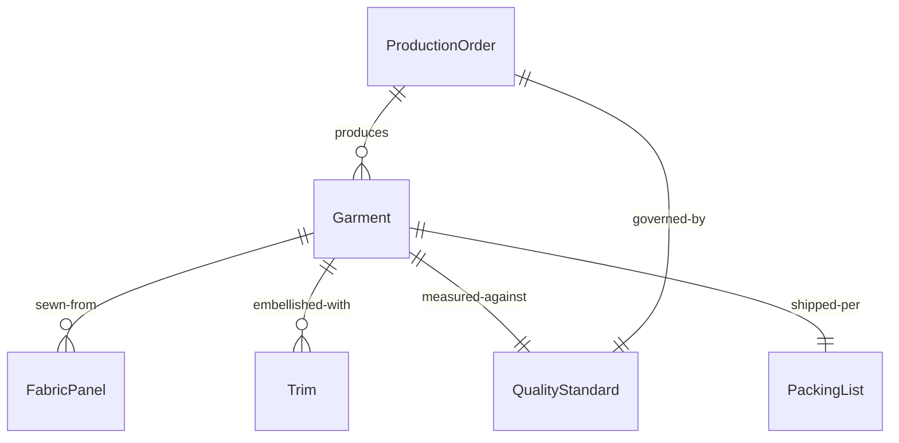
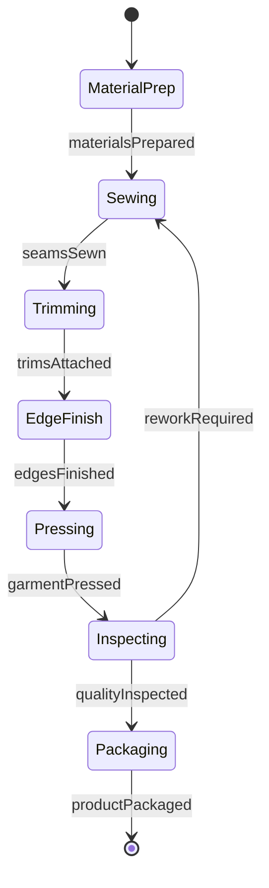
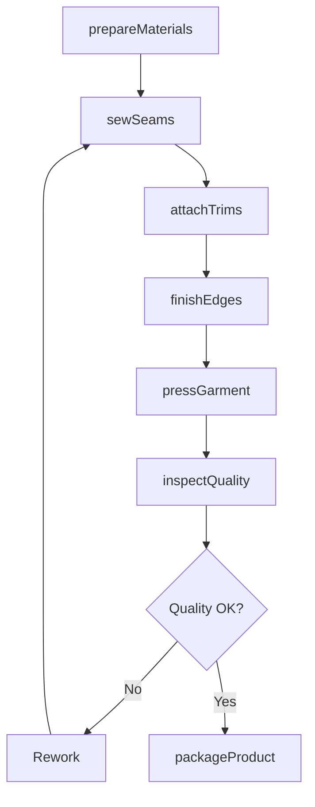
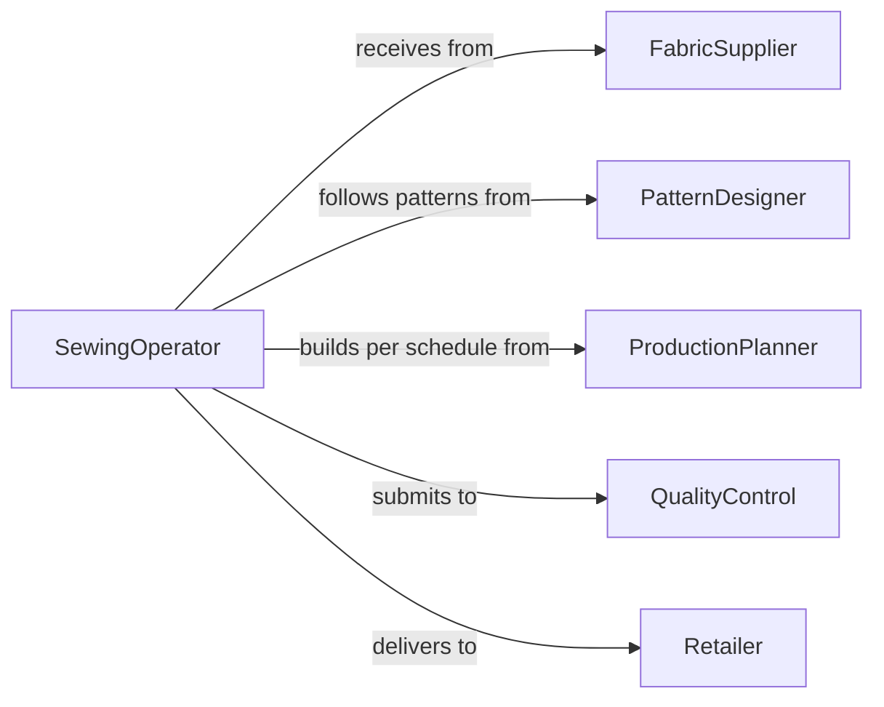

# Assemble Garments Textile Products

> Business-as-Code definition for assembling clothing, apparel, and textile products from fabric panels, trims, and components.

## Overview

Garment and textile product assembly involves joining cut fabric pieces, attaching trims and fasteners, and finishing items for retail or industrial use. This definition models the assembly workflow from material preparation through sewing, finishing, and quality inspection.

## Actors

| Actor | Description |
|-------|-------------|
| FabricSupplier | Provides textiles and raw materials |
| PatternDesigner | Creates garment specifications and cutting patterns |
| ProductionPlanner | Schedules assembly work based on orders |
| QualityControl | Inspects finished garments for defects |
| Retailer | Sells completed garments to consumers |
| BrandOwner | Specifies product requirements and standards |

## Roles

| Role | Description |
|------|-------------|
| SewingOperator | Assembles fabric pieces into garments |
| Finisher | Adds buttons, zippers, and final touches |
| Presser | Irons and shapes completed garments |
| Inspector | Verifies garment quality and specifications |

## Entities

| Entity | Description |
|--------|-------------|
| Garment | A clothing item being assembled |
| FabricPanel | Cut piece of textile ready for sewing |
| Trim | Button, zipper, label, or decorative element |
| ProductionOrder | Instructions for garment assembly batch |
| QualityStandard | Specifications for acceptable garment quality |
| PackingList | Documentation for completed garments |

## Actions

| Action | Description |
|--------|-------------|
| prepareMaterials | Organize fabric panels and trims for assembly |
| sewSeams | Join fabric pieces along designated lines |
| attachTrims | Add buttons, zippers, labels, and decorative elements |
| finishEdges | Hem, overlock, or bind fabric edges |
| pressGarment | Iron and shape completed item |
| inspectQuality | Verify garment meets specifications |
| packageProduct | Prepare finished garment for shipment or display |

## Events

| Event | Description |
|-------|-------------|
| materialsPrepared | Fabric and trims are organized for assembly |
| seamsSewn | Fabric pieces are joined |
| trimsAttached | Buttons, zippers, and labels are installed |
| edgesFinished | Hems and edges are complete |
| garmentPressed | Item is ironed and shaped |
| qualityInspected | Garment verification is complete |
| productPackaged | Item is ready for distribution |

## Searches

| Search | Description |
|--------|-------------|
| findPatterns | Retrieve assembly instructions by garment style |
| getProductionOrders | List garments scheduled for assembly |
| getQualityStandards | Find specifications for specific product lines |
| getDefectHistory | View common quality issues by garment type |
## Entity Relationships




## State Diagram




## Workflow



## Actor Relationships



## Usage

### Calling Actions

```typescript
import { assembleGarmentsTextileProducts } from '@headlessly/assemble-garments-textile-products'

const garments = assembleGarmentsTextileProducts()

// Prepare materials for shirt assembly
await garments.prepareMaterials({
  productionOrder: 'PO-2026-450',
  style: 'dress-shirt',
  quantity: 100,
  materials: ['collar', 'front-panel', 'back-panel', 'sleeves', 'cuffs']
})

// Sew seams
await garments.sewSeams({
  productionOrder: 'PO-2026-450',
  seams: ['shoulder', 'side', 'sleeve'],
  stitchType: 'lock-stitch',
  seamAllowance: 0.5
})

// Attach trims
await garments.attachTrims({
  productionOrder: 'PO-2026-450',
  trims: [
    { type: 'button', quantity: 7, location: 'front-placket' },
    { type: 'label', location: 'collar' }
  ]
})
```

### Event-Driven Automation

```typescript
// Press garment after edges are finished
garments.edgesFinished(async ({ productionOrder, quantity }) => {
  await garments.pressGarment({
    productionOrder,
    temperature: 'cotton-setting',
    steam: true
  })
})

// Alert on quality failure
garments.qualityInspected(async ({ productionOrder, result }) => {
  if (result.defectRate > 0.05) {
    await notify({
      to: 'production-manager',
      message: `High defect rate on ${productionOrder}: ${(result.defectRate * 100).toFixed(1)}%`
    })
  }
})
```
