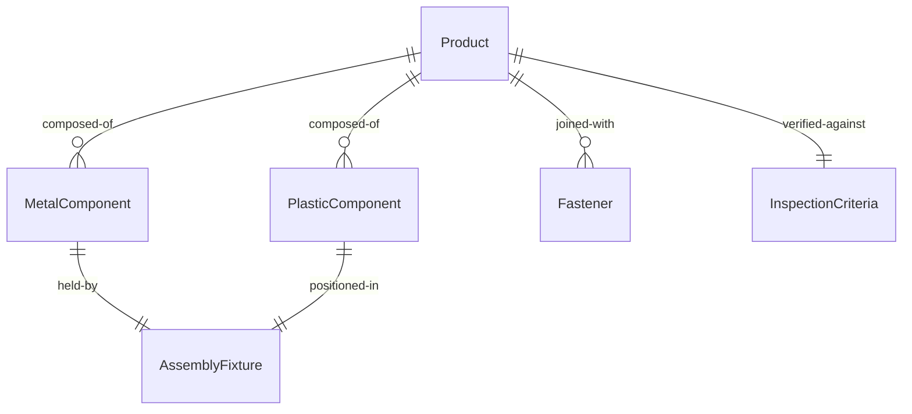
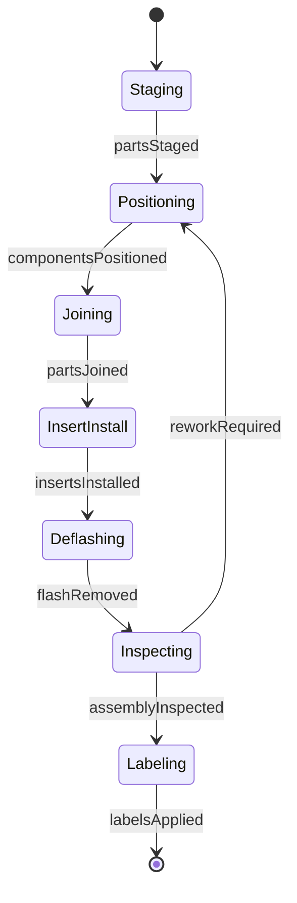
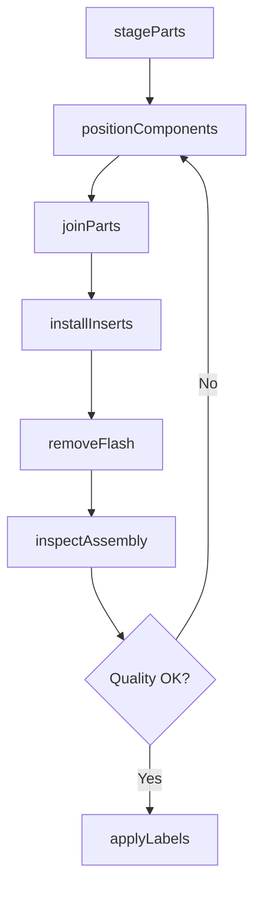
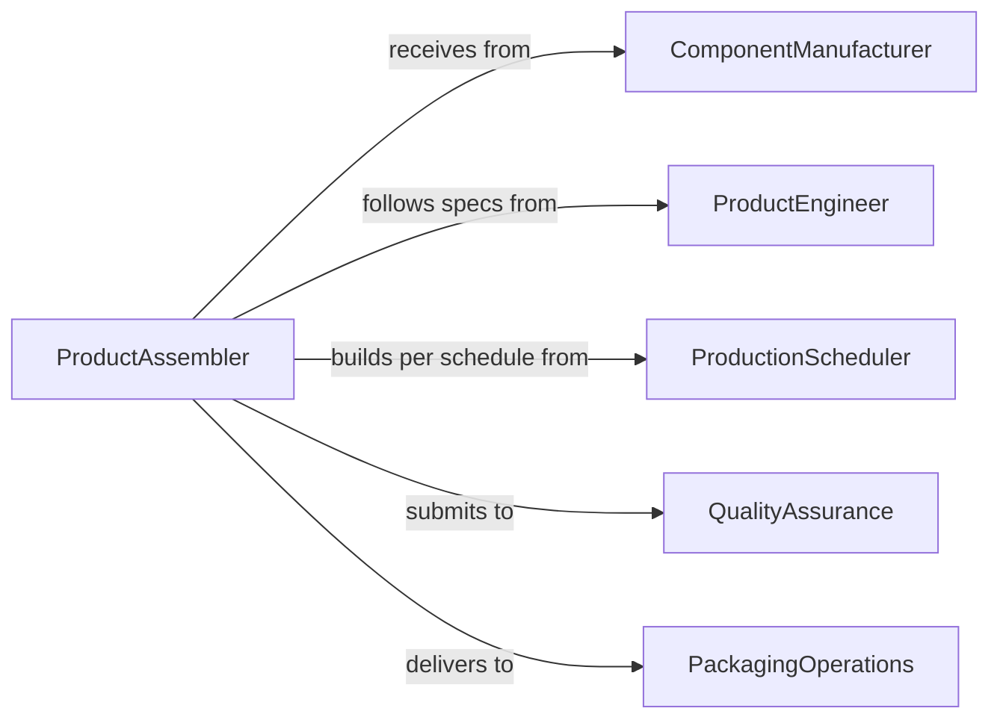

# Assemble Metal Plastic Parts Products

> Business-as-Code definition for assembling metal and plastic components into finished products for consumer, industrial, and commercial applications.

## Overview

Metal and plastic product assembly involves joining stamped, molded, or machined parts into complete units using fasteners, adhesives, welding, or snap-fit connections. This definition models the assembly workflow from parts staging through joining, finishing, and inspection.

## Actors

| Actor | Description |
|-------|-------------|
| ComponentManufacturer | Supplies metal and plastic parts |
| ProductEngineer | Designs assembly methods and tooling |
| ProductionScheduler | Plans assembly work based on demand |
| QualityAssurance | Inspects finished products for defects |
| PackagingOperations | Prepares products for distribution |
| EndCustomer | Purchases and uses finished products |

## Roles

| Role | Description |
|------|-------------|
| ProductAssembler | Joins metal and plastic parts into finished goods |
| WeldingTech | Joins metal components using welding processes |
| AdhesiveTech | Bonds parts using glues and sealants |
| QualityInspector | Verifies product quality and specifications |

## Entities

| Entity | Description |
|--------|-------------|
| Product | A finished item assembled from multiple parts |
| MetalComponent | A stamped, cast, or machined metal part |
| PlasticComponent | A molded or formed plastic part |
| Fastener | Screw, rivet, or other joining hardware |
| AssemblyFixture | Tooling that holds parts during assembly |
| InspectionCriteria | Quality specifications for finished products |

## Actions

| Action | Description |
|--------|-------------|
| stageParts | Organize components for assembly |
| positionComponents | Place parts in assembly fixture |
| joinParts | Connect components using fasteners, welds, or adhesive |
| installInserts | Add threaded inserts, clips, or reinforcements |
| removeFlash | Clean excess material from molded parts |
| inspectAssembly | Verify product meets quality standards |
| applyLabels | Add identification and branding |

## Events

| Event | Description |
|-------|-------------|
| partsStaged | Components are organized for assembly |
| componentsPositioned | Parts are placed in fixture |
| partsJoined | Components are connected |
| insertsInstalled | Reinforcements and inserts are added |
| flashRemoved | Excess material is cleaned |
| assemblyInspected | Quality verification is complete |
| labelsApplied | Product identification is added |

## Searches

| Search | Description |
|--------|-------------|
| findAssemblyProcedures | Retrieve instructions by product model |
| getBillOfMaterials | List components required for specific product |
| getQualityStandards | Find specifications for product line |
| getPendingOrders | View products scheduled for assembly |
## Entity Relationships




## State Diagram




## Workflow



## Actor Relationships



## Usage

### Calling Actions

```typescript
import { assembleMetalPlasticPartsProducts } from '@headlessly/assemble-metal-plastic-parts-products'

const assembly = assembleMetalPlasticPartsProducts()

// Stage parts for assembly
await assembly.stageParts({
  productModel: 'HOUSING-450',
  components: [
    { type: 'metal-base', partNumber: 'MB-100' },
    { type: 'plastic-cover', partNumber: 'PC-200' },
    { type: 'fasteners', partNumber: 'SCREW-M4', quantity: 8 }
  ]
})

// Position components in fixture
await assembly.positionComponents({
  productModel: 'HOUSING-450',
  fixture: 'ASSY-FIX-450',
  alignment: 'auto-locate'
})

// Join parts with fasteners
await assembly.joinParts({
  productModel: 'HOUSING-450',
  method: 'screw-fastening',
  torque: 2.5,
  pattern: 'cross-sequence'
})
```

### Event-Driven Automation

```typescript
// Remove flash after parts are joined
assembly.partsJoined(async ({ productModel, quantity }) => {
  await assembly.removeFlash({
    productModel,
    locations: ['parting-line', 'gate-marks']
  })
})

// Alert on quality failure
assembly.assemblyInspected(async ({ productModel, result }) => {
  if (result.status === 'rejected') {
    await notify({
      to: 'production-supervisor',
      message: `Product ${productModel} failed inspection: ${result.defects.join(', ')}`
    })
  }
})
```
