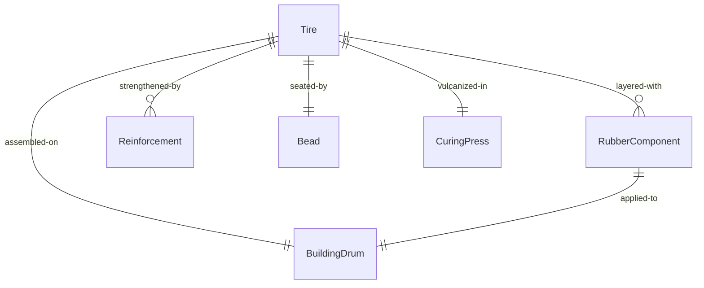
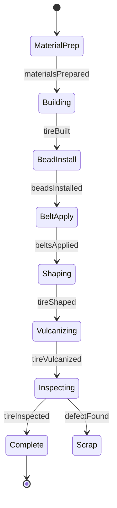
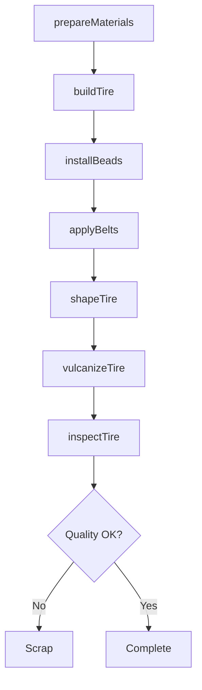
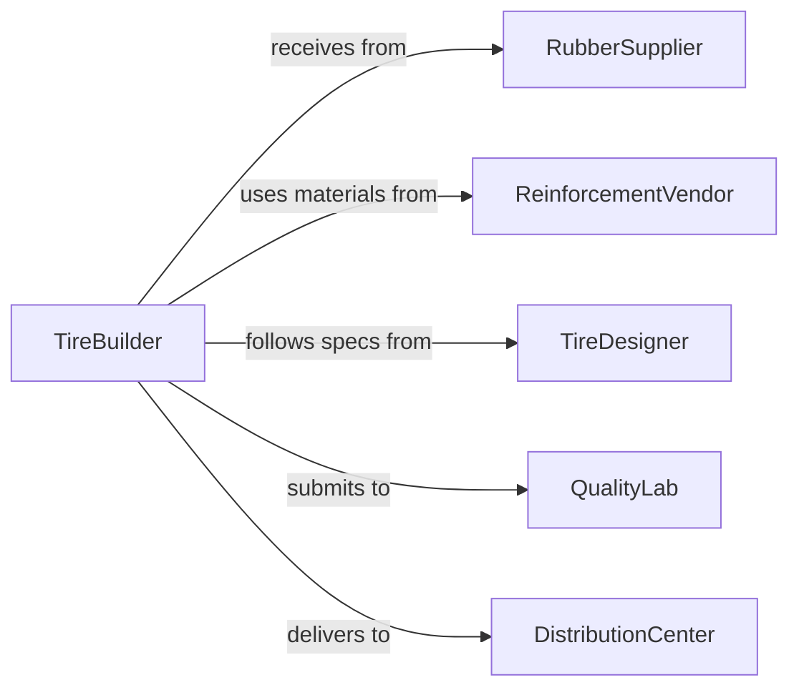

# Assemble Tires

> Business-as-Code definition for constructing pneumatic tires from rubber compounds, textile cords, steel belts, and beads through building, curing, and finishing processes.

## Overview

Tire assembly involves layering rubber compounds, textile reinforcements, and steel components onto a building drum, then curing the assembly in a mold under heat and pressure. This definition models the tire building workflow from material preparation through assembly, vulcanization, and final inspection.

## Actors

| Actor | Description |
|-------|-------------|
| RubberSupplier | Provides rubber compounds and raw materials |
| ReinforcementVendor | Supplies textile cords and steel belts |
| TireDesigner | Specifies construction details and specifications |
| QualityLab | Tests finished tires for performance and defects |
| DistributionCenter | Warehouses and ships finished tires |
| VehicleManufacturer | Uses tires as original equipment |

## Roles

| Role | Description |
|------|-------------|
| TireBuilder | Assembles tire components on building drum |
| CuringOperator | Vulcanizes tires in curing press |
| Inspector | Examines finished tires for defects |
| TrimOperator | Removes flash and finishes tire edges |

## Entities

| Entity | Description |
|--------|-------------|
| Tire | A finished pneumatic tire ready for use |
| RubberComponent | Inner liner, sidewall, tread, or other rubber layer |
| Reinforcement | Textile cord or steel belt providing strength |
| Bead | Steel wire bundle that seats tire on rim |
| BuildingDrum | Machine on which tire is assembled |
| CuringPress | Heated mold that vulcanizes tire |

## Actions

| Action | Description |
|--------|-------------|
| prepareMaterials | Stage rubber, cords, belts, and beads |
| buildTire | Layer components on building drum |
| installBeads | Position steel wire bundles at tire edges |
| applyBelts | Add steel reinforcement layers |
| shapeTire | Form assembled components into tire shape |
| vulcanizeTire | Cure tire in heated press |
| inspectTire | Examine for defects and verify specifications |

## Events

| Event | Description |
|-------|-------------|
| materialsPrepared | Components are ready for tire building |
| tireBuilt | All layers are assembled on drum |
| beadsInstalled | Steel wire bundles are positioned |
| beltsApplied | Steel reinforcements are added |
| tireShaped | Components are formed into final shape |
| tireVulcanized | Curing process is complete |
| tireInspected | Quality verification is finished |

## Searches

| Search | Description |
|--------|-------------|
| findBuildSpecs | Retrieve construction details by tire model |
| getCuringParameters | Find vulcanization settings for specific compounds |
| getQualityStandards | View specifications for tire performance |
| getProductionSchedule | List tires scheduled for building |
## Entity Relationships




## State Diagram




## Workflow



## Actor Relationships



## Usage

### Calling Actions

```typescript
import { assembleTires } from '@headlessly/assemble-tires'

const tires = assembleTires()

// Prepare materials for passenger tire
await tires.prepareMaterials({
  tireModel: 'P215/65R16',
  components: ['inner-liner', 'body-ply', 'sidewall', 'tread', 'steel-belts', 'beads']
})

// Build tire on drum
await tires.buildTire({
  tireModel: 'P215/65R16',
  drum: 'BUILD-DRUM-12',
  layers: ['inner-liner', 'body-ply', 'sidewall']
})

// Vulcanize tire
await tires.vulcanizeTire({
  tireId: 'TIRE-2026-45678',
  press: 'CURE-PRESS-08',
  temperature: 170,
  pressure: 15,
  duration: 12
})
```

### Event-Driven Automation

```typescript
// Vulcanize after tire is shaped
tires.tireShaped(async ({ tireId, tireModel }) => {
  await tires.vulcanizeTire({
    tireId,
    parameters: 'model-standard'
  })
})

// Alert on inspection failure
tires.tireInspected(async ({ tireId, result }) => {
  if (result.status === 'rejected') {
    await notify({
      to: 'quality-engineering',
      message: `Tire ${tireId} failed inspection: ${result.defects.join(', ')}`
    })
  }
})
```
