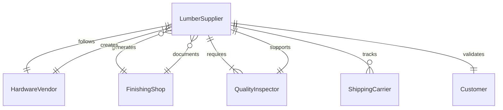
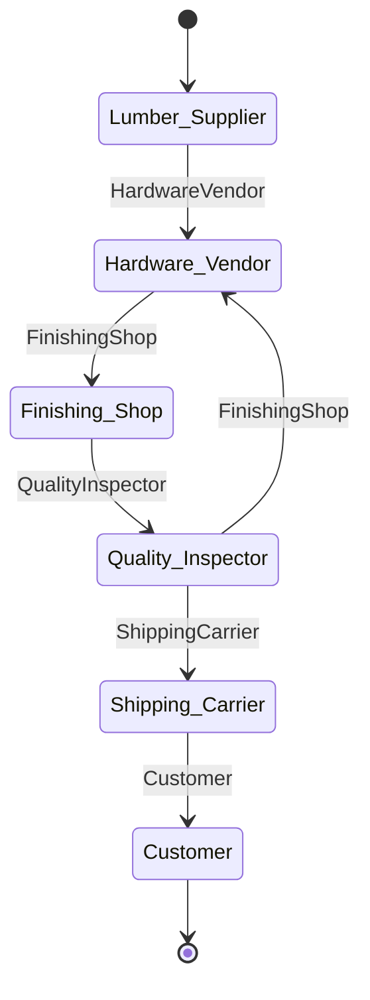
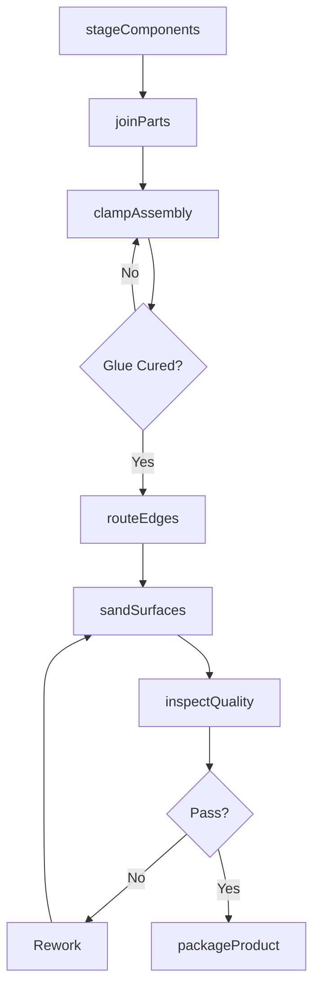
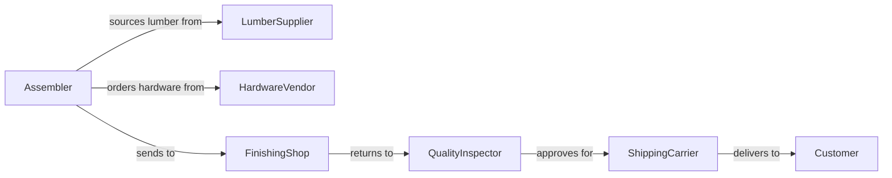

# Assemble Wood Products

> Business-as-Code definition for assembling wood products from components and raw materials. Models the complete assembly process from parts staging through quality inspection.

## Overview

Wood product assembly involves joining lumber, panels, and hardware into finished furniture, cabinetry, millwork, and structural components. This definition exposes actions for each assembly phase, events for production automation, and searches for inventory and work order management.

## Actors

| Actor | Description |
|-------|-------------|
| LumberSupplier | Provides dimensional lumber and engineered wood products |
| HardwareVendor | Supplies fasteners, hinges, drawer slides, and fixtures |
| FinishingShop | Applies stains, sealers, and protective coatings |
| QualityInspector | Verifies assembly tolerances and finish quality |
| ShippingCarrier | Transports finished products to customers |
| Customer | Orders and receives assembled wood products |

## Roles

| Role | Description |
|------|-------------|
| Assembler | Joins wood components using fasteners and adhesives |
| CutListManager | Prepares cutting schedules and material allocations |
| FinishCarpenter | Performs final fitting and detail work |
| ProductionSupervisor | Coordinates assembly workflows and resource allocation |

## Entities

| Entity | Description |
|--------|-------------|
| Assembly | A wood product being constructed from components |
| Component | Individual lumber piece, panel, or hardware item |
| WorkOrder | Production instructions for a specific assembly |
| CutList | Detailed cutting schedule with dimensions and quantities |
| JoinerySpec | Technical specification for joints and fastening methods |
| FinishedProduct | Completed and inspected wood assembly ready for delivery |

## Actions

| Action | Description |
|--------|-------------|
| stageComponents | Organize lumber and hardware for assembly |
| joinParts | Connect wood components using fasteners or adhesives |
| clampAssembly | Apply pressure during glue curing or alignment |
| routeEdges | Shape edges and profiles on assembled pieces |
| sandSurfaces | Smooth surfaces in preparation for finishing |
| inspectQuality | Verify dimensional accuracy and structural integrity |
| packageProduct | Prepare finished assembly for shipment or storage |

## Events

| Event | Description |
|-------|-------------|
| componentsStaged | Parts and materials are organized for assembly |
| partsJoined | Components have been connected and secured |
| assemblyGluedUp | Clamps applied and adhesive curing in progress |
| edgesRouted | Profiles and edges have been shaped |
| surfacesSanded | Sanding complete and assembly ready for finish |
| qualityApproved | Assembly passed dimensional and structural inspection |
| productPackaged | Finished wood product is ready for shipment |

## Searches

| Search | Description |
|--------|-------------|
| findWorkOrders | List assembly jobs by status, product type, or customer |
| getComponents | Retrieve available lumber and hardware inventory |
| getAssemblies | Find in-progress assemblies by stage or work center |
| getQualityReports | Retrieve inspection results and defect records |
## Entity Relationships




## State Diagram




## Workflow



## Actor Relationships



## Usage

### Calling Actions

```typescript
import { assembleWoodProducts } from '@headlessly/assemble-wood-products'

const assembly = assembleWoodProducts()

// Stage components for a cabinet assembly
await assembly.stageComponents({
  workOrderId: 'WO-2847',
  components: [
    { sku: 'PLY-3/4-48X96', quantity: 2, description: 'Cabinet sides' },
    { sku: 'HRD-HINGE-EURO', quantity: 6, description: 'European hinges' },
    { sku: 'HRD-SLIDE-22', quantity: 4, description: '22" drawer slides' }
  ]
})

// Join parts using pocket screws
await assembly.joinParts({
  workOrderId: 'WO-2847',
  method: 'pocket-screw',
  joints: [
    { part1: 'side-left', part2: 'bottom', fasteners: 4 },
    { part1: 'side-right', part2: 'bottom', fasteners: 4 }
  ]
})

// Inspect completed assembly
const inspection = await assembly.inspectQuality({
  workOrderId: 'WO-2847',
  checks: ['squareness', 'joint-integrity', 'surface-quality']
})
```

### Event-Driven Automation

```typescript
// Auto-schedule finishing after sanding
assembly.surfacesSanded(async ({ workOrderId }) => {
  await scheduleFinishing({
    workOrderId,
    finishType: 'water-based-polyurethane',
    coats: 3
  })
})

// Alert on quality failures
assembly.qualityApproved(async ({ workOrderId, passed, defects }) => {
  if (!passed) {
    await notify({
      to: 'production-supervisor',
      message: `Assembly ${workOrderId} failed inspection: ${defects.join(', ')}`
    })
  }
})
```
