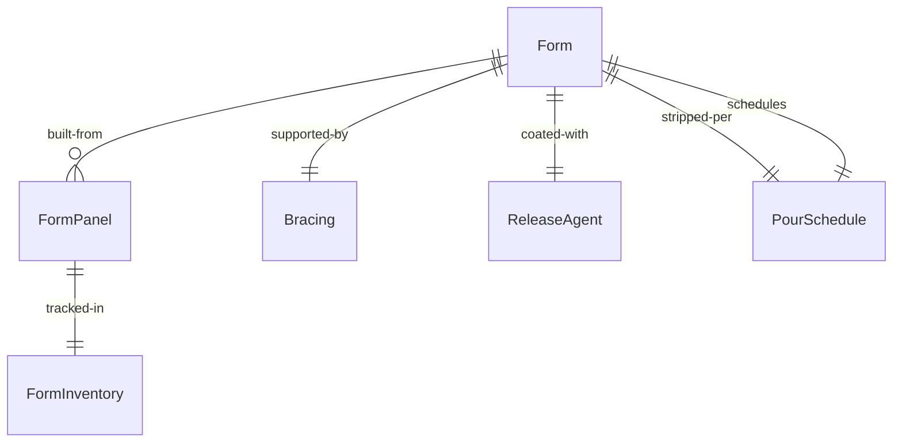
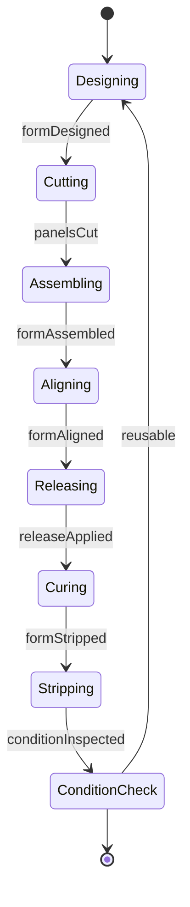
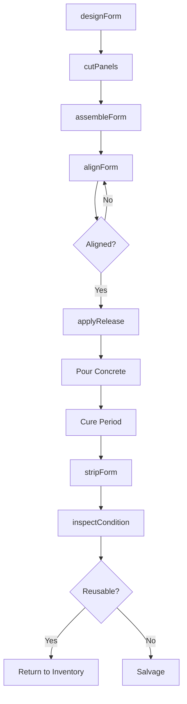
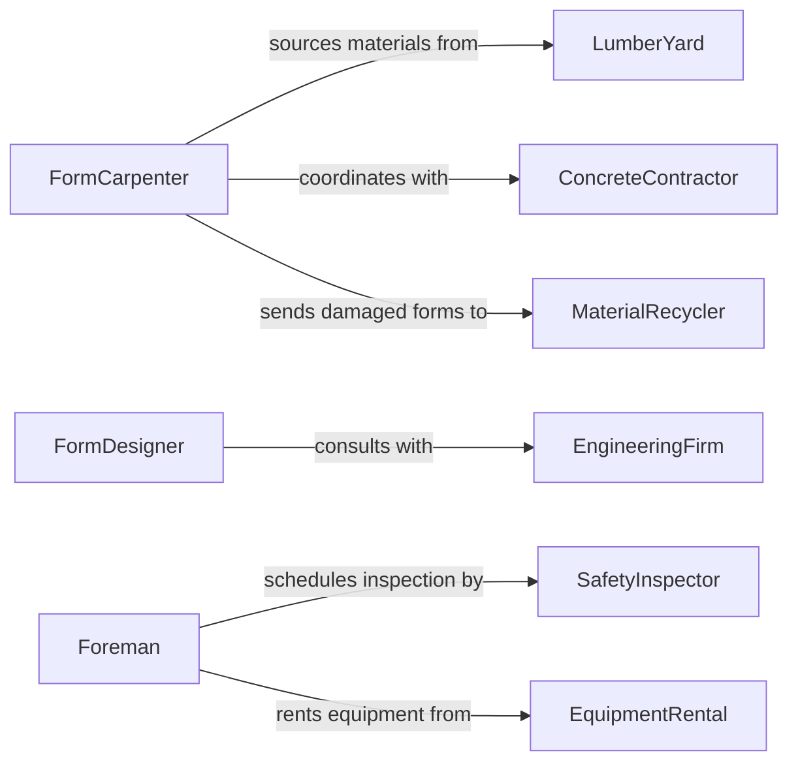

# Build Construction Forms Molds

> Business-as-Code definition for building construction forms and molds for concrete casting. Models the complete formwork lifecycle from design through stripping and reuse.

## Overview

Construction form and mold building involves fabricating temporary structures to shape poured concrete for foundations, walls, columns, and architectural elements. This definition exposes actions for formwork construction, events for scheduling automation, and searches for form inventory and job tracking.

## Actors

| Actor | Description |
|-------|-------------|
| LumberYard | Supplies plywood, dimensional lumber, and forming materials |
| ConcreteContractor | Uses forms for casting structural and decorative concrete |
| EngineeringFirm | Provides structural calculations and formwork designs |
| SafetyInspector | Verifies formwork meets load and stability requirements |
| EquipmentRental | Provides shoring towers, bracing, and form hardware |
| MaterialRecycler | Accepts used forms and salvaged forming materials |

## Roles

| Role | Description |
|------|-------------|
| FormCarpenter | Constructs and assembles formwork systems |
| Foreman | Coordinates formwork installation and stripping schedules |
| FormDesigner | Engineers formwork to support concrete loads |
| QualityController | Inspects form alignment and structural adequacy |

## Entities

| Entity | Description |
|--------|-------------|
| Form | A temporary structure for shaping poured concrete |
| FormPanel | Reusable plywood or metal sheet forming surface |
| Bracing | Structural support system to resist concrete pressure |
| ReleaseAgent | Coating applied to prevent concrete adhesion |
| PourSchedule | Timeline for concrete placement and form stripping |
| FormInventory | Available formwork components for allocation |

## Actions

| Action | Description |
|--------|-------------|
| designForm | Create formwork plan based on structural requirements |
| cutPanels | Fabricate form panels to specified dimensions |
| assembleForm | Erect formwork structure with bracing and ties |
| alignForm | Verify elevation, plumb, and dimensional accuracy |
| applyRelease | Coat form surfaces to facilitate concrete release |
| stripForm | Remove formwork after concrete cures |
| inspectCondition | Assess form panels for damage and reusability |

## Events

| Event | Description |
|-------|-------------|
| formDesigned | Formwork plan completed and approved |
| panelsCut | Form panels fabricated to specification |
| formAssembled | Formwork structure erected and braced |
| formAligned | Alignment verified and form ready for concrete |
| releaseApplied | Form surfaces treated with release agent |
| formStripped | Formwork removed and concrete exposed |
| conditionInspected | Form panels assessed for reuse or disposal |

## Searches

| Search | Description |
|--------|-------------|
| findForms | List forms by project, type, or construction status |
| getInventory | Retrieve available form panels and hardware |
| getPourSchedules | Find concrete placement timelines by project |
| getInspections | Retrieve formwork safety and quality inspection results |
## Entity Relationships




## State Diagram




## Workflow



## Actor Relationships



## Usage

### Calling Actions

```typescript
import { buildConstructionFormsMolds } from '@headlessly/build-construction-forms-molds'

const forms = buildConstructionFormsMolds()

// Design formwork for a foundation wall
const design = await forms.designForm({
  projectId: 'PROJ-4829',
  element: 'foundation-wall',
  dimensions: { length: 40, height: 10, thickness: 12 },
  concreteLoad: 150 // lbs per cubic foot
})

// Assemble the form structure
await forms.assembleForm({
  formId: design.id,
  panels: ['FP-4X8-001', 'FP-4X8-002', 'FP-4X8-003'],
  bracing: { vertical: 8, horizontal: 12, ties: 24 }
})

// Verify alignment before pour
const alignment = await forms.alignForm({
  formId: design.id,
  tolerances: { plumb: 0.25, elevation: 0.125 }
})
```

### Event-Driven Automation

```typescript
// Auto-schedule concrete pour after release applied
forms.releaseApplied(async ({ formId, projectId }) => {
  await scheduleConcretePour({
    projectId,
    formId,
    readyDate: new Date(Date.now() + 24 * 60 * 60 * 1000)
  })
})

// Alert when forms ready to strip
forms.formAligned(async ({ formId, pourDate }) => {
  const stripDate = new Date(pourDate.getTime() + 7 * 24 * 60 * 60 * 1000)
  await scheduleTask({
    task: 'strip-forms',
    formId,
    date: stripDate
  })
})
```
