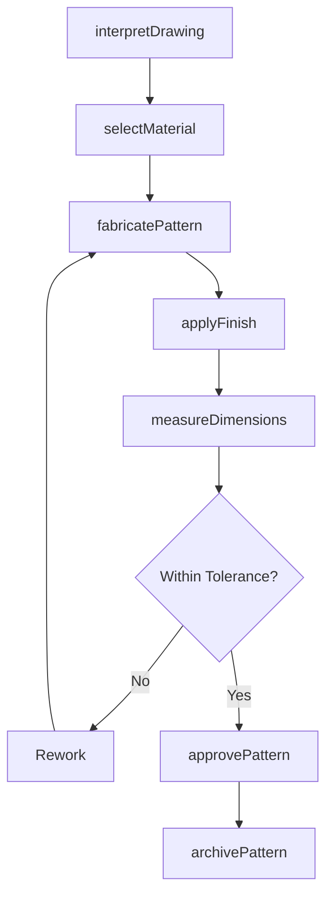
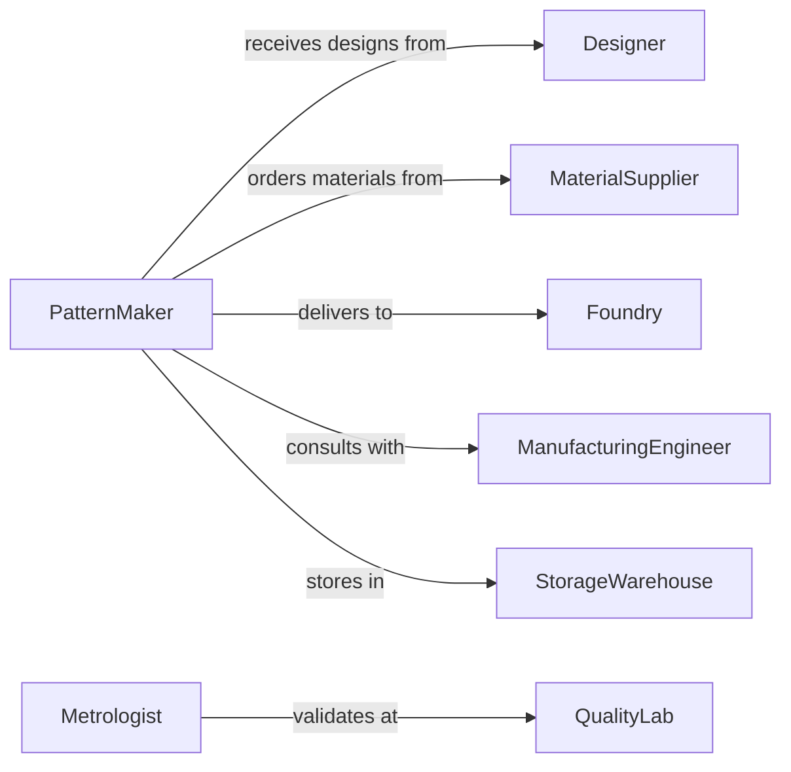

# Build Models Patterns Templates

> Business-as-Code definition for building models, patterns, and templates for manufacturing and prototyping. Models the complete development process from design interpretation through validation.

## Overview

Model, pattern, and template building involves creating precise physical representations used in casting, molding, machining, and production setup. This definition exposes actions for each fabrication phase, events for workflow automation, and searches for inventory and specification management.

## Actors

| Actor | Description |
|-------|-------------|
| Designer | Provides CAD models and technical drawings |
| MaterialSupplier | Furnishes wood, foam, resin, and composite materials |
| Foundry | Uses patterns for sand casting and metal production |
| ManufacturingEngineer | Specifies tolerances and production requirements |
| QualityLab | Validates dimensional accuracy with CMM and gauging |
| StorageWarehouse | Maintains inventory of patterns and templates |

## Roles

| Role | Description |
|------|-------------|
| PatternMaker | Fabricates patterns from drawings and CAD models |
| TemplateBuilder | Constructs reusable guides and fixtures |
| ModelShop Supervisor | Coordinates pattern production and delivery schedules |
| Metrologist | Performs precision measurements and inspections |

## Entities

| Entity | Description |
|--------|-------------|
| Pattern | A physical master used to create molds or castings |
| Template | A reusable guide for cutting, drilling, or layout |
| Model | A scaled or full-size prototype for visualization or testing |
| Specification | Technical requirements including tolerances and materials |
| BuildSheet | Detailed fabrication instructions and material list |
| Inspection Report | Dimensional verification and deviation analysis |

## Actions

| Action | Description |
|--------|-------------|
| interpretDrawing | Analyze CAD models and drawings for pattern requirements |
| selectMaterial | Choose appropriate material based on use and durability |
| fabricatePattern | Machine, carve, or mold pattern to specification |
| applyFinish | Seal and coat pattern surfaces for durability |
| measureDimensions | Verify pattern against specification tolerances |
| approvePattern | Formally accept pattern for production use |
| archivePattern | Store pattern with identification and location tracking |

## Events

| Event | Description |
|-------|-------------|
| drawingInterpreted | Technical requirements extracted from design documents |
| materialSelected | Appropriate stock material allocated for fabrication |
| patternFabricated | Physical pattern completed to specification |
| finishApplied | Surface treatment completed and cured |
| dimensionsMeasured | Inspection performed and deviations recorded |
| patternApproved | Pattern accepted for manufacturing use |
| patternArchived | Pattern stored and indexed for future retrieval |

## Searches

| Search | Description |
|--------|-------------|
| findPatterns | List patterns by part number, project, or material |
| getSpecifications | Retrieve tolerance and material requirements |
| getInspections | Find measurement reports and deviation records |
| getArchive | Locate stored patterns by identification or project |

## Workflow



## Actor Relationships



## Usage

### Calling Actions

```typescript
import { buildModelsPatternsTemplates } from '@headlessly/build-models-patterns-templates'

const patterns = buildModelsPatternsTemplates()

// Interpret drawing for a casting pattern
const requirements = await patterns.interpretDrawing({
  partNumber: 'PN-8472',
  cadFile: 'impeller-housing.step',
  castingMethod: 'sand-casting',
  shrinkage: 0.010 // inches per inch
})

// Select material for pattern construction
await patterns.selectMaterial({
  patternId: requirements.id,
  material: 'urethane-tooling-board',
  stock: { length: 24, width: 18, thickness: 6 }
})

// Measure completed pattern
const inspection = await patterns.measureDimensions({
  patternId: requirements.id,
  method: 'CMM',
  criticalDimensions: ['bore-diameter', 'flange-thickness', 'mounting-holes']
})
```

### Event-Driven Automation

```typescript
// Auto-schedule finishing after fabrication
patterns.patternFabricated(async ({ patternId, material }) => {
  const finishType = material === 'wood' ? 'polyurethane-sealer' : 'epoxy-coating'
  await scheduleFinishing({
    patternId,
    finish: finishType,
    coats: 2
  })
})

// Alert on out-of-tolerance conditions
patterns.dimensionsMeasured(async ({ patternId, deviations }) => {
  const critical = deviations.filter(d => d.severity === 'critical')
  if (critical.length > 0) {
    await notify({
      to: 'modelshop-supervisor',
      message: `Pattern ${patternId} has ${critical.length} critical deviations`
    })
  }
})
```
