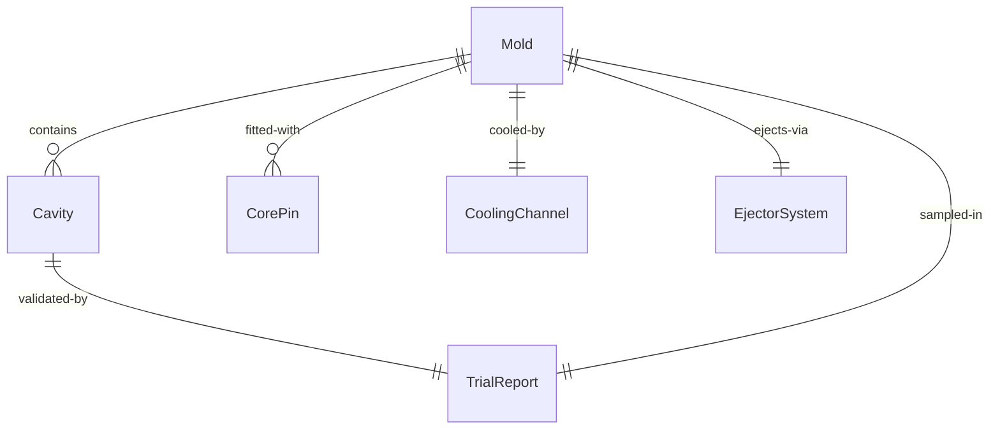
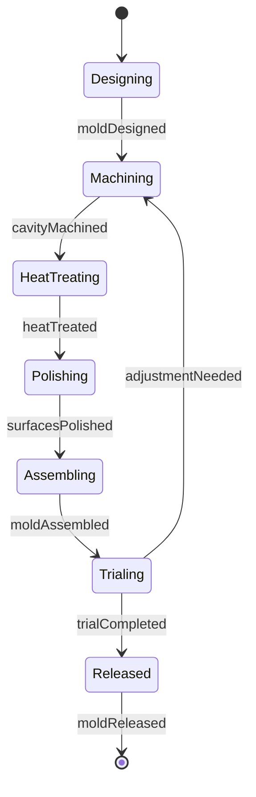
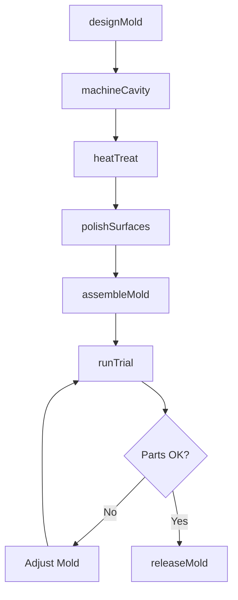
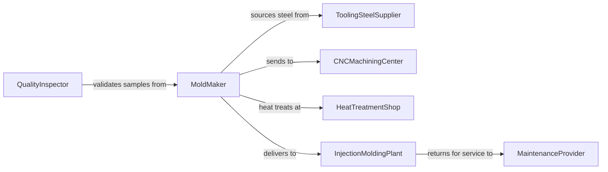

# Build Production Molds

> Business-as-Code definition for building production molds for injection molding, casting, and thermoforming. Models the complete mold fabrication process from tooling design through validation and release.

## Overview

Production mold building involves precision machining and assembly of tooling used to manufacture plastic, rubber, metal, and composite parts. This definition exposes actions for each fabrication phase, events for scheduling automation, and searches for mold tracking and maintenance management.

## Actors

| Actor | Description |
|-------|-------------|
| ToolingSteelSupplier | Provides hardened steel, aluminum, and specialty alloys |
| CNCMachiningCenter | Performs multi-axis milling and EDM operations |
| HeatTreatmentShop | Hardens and tempers mold components |
| InjectionMoldingPlant | Uses molds for high-volume production |
| QualityInspector | Validates mold dimensions and surface finish |
| MaintenanceProvider | Performs mold repair and refurbishment |

## Roles

| Role | Description |
|------|-------------|
| MoldMaker | Machines and assembles production mold components |
| ToolDesigner | Engineers mold geometry and cooling systems |
| PolishingTechnician | Finishes cavity surfaces to specified roughness |
| MoldTrialCoordinator | Manages sampling and process validation |

## Entities

| Entity | Description |
|--------|-------------|
| Mold | A production tool for shaping molten or liquid materials |
| Cavity | The formed surface that defines part geometry |
| CorePin | An insert that creates internal features or undercuts |
| CoolingChannel | A machined passage for temperature control fluid |
| EjectorSystem | Mechanism for removing parts from the mold |
| TrialReport | Validation data from sampling and process optimization |

## Actions

| Action | Description |
|--------|-------------|
| designMold | Create tooling layout with cooling and ejection systems |
| machineCavity | CNC mill cavity surfaces to specified geometry |
| heatTreat | Harden steel components to target Rockwell hardness |
| polishSurfaces | Finish cavity to specified surface roughness |
| assembleMold | Install cores, ejectors, and cooling connections |
| runTrial | Produce sample parts for dimensional validation |
| releaseMold | Approve mold for production and transfer to plant |

## Events

| Event | Description |
|-------|-------------|
| moldDesigned | Tooling layout completed and approved for fabrication |
| cavityMachined | Primary mold surfaces CNC machined to tolerance |
| heatTreated | Steel hardened and tempered to specification |
| surfacesPolished | Cavity finish meets surface roughness requirement |
| moldAssembled | All components installed and mold ready for trial |
| trialCompleted | Sample parts produced and validated |
| moldReleased | Mold approved and transferred to production facility |

## Searches

| Search | Description |
|--------|-------------|
| findMolds | List molds by part number, project, or status |
| getCavities | Retrieve cavity specifications and machining programs |
| getTrials | Find trial reports and validation data |
| getMaintenance | Retrieve mold repair and cycle count history |
## Entity Relationships




## State Diagram




## Workflow



## Actor Relationships



## Usage

### Calling Actions

```typescript
import { buildProductionMolds } from '@headlessly/build-production-molds'

const molds = buildProductionMolds()

// Design a two-cavity injection mold
const design = await molds.designMold({
  partNumber: 'PN-3948',
  material: 'ABS',
  cavities: 2,
  coolingCircuits: 4,
  ejectorPins: 8,
  expectedCycles: 1000000
})

// Machine the cavity surfaces
await molds.machineCavity({
  moldId: design.id,
  machine: 'CNC-MILL-05',
  program: 'CAM-3948-A',
  tolerance: 0.0005,
  finish: 'semi-rough'
})

// Run validation trial
const trial = await molds.runTrial({
  moldId: design.id,
  shots: 50,
  material: 'ABS-natural',
  cycleTime: 45
})
```

### Event-Driven Automation

```typescript
// Auto-schedule polishing after heat treatment
molds.heatTreated(async ({ moldId, hardness }) => {
  await schedulePolishing({
    moldId,
    targetRoughness: 'SPI-A2',
    priority: 'high'
  })
})

// Alert on trial failures
molds.trialCompleted(async ({ moldId, passed, defects }) => {
  if (!passed) {
    await notify({
      to: 'tool-designer',
      message: `Mold ${moldId} trial failed: ${defects.join(', ')}`
    })
  }
})
```
