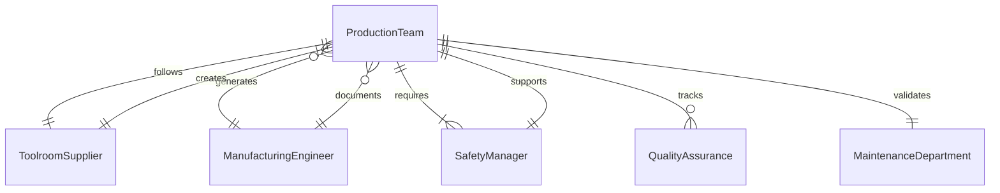
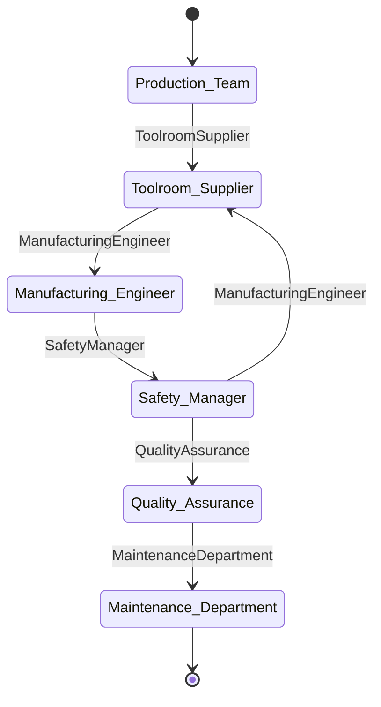
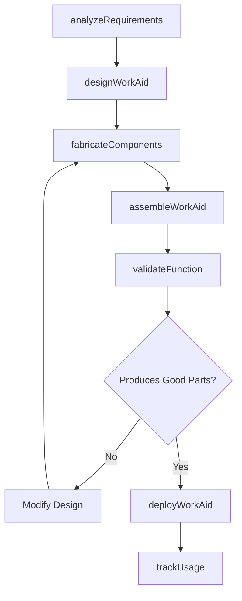
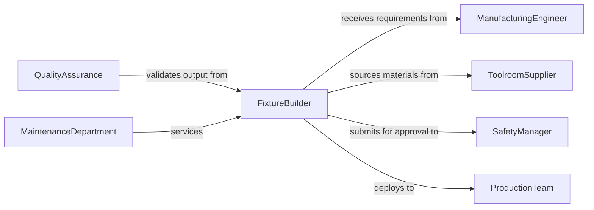

# Construct Patterns Templates Work Aids

> Business-as-Code definition for constructing patterns, templates, and work aids to support manufacturing and assembly operations. Models the complete fabrication process from requirements analysis through deployment and maintenance.

## Overview

Pattern, template, and work aid construction involves creating reusable guides, fixtures, and jigs that ensure consistency and efficiency in production processes. This definition exposes actions for each construction phase, events for inventory automation, and searches for work aid tracking and utilization analysis.

## Actors

| Actor | Description |
|-------|-------------|
| ProductionTeam | Uses work aids to perform assembly and fabrication tasks |
| ToolroomSupplier | Provides steel, aluminum, and fixture components |
| ManufacturingEngineer | Specifies work aid requirements and tolerances |
| SafetyManager | Approves work aids for operator use and ergonomics |
| QualityAssurance | Validates work aids produce conforming parts |
| MaintenanceDepartment | Repairs and refurbishes worn work aids |

## Roles

| Role | Description |
|------|-------------|
| FixtureBuilder | Fabricates jigs, templates, and assembly aids |
| ProcessEngineer | Designs work aids to optimize cycle time and quality |
| Toolmaker | Machines precision components for fixtures and gauges |
| TrainingCoordinator | Instructs operators on proper work aid usage |

## Entities

| Entity | Description |
|--------|-------------|
| WorkAid | A reusable device that assists in manufacturing operations |
| Template | A guide for marking, cutting, or drilling operations |
| Fixture | A device that holds workpieces during processing |
| Jig | A guide that controls tool location and movement |
| UsageLog | Record of work aid deployment and utilization |
| MaintenanceRecord | History of repairs and condition assessments |

## Actions

| Action | Description |
|--------|-------------|
| analyzeRequirements | Define work aid functionality and performance criteria |
| designWorkAid | Create detailed drawings and assembly instructions |
| fabricateComponents | Machine or fabricate work aid parts and hardware |
| assembleWorkAid | Join components and install locating features |
| validateFunction | Test work aid with production parts and processes |
| deployWorkAid | Issue work aid to production and train operators |
| trackUsage | Monitor work aid utilization and condition |

## Events

| Event | Description |
|-------|-------------|
| requirementsAnalyzed | Work aid specifications defined and documented |
| workAidDesigned | Drawings and bill of materials completed |
| componentsFabricated | All parts machined and ready for assembly |
| workAidAssembled | Device constructed and hardware installed |
| functionValidated | Work aid tested and produces conforming parts |
| workAidDeployed | Issued to production with training completed |
| usageTracked | Utilization data recorded and analyzed |

## Searches

| Search | Description |
|--------|-------------|
| findWorkAids | List work aids by type, process, or location |
| getDesigns | Retrieve drawings and specifications |
| getUsageLogs | Find deployment history and utilization rates |
| getMaintenance | Retrieve repair records and condition assessments |
## Entity Relationships




## State Diagram




## Workflow



## Actor Relationships



## Usage

### Calling Actions

```typescript
import { constructPatternsTemplatesWorkAids } from '@headlessly/construct-patterns-templates-work-aids'

const workAids = constructPatternsTemplatesWorkAids()

// Analyze requirements for a drilling template
const requirements = await workAids.analyzeRequirements({
  process: 'drilling',
  partNumber: 'PN-7294',
  features: ['8-hole-pattern', '0.250-dia', '4.500-bolt-circle'],
  throughput: 200 // parts per day
})

// Design the work aid
const design = await workAids.designWorkAid({
  requirementId: requirements.id,
  material: 'aluminum-6061',
  bushings: 8,
  locatingPins: 2,
  clampType: 'toggle'
})

// Validate with production parts
const validation = await workAids.validateFunction({
  workAidId: design.id,
  trialParts: 10,
  criteria: ['hole-location', 'hole-size', 'perpendicularity']
})
```

### Event-Driven Automation

```typescript
// Auto-schedule training after deployment
workAids.workAidDeployed(async ({ workAidId, location }) => {
  await scheduleTraining({
    workAidId,
    location,
    topic: 'proper-use-and-handling',
    attendees: 'all-shift-operators'
  })
})

// Alert on validation failures
workAids.functionValidated(async ({ workAidId, passed, issues }) => {
  if (!passed) {
    await notify({
      to: 'process-engineer',
      message: `Work aid ${workAidId} failed validation: ${issues.join(', ')}`
    })
  }
})
```
