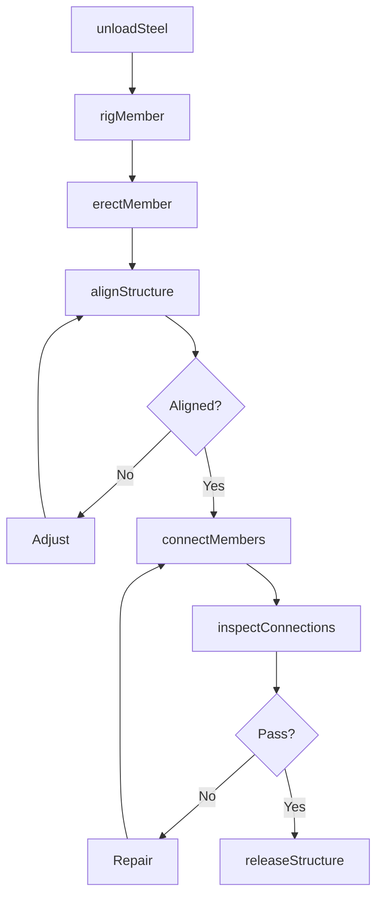
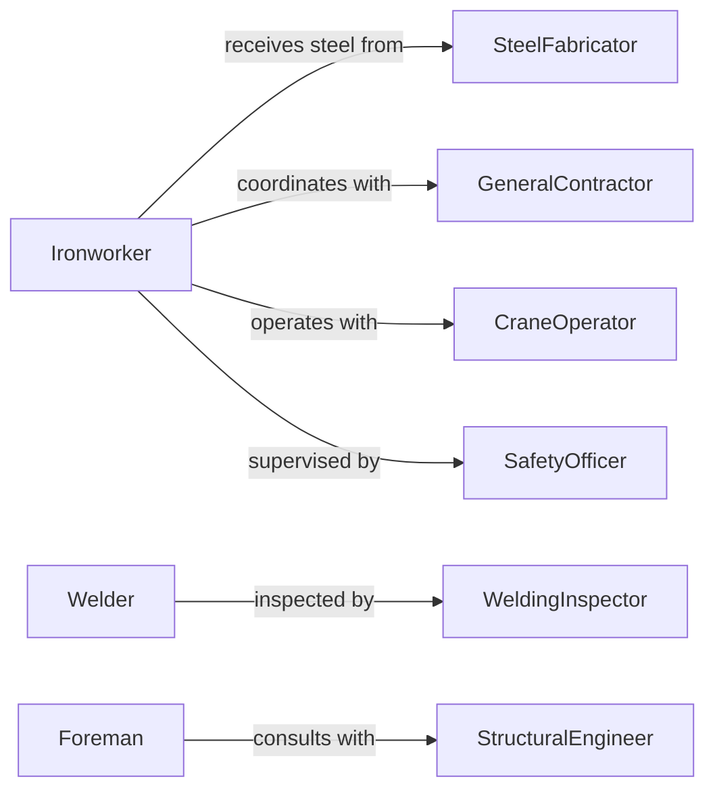

# Assemble Metal Structures

> Business-as-Code definition for assembling metal structures including steel frames, trusses, and architectural components. Models the complete assembly process from fabrication through erection and inspection.

## Overview

Metal structure assembly involves joining steel beams, columns, bracing, and connection hardware into buildings, bridges, towers, and industrial frameworks. This definition exposes actions for each erection phase, events for safety and scheduling automation, and searches for material tracking and job management.

## Actors

| Actor | Description |
|-------|-------------|
| SteelFabricator | Supplies fabricated beams, columns, and connection plates |
| GeneralContractor | Coordinates site preparation and construction schedule |
| CraneOperator | Provides lifting equipment and rigging services |
| WeldingInspector | Certifies weld quality and structural connections |
| StructuralEngineer | Reviews field conditions and approves modifications |
| SafetyOfficer | Monitors fall protection and rigging safety compliance |

## Roles

| Role | Description |
|------|-------------|
| Ironworker | Erects and connects structural steel members |
| Foreman | Coordinates crew activities and material flow |
| Welder | Performs structural welding and connection fabrication |
| BoltUpCrew | Installs high-strength bolted connections |

## Entities

| Entity | Description |
|--------|-------------|
| Structure | A metal framework of connected beams and columns |
| Member | An individual beam, column, or bracing element |
| Connection | A welded or bolted joint between structural members |
| ErectionDrawing | Field assembly instructions and piece marks |
| LiftPlan | Rigging and crane operation safety plan |
| Inspection Report | Documentation of weld and bolt quality |

## Actions

| Action | Description |
|--------|-------------|
| unloadSteel | Receive and organize fabricated members on site |
| rigMember | Attach lifting hardware and prepare for hoisting |
| erectMember | Position and temporarily secure structural steel |
| alignStructure | Verify plumb, level, and dimensional accuracy |
| connectMembers | Install bolts or perform field welding |
| inspectConnections | Verify weld quality and bolt torque |
| releaseStructure | Remove temporary bracing and accept work |

## Events

| Event | Description |
|-------|-------------|
| steelUnloaded | Fabricated members delivered and staged on site |
| memberRigged | Lifting hardware attached and crane ready to hoist |
| memberErected | Steel positioned and temporarily braced |
| structureAligned | Plumb, level, and dimensions verified within tolerance |
| membersConnected | Permanent connections completed and cooling |
| connectionsInspected | Quality verification passed and documented |
| structureReleased | Temporary supports removed and load transferred |

## Searches

| Search | Description |
|--------|-------------|
| findStructures | List jobs by project, status, or erection sequence |
| getMembers | Retrieve steel inventory by piece mark or location |
| getDrawings | Find erection plans and connection details |
| getInspections | Retrieve weld and bolt inspection records |

## Workflow



## Actor Relationships



## Usage

### Calling Actions

```typescript
import { assembleMetalStructures } from '@headlessly/assemble-metal-structures'

const structures = assembleMetalStructures()

// Unload and stage steel delivery
await structures.unloadSteel({
  projectId: 'PROJ-9284',
  shipment: 'SHIP-4729',
  members: [
    { pieceMark: 'C1', type: 'column', weight: 4200 },
    { pieceMark: 'B12', type: 'beam', weight: 3800 },
    { pieceMark: 'BR3', type: 'brace', weight: 1200 }
  ]
})

// Rig a column for hoisting
await structures.rigMember({
  pieceMark: 'C1',
  crane: 'CRANE-01',
  rigging: { slings: 2, shackles: 2, weight: 4200 },
  radius: 85 // feet
})

// Inspect welded connections
const inspection = await structures.inspectConnections({
  projectId: 'PROJ-9284',
  connections: ['C1-B12', 'B12-C2'],
  method: 'visual-and-UT'
})
```

### Event-Driven Automation

```typescript
// Auto-schedule inspection after connections complete
structures.membersConnected(async ({ projectId, connections }) => {
  await scheduleInspection({
    projectId,
    connections,
    inspector: 'CWI-certified',
    within: '24-hours'
  })
})

// Alert on alignment issues
structures.structureAligned(async ({ projectId, aligned, deviations }) => {
  if (!aligned) {
    await notify({
      to: 'structural-engineer',
      message: `Structure ${projectId} out of tolerance: ${deviations.join(', ')}`
    })
  }
})
```
