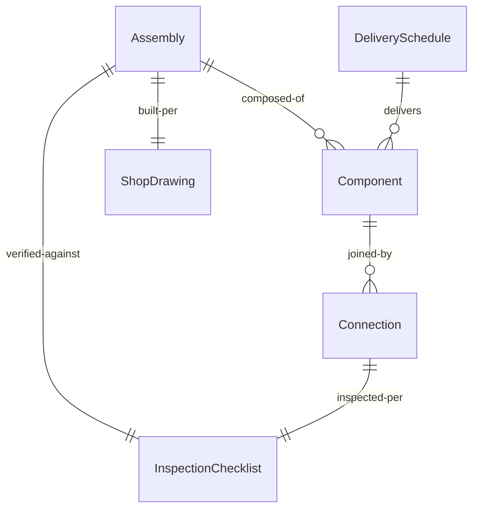
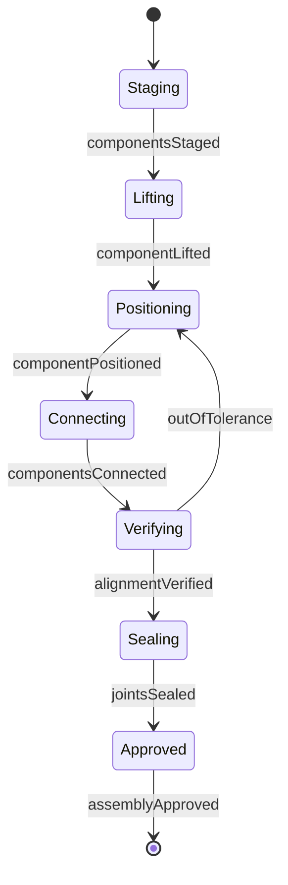
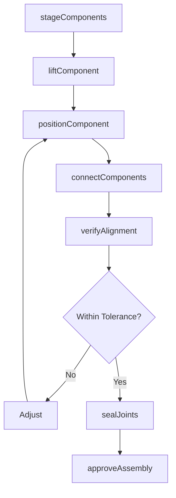
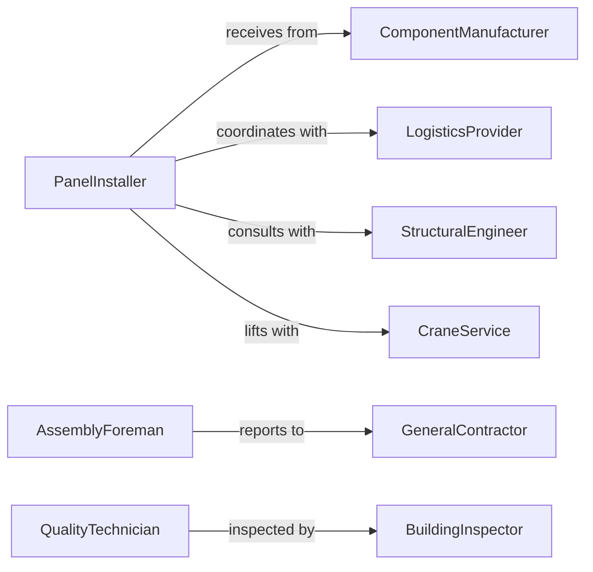

# Assemble Structural Components

> Business-as-Code definition for assembling structural components including prefabricated panels, trusses, and modular building elements. Models the complete assembly process from component staging through connection and verification.

## Overview

Structural component assembly involves joining prefabricated elements into building systems, including wall panels, roof trusses, floor systems, and precast concrete assemblies. This definition exposes actions for each assembly phase, events for logistics automation, and searches for component tracking and project scheduling.

## Actors

| Actor | Description |
|-------|-------------|
| ComponentManufacturer | Produces prefabricated structural panels and modules |
| LogisticsProvider | Transports components to job site with specialized equipment |
| GeneralContractor | Manages site conditions and construction sequence |
| StructuralEngineer | Reviews assembly procedures and connection details |
| BuildingInspector | Verifies code compliance and structural integrity |
| CraneService | Provides lifting equipment for panel erection |

## Roles

| Role | Description |
|------|-------------|
| PanelInstaller | Positions and connects structural components |
| AssemblyForeman | Coordinates component sequencing and crew assignments |
| ConnectionSpecialist | Installs fasteners and seals between components |
| QualityTechnician | Inspects alignment and connection quality |

## Entities

| Entity | Description |
|--------|-------------|
| Component | A prefabricated structural element ready for assembly |
| Assembly | A collection of connected components forming a system |
| Connection | A mechanical or adhesive joint between components |
| ShopDrawing | Detailed fabrication and installation instructions |
| DeliverySchedule | Timeline for component delivery to job site |
| InspectionChecklist | Quality verification criteria and tolerances |

## Actions

| Action | Description |
|--------|-------------|
| stageComponents | Organize delivered components for installation sequence |
| liftComponent | Hoist component to installation location |
| positionComponent | Align component with adjacent elements and substrate |
| connectComponents | Install fasteners, welds, or adhesives between elements |
| verifyAlignment | Measure plumb, level, and dimensional accuracy |
| sealJoints | Apply weatherproofing and thermal barriers |
| approveAssembly | Accept completed assembly for subsequent work |

## Events

| Event | Description |
|-------|-------------|
| componentsStaged | Elements organized and ready for installation |
| componentLifted | Panel or module hoisted and positioned |
| componentPositioned | Element aligned and temporarily secured |
| componentsConnected | Permanent fastening completed |
| alignmentVerified | Dimensions and plumb checked within tolerance |
| jointsSealed | Weatherproofing and insulation installed |
| assemblyApproved | Installation accepted and documented |

## Searches

| Search | Description |
|--------|-------------|
| findComponents | List components by project, type, or delivery status |
| getAssemblies | Retrieve installation status by zone or elevation |
| getDrawings | Find shop drawings and connection details |
| getInspections | Retrieve quality verification and punch list items |
## Entity Relationships




## State Diagram




## Workflow



## Actor Relationships



## Usage

### Calling Actions

```typescript
import { assembleStructuralComponents } from '@headlessly/assemble-structural-components'

const components = assembleStructuralComponents()

// Stage wall panels for installation
await components.stageComponents({
  projectId: 'PROJ-5729',
  zone: 'Level-2-North',
  components: [
    { id: 'WP-201', type: 'wall-panel', length: 20, height: 10 },
    { id: 'WP-202', type: 'wall-panel', length: 24, height: 10 },
    { id: 'WP-203', type: 'corner-panel', length: 12, height: 10 }
  ]
})

// Position a panel
await components.positionComponent({
  componentId: 'WP-201',
  location: { x: 0, y: 0, z: 120 },
  adjacent: ['WP-200', 'floor-deck-2N']
})

// Verify alignment
const verification = await components.verifyAlignment({
  componentId: 'WP-201',
  tolerances: { plumb: 0.25, level: 0.125, position: 0.5 }
})
```

### Event-Driven Automation

```typescript
// Auto-schedule sealing after alignment verified
components.alignmentVerified(async ({ componentId, zone }) => {
  await scheduleSealing({
    componentId,
    zone,
    materials: ['air-barrier', 'thermal-insulation'],
    crew: 'sealing-team-A'
  })
})

// Alert on delivery delays
components.componentsStaged(async ({ projectId, deliveryDate, scheduled }) => {
  const delayDays = (new Date(deliveryDate) - new Date(scheduled)) / (1000 * 60 * 60 * 24)
  if (delayDays > 2) {
    await notify({
      to: 'assembly-foreman',
      message: `Components for ${projectId} delayed ${delayDays} days`
    })
  }
})
```
