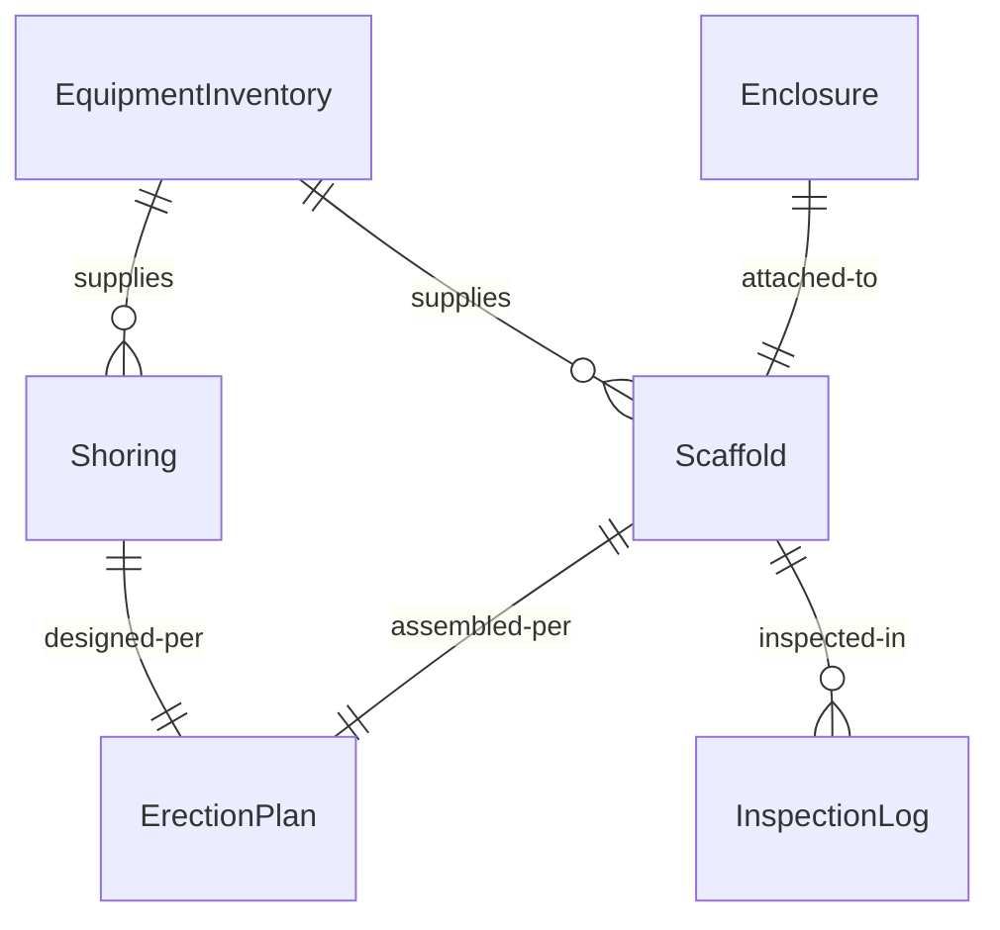
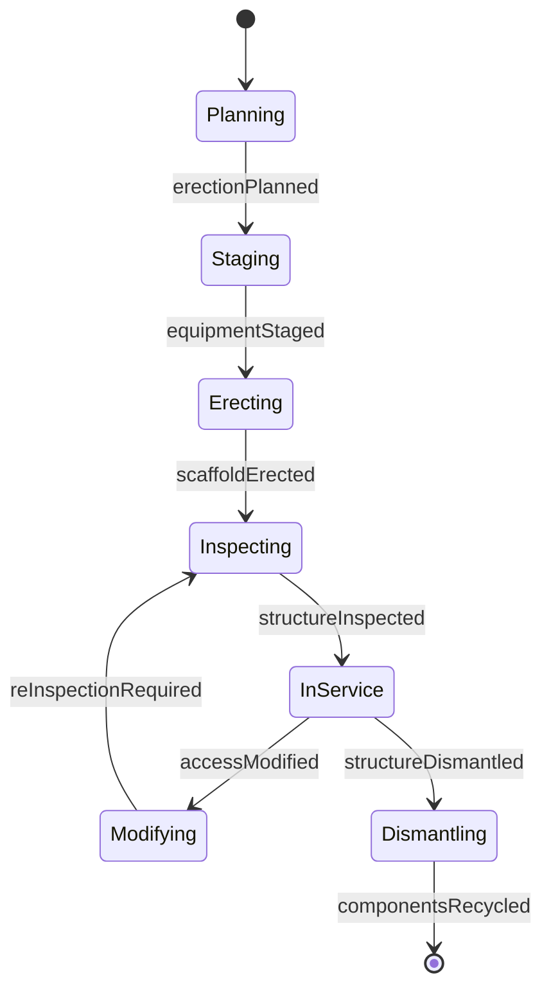
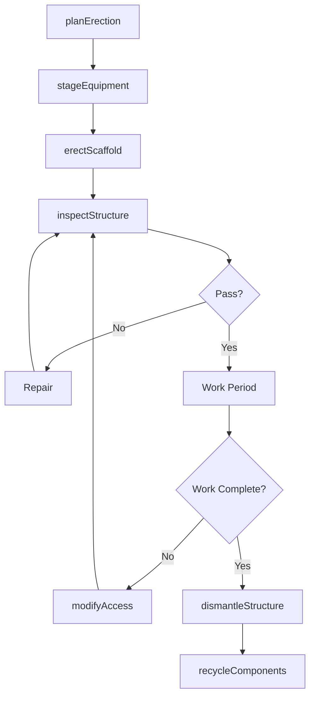
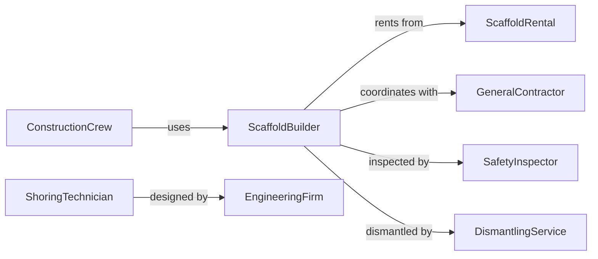

# Assemble Temporary Equipment Structures

> Business-as-Code definition for assembling temporary equipment and structures including scaffolding, shoring, staging, and protective enclosures. Models the complete assembly process from planning through dismantling and reuse.

## Overview

Temporary structure assembly involves erecting scaffolding, formwork supports, weather protection, and access platforms to facilitate construction, maintenance, and event activities. This definition exposes actions for each phase, events for safety automation, and searches for equipment tracking and utilization management.

## Actors

| Actor | Description |
|-------|-------------|
| ScaffoldRental | Supplies frames, planks, bracing, and hardware |
| GeneralContractor | Specifies access and work platform requirements |
| SafetyInspector | Verifies structural integrity and fall protection |
| ConstructionCrew | Uses temporary structures for work access |
| EngineeringFirm | Designs shoring and support systems for complex loads |
| DismantlingService | Removes and recycles temporary structures |

## Roles

| Role | Description |
|------|-------------|
| ScaffoldBuilder | Erects and secures temporary access platforms |
| ShoringTechnician | Installs load-bearing temporary supports |
| SafetyCoordinator | Ensures compliance with fall protection regulations |
| InspectionTechnician | Performs daily competent person inspections |

## Entities

| Entity | Description |
|--------|-------------|
| Scaffold | A temporary access platform or work surface |
| Shoring | A support structure to carry temporary or permanent loads |
| Enclosure | A weather protection barrier or containment system |
| ErectionPlan | Assembly instructions and load capacity specifications |
| InspectionLog | Daily safety verification and deficiency records |
| EquipmentInventory | Available frames, planks, and hardware for deployment |

## Actions

| Action | Description |
|--------|-------------|
| planErection | Design temporary structure for loads and access needs |
| stageEquipment | Organize frames, planks, and hardware at work location |
| erectScaffold | Assemble frames, platforms, and guardrails |
| inspectStructure | Verify stability, load capacity, and safety features |
| modifyAccess | Adjust platform height or configuration as work progresses |
| dismantleStructure | Remove temporary structure and return components to inventory |
| recycleComponents | Clean, inspect, and store equipment for reuse |

## Events

| Event | Description |
|-------|-------------|
| erectionPlanned | Temporary structure design and capacity verified |
| equipmentStaged | Frames and hardware delivered to work location |
| scaffoldErected | Platform assembled with guardrails and access |
| structureInspected | Safety verification completed and documented |
| accessModified | Platform height or configuration changed |
| structureDismantled | Temporary structure removed and work complete |
| componentsRecycled | Equipment cleaned, inspected, and returned to inventory |

## Searches

| Search | Description |
|--------|-------------|
| findStructures | List temporary structures by project, type, or status |
| getEquipment | Retrieve available scaffold and shoring inventory |
| getInspections | Find safety inspection logs and deficiency records |
| getUtilization | Retrieve equipment deployment and rental history |
## Entity Relationships




## State Diagram




## Workflow



## Actor Relationships



## Usage

### Calling Actions

```typescript
import { assembleTemporaryEquipmentStructures } from '@headlessly/assemble-temporary-equipment-structures'

const temporary = assembleTemporaryEquipmentStructures()

// Plan scaffolding for facade work
const plan = await temporary.planErection({
  projectId: 'PROJ-8274',
  type: 'facade-scaffold',
  height: 60,
  length: 120,
  workLoad: 75, // pounds per square foot
  duration: 90 // days
})

// Erect the scaffold
await temporary.erectScaffold({
  planId: plan.id,
  bays: 24,
  lifts: 6,
  platforms: { width: 5, planks: 3 },
  guardrails: true,
  toeboards: true
})

// Perform daily inspection
const inspection = await temporary.inspectStructure({
  structureId: plan.id,
  inspector: 'competent-person-ID-472',
  checks: ['stability', 'guardrails', 'access', 'load-capacity']
})
```

### Event-Driven Automation

```typescript
// Auto-schedule daily inspections
temporary.scaffoldErected(async ({ structureId, projectId }) => {
  await scheduleRecurringInspection({
    structureId,
    frequency: 'daily',
    inspector: 'competent-person',
    duration: 90 // days
  })
})

// Alert on inspection failures
temporary.structureInspected(async ({ structureId, passed, deficiencies }) => {
  if (!passed) {
    await notify({
      to: 'safety-coordinator',
      urgent: true,
      message: `Scaffold ${structureId} failed inspection: ${deficiencies.join(', ')}`
    })
    await tagOutOfService({ structureId })
  }
})
```
