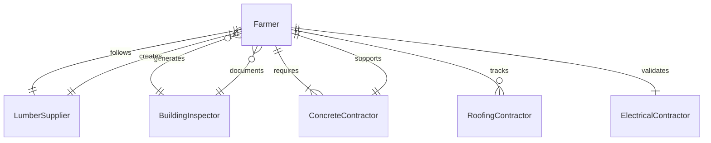
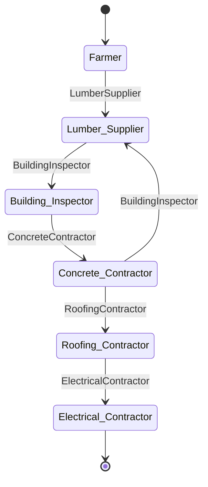
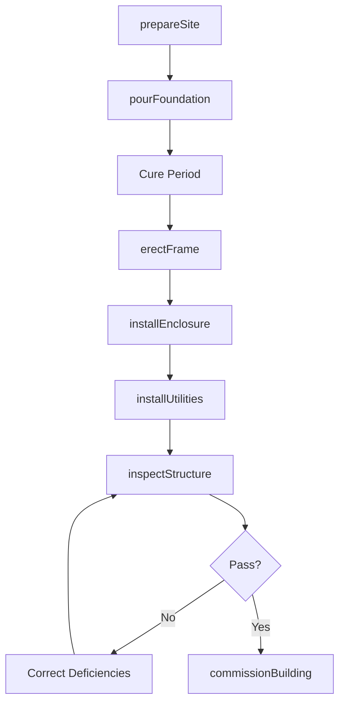
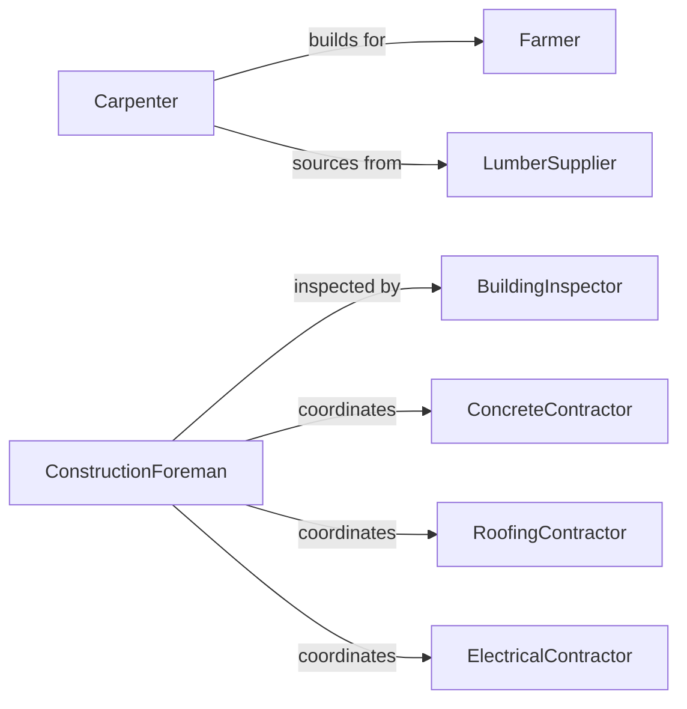

# Build Agricultural Structures

> Business-as-Code definition for building agricultural structures including barns, greenhouses, storage facilities, and livestock housing. Models the complete construction process from site preparation through final inspection.

## Overview

Agricultural structure construction involves erecting specialized buildings and enclosures to support farming operations, livestock management, crop storage, and equipment protection. This definition exposes actions for each construction phase, events for project automation, and searches for material tracking and regulatory compliance.

## Actors

| Actor | Description |
|-------|-------------|
| Farmer | Specifies functional requirements and operational needs |
| LumberSupplier | Provides framing materials and engineered wood products |
| BuildingInspector | Verifies code compliance and structural integrity |
| ConcreteContractor | Pours foundations, floors, and feed bunkers |
| RoofingContractor | Installs metal roofing and ventilation systems |
| ElectricalContractor | Wires lighting, fans, and automated feeding systems |

## Roles

| Role | Description |
|------|-------------|
| Carpenter | Frames walls, trusses, and structural systems |
| ConstructionForeman | Coordinates subcontractors and material deliveries |
| SiteSupervisor | Manages daily activities and safety compliance |
| PermitCoordinator | Secures building permits and zoning approvals |

## Entities

| Entity | Description |
|--------|-------------|
| Structure | An agricultural building or enclosure under construction |
| Foundation | Concrete slab or pier system supporting the structure |
| Frame | Structural skeleton of posts, beams, and trusses |
| Enclosure | Walls, doors, and roof forming the building envelope |
| Utility | Electrical, plumbing, or HVAC system installation |
| Permit | Regulatory approval required for construction |

## Actions

| Action | Description |
|--------|-------------|
| prepareSite | Grade land and excavate for foundation |
| pourFoundation | Place concrete footings, slabs, and floors |
| erectFrame | Assemble posts, beams, and roof trusses |
| installEnclosure | Attach siding, doors, and roofing materials |
| installUtilities | Wire electrical systems and plumbing |
| inspectStructure | Verify building code compliance and safety |
| commissionBuilding | Accept completed structure for agricultural use |

## Events

| Event | Description |
|-------|-------------|
| sitePrepared | Land graded and foundation excavation complete |
| foundationPoured | Concrete cured and ready for framing |
| frameErected | Structural skeleton assembled and braced |
| enclosureInstalled | Building envelope closed and weathertight |
| utilitiesInstalled | Electrical and mechanical systems operational |
| structureInspected | Code compliance verified and documented |
| buildingCommissioned | Structure accepted and ready for farm operations |

## Searches

| Search | Description |
|--------|-------------|
| findStructures | List projects by farm, type, or construction status |
| getMaterials | Retrieve lumber, hardware, and component inventory |
| getPermits | Find regulatory approvals and inspection schedules |
| getInspections | Retrieve compliance verification and punch list items |
## Entity Relationships




## State Diagram




## Workflow



## Actor Relationships



## Usage

### Calling Actions

```typescript
import { buildAgriculturalStructures } from '@headlessly/build-agricultural-structures'

const structures = buildAgriculturalStructures()

// Prepare site for a new barn
await structures.prepareSite({
  farmId: 'FARM-472',
  structureType: 'livestock-barn',
  dimensions: { length: 120, width: 60 },
  grading: { elevation: 'crown-center', slope: 0.02 }
})

// Pour the foundation slab
await structures.pourFoundation({
  structureId: 'STRUCT-8472',
  type: 'slab-on-grade',
  thickness: 6,
  reinforcement: 'welded-wire-mesh',
  cureTime: 7 // days
})

// Inspect completed structure
const inspection = await structures.inspectStructure({
  structureId: 'STRUCT-8472',
  inspector: 'building-dept-ID-293',
  checks: ['structural', 'electrical', 'fire-safety']
})
```

### Event-Driven Automation

```typescript
// Auto-schedule framing after foundation cures
structures.foundationPoured(async ({ structureId, pourDate }) => {
  const frameDate = new Date(pourDate.getTime() + 7 * 24 * 60 * 60 * 1000)
  await scheduleFraming({
    structureId,
    startDate: frameDate,
    crew: 'framing-crew-A'
  })
})

// Alert farmer when building ready
structures.buildingCommissioned(async ({ structureId, farmId }) => {
  await notify({
    to: farmId,
    message: `Agricultural structure ${structureId} is complete and ready for use`
  })
})
```
