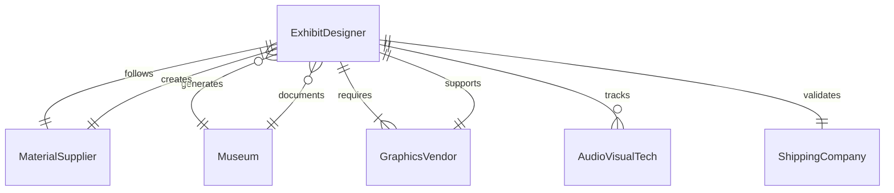
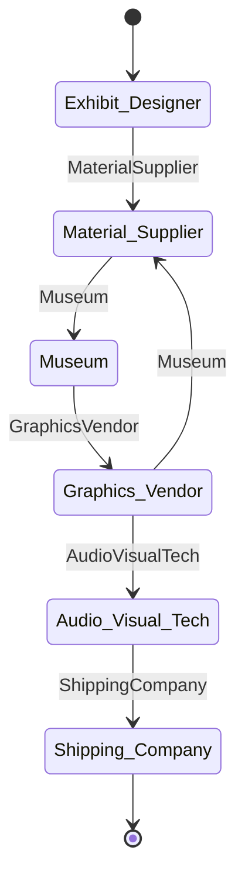
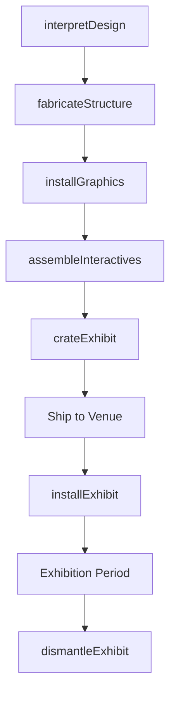
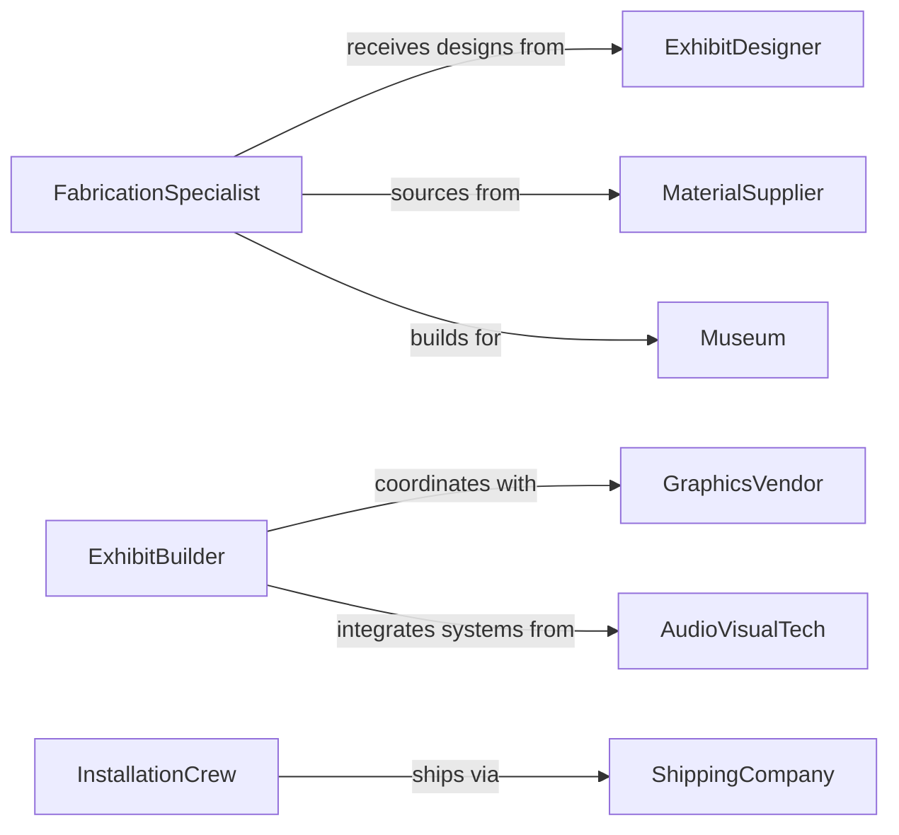

# Construct Exhibits Parts Exhibits

> Business-as-Code definition for constructing exhibits and exhibit components for museums, trade shows, and public displays. Models the complete fabrication process from design interpretation through installation and teardown.

## Overview

Exhibit construction involves building display structures, interactive installations, signage, and architectural elements that communicate information and engage audiences. This definition exposes actions for each fabrication phase, events for scheduling automation, and searches for project tracking and inventory management.

## Actors

| Actor | Description |
|-------|-------------|
| ExhibitDesigner | Provides design renderings and technical specifications |
| MaterialSupplier | Furnishes fabrication materials and specialty components |
| Museum | Commissions exhibits and provides installation requirements |
| GraphicsVendor | Produces printed panels, signage, and visual elements |
| AudioVisualTech | Installs interactive displays and multimedia systems |
| ShippingCompany | Crates and transports exhibits to installation sites |

## Roles

| Role | Description |
|------|-------------|
| FabricationSpecialist | Builds exhibit structures and custom components |
| ExhibitBuilder | Assembles display elements and installs graphics |
| ProjectManager | Coordinates fabrication schedule and vendor deliveries |
| InstallationCrew | Erects exhibits at museums and event venues |

## Entities

| Entity | Description |
|--------|-------------|
| Exhibit | A complete display installation or themed environment |
| DisplayCase | A protective enclosure for artifacts or specimens |
| Panel | A graphic or informational element mounted to structure |
| Interactive | A hands-on component or digital touchscreen display |
| ShopDrawing | Detailed fabrication instructions and material specifications |
| InstallationPlan | Site-specific assembly instructions and layouts |

## Actions

| Action | Description |
|--------|-------------|
| interpretDesign | Analyze renderings and create fabrication drawings |
| fabricateStructure | Build frames, bases, and support systems |
| installGraphics | Apply vinyl, prints, and signage to display surfaces |
| assembleInteractives | Integrate mechanical and electronic components |
| crateExhibit | Package exhibit for shipping and handling protection |
| installExhibit | Erect display at venue and connect utilities |
| dismantleExhibit | Remove exhibit and prepare for storage or disposal |

## Events

| Event | Description |
|-------|-------------|
| designInterpreted | Shop drawings completed and approved for fabrication |
| structureFabricated | Display frames and supports constructed |
| graphicsInstalled | Printed panels and signage mounted to structure |
| interactivesAssembled | Mechanical and electronic components integrated |
| exhibitCrated | Display packaged and ready for shipment |
| exhibitInstalled | Display erected at venue and operational |
| exhibitDismantled | Installation removed and components recovered |

## Searches

| Search | Description |
|--------|-------------|
| findExhibits | List projects by client, venue, or status |
| getComponents | Retrieve fabrication parts and material inventory |
| getDrawings | Find shop drawings and installation instructions |
| getSchedules | Retrieve fabrication and installation timelines |
## Entity Relationships




## State Diagram




## Workflow



## Actor Relationships



## Usage

### Calling Actions

```typescript
import { constructExhibitsPartsExhibits } from '@headlessly/construct-exhibits-parts-exhibits'

const exhibits = constructExhibitsPartsExhibits()

// Interpret design for a natural history exhibit
const design = await exhibits.interpretDesign({
  projectId: 'EXH-2947',
  title: 'Ancient Oceans',
  renderings: ['concept-A.pdf', 'elevation-views.pdf'],
  budget: 350000,
  installDate: '2026-06-15'
})

// Fabricate display structure
await exhibits.fabricateStructure({
  exhibitId: design.id,
  components: [
    { type: 'display-case', dimensions: { w: 48, d: 36, h: 84 } },
    { type: 'platform', dimensions: { w: 120, d: 96, h: 18 } },
    { type: 'archway', dimensions: { w: 96, h: 120 } }
  ]
})

// Install exhibit at museum
const installation = await exhibits.installExhibit({
  exhibitId: design.id,
  venue: 'Natural-History-Museum',
  gallery: 'East-Wing-Gallery-3',
  crew: 'install-team-B'
})
```

### Event-Driven Automation

```typescript
// Auto-coordinate graphics after structure complete
exhibits.structureFabricated(async ({ exhibitId }) => {
  await scheduleGraphics({
    exhibitId,
    vendor: 'preferred-graphics-vendor',
    production: 'print-and-mount',
    lead: 14 // days
  })
})

// Alert on installation completion
exhibits.exhibitInstalled(async ({ exhibitId, venue, installDate }) => {
  await notify({
    to: 'project-manager',
    message: `Exhibit ${exhibitId} installed at ${venue} on ${installDate}`
  })
  await scheduleQualityReview({ exhibitId, within: '24-hours' })
})
```
