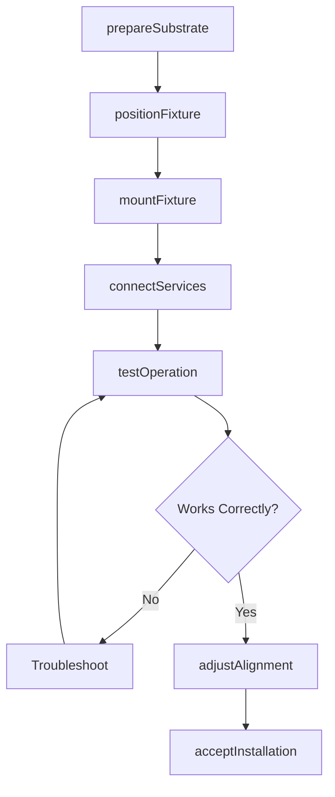
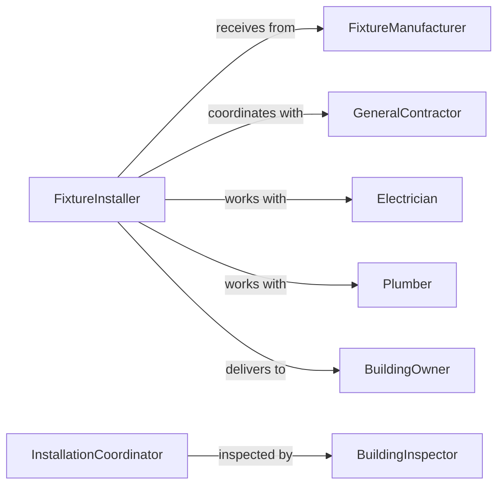

# Install Building Fixtures

> Business-as-Code definition for installing building fixtures including lighting, plumbing, cabinetry, and architectural hardware. Models the complete installation process from site preparation through testing and acceptance.

## Overview

Building fixture installation involves mounting and connecting permanent fixtures that provide functionality and finish to interior and exterior spaces. This definition exposes actions for each installation phase, events for coordination automation, and searches for inventory and project scheduling.

## Actors

| Actor | Description |
|-------|-------------|
| FixtureManufacturer | Supplies lighting, plumbing fixtures, and hardware |
| GeneralContractor | Coordinates installation sequence and site access |
| Electrician | Connects lighting fixtures and powered components |
| Plumber | Installs water supply and drain connections |
| BuildingInspector | Verifies code compliance and installation quality |
| BuildingOwner | Accepts completed installations and provides punch list |

## Roles

| Role | Description |
|------|-------------|
| FixtureInstaller | Mounts and secures fixtures to building substrates |
| CabinetInstaller | Installs millwork, casework, and storage systems |
| HardwareSpecialist | Installs door hardware, railings, and accessories |
| InstallationCoordinator | Schedules crews and manages material deliveries |

## Entities

| Entity | Description |
|--------|-------------|
| Fixture | A permanently attached building component or device |
| Mounting | Fasteners and support hardware securing fixture to substrate |
| Connection | Electrical, plumbing, or mechanical service tie-in |
| InstallationSchedule | Timeline coordinating trades and material availability |
| PunchList | List of deficiencies and corrections required |
| AsBuiltRecord | Documentation of final fixture locations and models |

## Actions

| Action | Description |
|--------|-------------|
| prepareSubstrate | Verify backing, anchors, and rough-in locations |
| positionFixture | Align fixture with plans and adjacent elements |
| mountFixture | Secure fixture using appropriate fasteners |
| connectServices | Tie in electrical, water, or gas services |
| testOperation | Verify fixture functions correctly and safely |
| adjustAlignment | Fine-tune position and level for aesthetics |
| acceptInstallation | Document completion and approve fixture for use |

## Events

| Event | Description |
|-------|-------------|
| substratePrepared | Backing and anchors verified ready for fixtures |
| fixturePositioned | Fixture aligned and ready for mounting |
| fixtureMounted | Fasteners installed and fixture secured |
| servicesConnected | Electrical or plumbing connections completed |
| operationTested | Fixture functioning correctly and safely |
| alignmentAdjusted | Final positioning and leveling complete |
| installationAccepted | Fixture approved and documented |

## Searches

| Search | Description |
|--------|-------------|
| findFixtures | List fixtures by type, room, or installation status |
| getInventory | Retrieve available fixtures and delivery schedules |
| getSchedules | Find installation timelines by trade or zone |
| getPunchLists | Retrieve deficiency lists and correction status |

## Workflow



## Actor Relationships



## Usage

### Calling Actions

```typescript
import { installBuildingFixtures } from '@headlessly/install-building-fixtures'

const fixtures = installBuildingFixtures()

// Prepare substrate for vanity installation
await fixtures.prepareSubstrate({
  fixtureType: 'vanity-cabinet',
  location: 'Unit-204-Master-Bath',
  substrate: 'steel-stud-wall',
  backing: 'plywood-3/4',
  roughIn: { water: true, drain: true, electrical: true }
})

// Mount the fixture
await fixtures.mountFixture({
  fixtureId: 'VAN-48-OAK-002',
  location: 'Unit-204-Master-Bath',
  height: 34.5,
  fasteners: { type: 'lag-screw', quantity: 6 }
})

// Test operation
const test = await fixtures.testOperation({
  fixtureId: 'VAN-48-OAK-002',
  checks: ['water-flow', 'drain-operation', 'lighting', 'gfci-protection']
})
```

### Event-Driven Automation

```typescript
// Auto-schedule services after mounting
fixtures.fixtureMounted(async ({ fixtureId, location, serviceType }) => {
  if (serviceType.includes('electrical')) {
    await scheduleElectrician({ fixtureId, location, priority: 'normal' })
  }
  if (serviceType.includes('plumbing')) {
    await schedulePlumber({ fixtureId, location, priority: 'normal' })
  }
})

// Alert on test failures
fixtures.operationTested(async ({ fixtureId, passed, issues }) => {
  if (!passed) {
    await notify({
      to: 'installation-coordinator',
      message: `Fixture ${fixtureId} test failed: ${issues.join(', ')}`
    })
  }
})
```
