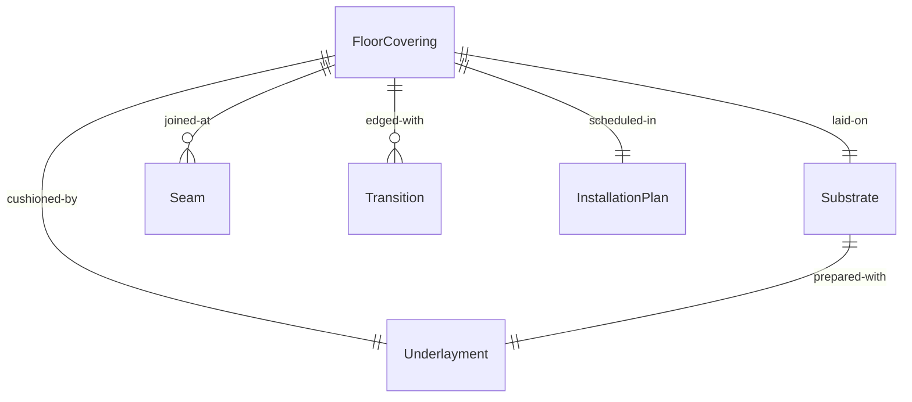
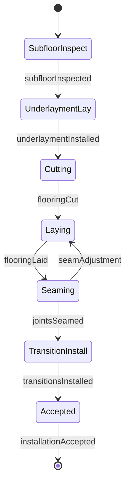
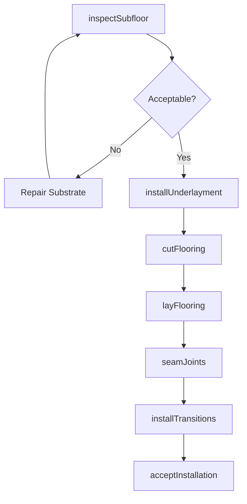
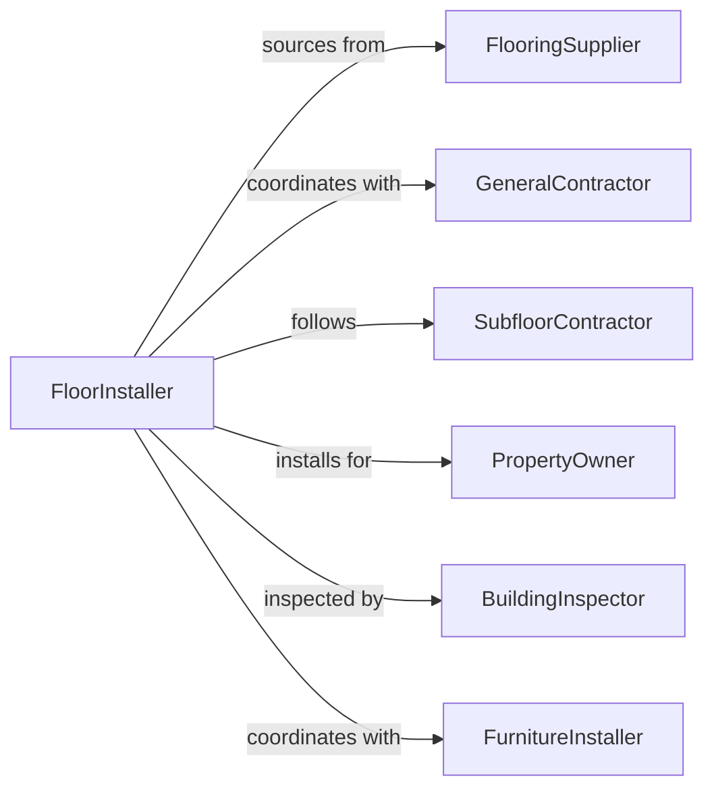

# Install Carpet Flooring

> Business-as-Code definition for installing carpet and resilient flooring systems including broadloom, tile, vinyl, and laminate products. Models the complete installation process from substrate preparation through sealing and acceptance.

## Overview

Carpet and flooring installation involves preparing subfloors, laying underlayment, and installing finish floor products that provide comfort, durability, and aesthetics. This definition exposes actions for each installation phase, events for scheduling automation, and searches for material tracking and project management.

## Actors

| Actor | Description |
|-------|-------------|
| FlooringSupplier | Provides carpet, tile, vinyl, and installation materials |
| GeneralContractor | Coordinates installation schedule and site conditions |
| SubfloorContractor | Prepares and levels concrete or wood substrates |
| PropertyOwner | Selects flooring products and approves installation |
| BuildingInspector | Verifies installation quality and code compliance |
| FurnitureInstaller | Moves furniture and coordinates room access |

## Roles

| Role | Description |
|------|-------------|
| FloorInstaller | Lays carpet, tile, and resilient flooring products |
| CarpetLayer | Stretches and seams broadloom carpet installations |
| TileSetter | Installs carpet tile and luxury vinyl tile systems |
| FinishCarpenter | Installs baseboards, transitions, and trim |

## Entities

| Entity | Description |
|--------|-------------|
| FloorCovering | Carpet, tile, or resilient material installed over subfloor |
| Substrate | Prepared surface receiving flooring material |
| Underlayment | Cushion or moisture barrier beneath finish flooring |
| Seam | A joint where two flooring pieces meet |
| Transition | A molding connecting different flooring types or elevations |
| InstallationPlan | Room-by-room schedule and material allocation |

## Actions

| Action | Description |
|--------|-------------|
| inspectSubfloor | Verify substrate flatness, moisture, and condition |
| installUnderlayment | Lay cushion, moisture barrier, or sound control layer |
| cutFlooring | Measure and cut carpet or tile to room dimensions |
| layFlooring | Position and adhere flooring material to substrate |
| seamJoints | Join carpet sections or align tile patterns |
| installTransitions | Mount edge strips and thresholds between rooms |
| acceptInstallation | Inspect completed floor and document acceptance |

## Events

| Event | Description |
|-------|-------------|
| subfloorInspected | Substrate verified ready for underlayment |
| underlaymentInstalled | Cushion or barrier laid and ready for flooring |
| flooringCut | Material measured and cut to fit room layout |
| flooringLaid | Carpet or tile positioned and secured to substrate |
| jointsSeamed | Carpet seams heat-welded or tile pattern aligned |
| transitionsInstalled | Edge strips and thresholds mounted |
| installationAccepted | Floor approved and room released for furniture |

## Searches

| Search | Description |
|--------|-------------|
| findProjects | List installations by property, room, or status |
| getMaterials | Retrieve flooring inventory and delivery schedules |
| getSchedules | Find installation timelines by installer or room |
| getInspections | Retrieve quality verification and acceptance records |
## Entity Relationships




## State Diagram




## Workflow



## Actor Relationships



## Usage

### Calling Actions

```typescript
import { installCarpetFlooring } from '@headlessly/install-carpet-flooring'

const flooring = installCarpetFlooring()

// Inspect subfloor in a commercial office
const inspection = await flooring.inspectSubfloor({
  projectId: 'PROJ-7429',
  room: 'Suite-400-Conference-Room',
  substrateType: 'concrete-slab',
  checks: ['flatness', 'moisture', 'cracks', 'cleanliness']
})

// Install carpet with padding
await flooring.installUnderlayment({
  room: 'Suite-400-Conference-Room',
  type: 'rebond-pad',
  thickness: 0.5,
  coverage: 450 // square feet
})

// Lay broadloom carpet
await flooring.layFlooring({
  room: 'Suite-400-Conference-Room',
  product: 'commercial-loop-pile',
  installation: 'stretch-in',
  direction: 'north-south'
})
```

### Event-Driven Automation

```typescript
// Auto-schedule seaming after carpet laid
flooring.flooringLaid(async ({ projectId, room, material }) => {
  if (material.includes('broadloom')) {
    await scheduleSeaming({
      projectId,
      room,
      method: 'heat-bond',
      crew: 'carpet-team-A'
    })
  }
})

// Alert on subfloor issues
flooring.subfloorInspected(async ({ room, acceptable, issues }) => {
  if (!acceptable) {
    await notify({
      to: 'general-contractor',
      message: `Subfloor in ${room} requires repair: ${issues.join(', ')}`
    })
  }
})
```
