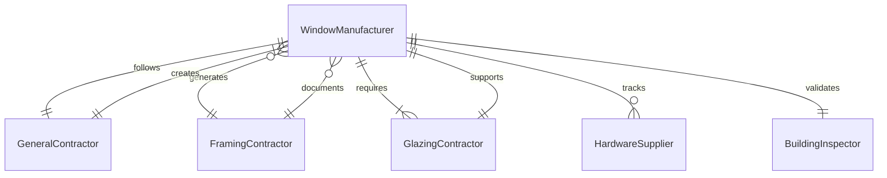
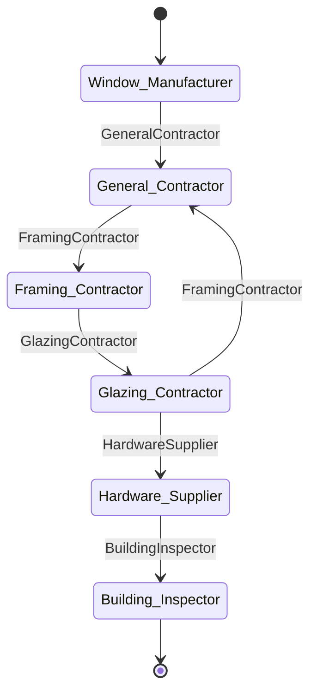
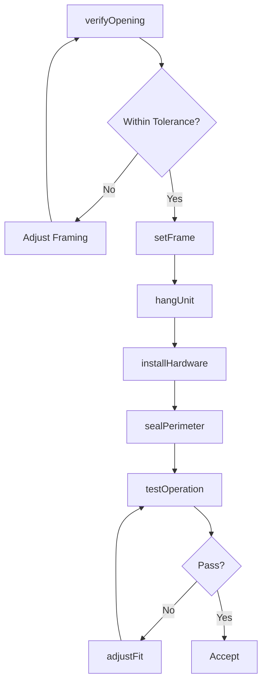
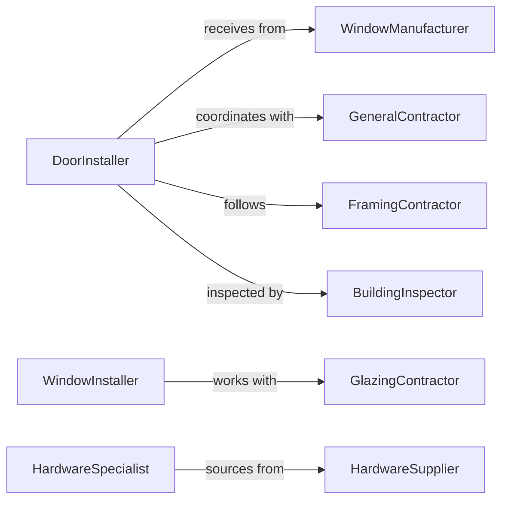

# Install Doors Windows

> Business-as-Code definition for installing doors and windows including frames, hardware, glazing, and weatherstripping. Models the complete installation process from rough opening verification through testing and adjustment.

## Overview

Door and window installation involves setting frames, hanging operable units, installing glazing, and sealing openings to provide security, weatherproofing, and energy efficiency. This definition exposes actions for each installation phase, events for coordination automation, and searches for material tracking and quality management.

## Actors

| Actor | Description |
|-------|-------------|
| WindowManufacturer | Supplies windows, doors, and factory-finished units |
| GeneralContractor | Coordinates installation schedule and building envelope work |
| FramingContractor | Prepares rough openings and structural supports |
| GlazingContractor | Installs glass and sealing systems in commercial applications |
| HardwareSupplier | Provides locksets, hinges, closers, and operators |
| BuildingInspector | Verifies installation quality and energy code compliance |

## Roles

| Role | Description |
|------|-------------|
| DoorInstaller | Hangs doors, installs frames, and adjusts hardware |
| WindowInstaller | Sets window units, seals perimeters, and installs trim |
| HardwareSpecialist | Installs locksets, closers, and panic hardware |
| WeatherizationTech | Applies sealants, weatherstripping, and insulation |

## Entities

| Entity | Description |
|--------|-------------|
| DoorUnit | A complete door assembly including frame, slab, and hardware |
| WindowUnit | A glazed opening assembly including frame and sash |
| RoughOpening | A framed wall or structural opening receiving a unit |
| Hardware | Hinges, locksets, closers, and operating mechanisms |
| Weatherseal | Gaskets, sweeps, and sealants preventing air and water infiltration |
| TestReport | Documentation of operation, security, and weatherproofing verification |

## Actions

| Action | Description |
|--------|-------------|
| verifyOpening | Check rough opening dimensions and plumb |
| setFrame | Install and shim door or window frame in opening |
| hangUnit | Install operable door slab or window sash |
| installHardware | Mount hinges, locksets, and operating mechanisms |
| sealPerimeter | Apply sealants and weatherstripping |
| testOperation | Verify swing, latch, lock, and weatherproofing |
| adjustFit | Fine-tune reveals, operation, and sealing |

## Events

| Event | Description |
|-------|-------------|
| openingVerified | Rough opening dimensions confirmed within tolerance |
| frameSet | Door or window frame installed and shimmed |
| unitHung | Operable door or window positioned in frame |
| hardwareInstalled | Locksets, closers, and operators mounted |
| perimeterSealed | Sealants and weatherstripping applied |
| operationTested | Function, security, and weatherproofing verified |
| fitAdjusted | Final adjustments completed and unit accepted |

## Searches

| Search | Description |
|--------|-------------|
| findUnits | List doors or windows by project, type, or status |
| getInventory | Retrieve available units and delivery schedules |
| getOpenings | Find rough opening locations and dimensions |
| getTests | Retrieve operation and weatherproofing test results |
## Entity Relationships




## State Diagram




## Workflow



## Actor Relationships



## Usage

### Calling Actions

```typescript
import { installDoorsWindows } from '@headlessly/install-doors-windows'

const units = installDoorsWindows()

// Verify rough opening for entry door
const opening = await units.verifyOpening({
  projectId: 'PROJ-5829',
  location: 'Unit-102-Front-Entry',
  unitType: 'exterior-door',
  nominal: { width: 36, height: 80 },
  tolerance: 0.25
})

// Set the door frame
await units.setFrame({
  openingId: opening.id,
  frame: 'steel-frame-18ga',
  anchors: { type: 'masonry-screw', quantity: 12 },
  shims: 'composite'
})

// Test operation after installation
const test = await units.testOperation({
  unitId: 'DOOR-102',
  checks: ['swing-clearance', 'latch-engagement', 'lock-function', 'weatherstrip-contact']
})
```

### Event-Driven Automation

```typescript
// Auto-schedule hardware installation after unit hung
units.unitHung(async ({ unitId, location, unitType }) => {
  const hardwareSpec = unitType === 'exterior-door' ? 'grade-1-lockset' : 'passage-latch'
  await scheduleHardware({
    unitId,
    location,
    hardware: hardwareSpec,
    crew: 'hardware-team'
  })
})

// Alert on test failures
units.operationTested(async ({ unitId, passed, issues }) => {
  if (!passed) {
    await notify({
      to: 'installation-foreman',
      message: `Unit ${unitId} failed testing: ${issues.join(', ')}`
    })
  }
})
```
