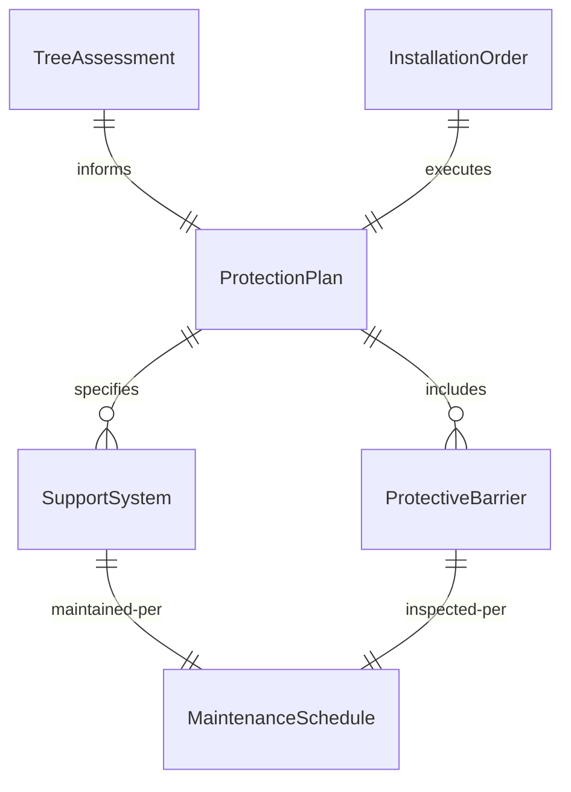
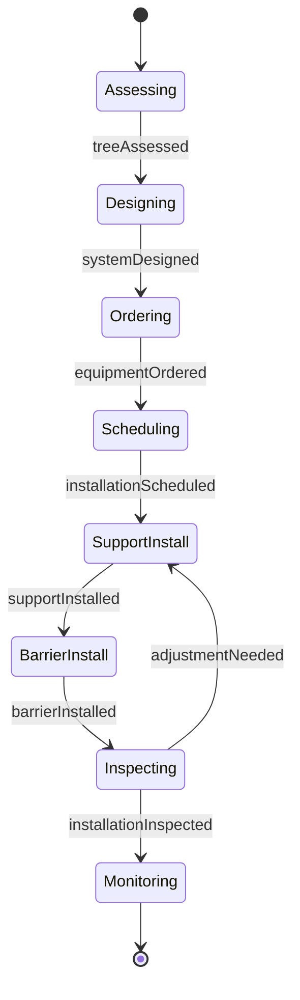
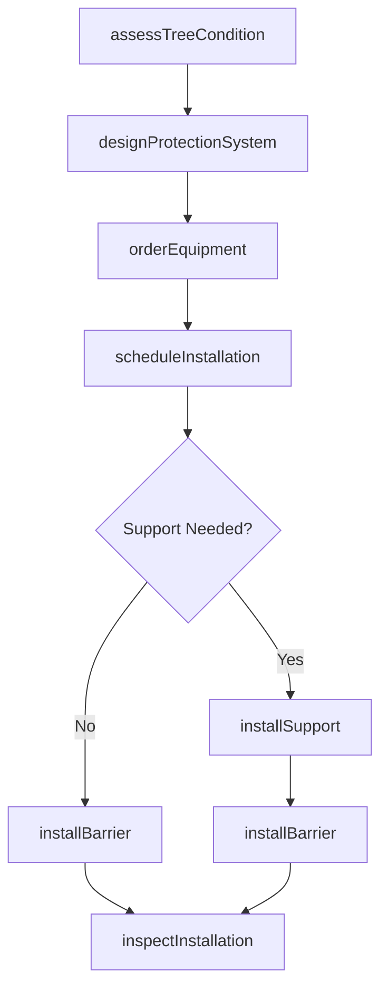
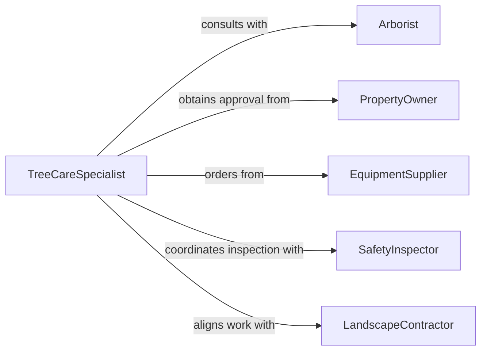

# Install Equipment Protect Support Trees

> Business-as-Code definition for tree protection and support equipment installation. Models the complete process from site assessment through equipment installation and maintenance scheduling for arboriculture and landscape construction.

## Overview

Tree protection and support equipment installation involves assessing tree health and structural needs, selecting appropriate support systems, and installing protective barriers, cabling, bracing, and stabilization equipment. This definition exposes actions for site evaluation, equipment specification, installation coordination, and ongoing monitoring to ensure proper tree care and safety compliance.

## Actors

| Actor | Description |
|-------|-------------|
| Arborist | Assesses tree health and recommends protection strategies |
| PropertyOwner | Authorizes installation and maintains ongoing care |
| EquipmentSupplier | Provides cabling, braces, stakes, and barriers |
| SafetyInspector | Verifies installation meets safety standards |
| LandscapeContractor | Coordinates overall site development |
| UtilityCompany | Manages installations near power lines or infrastructure |

## Roles

| Role | Description |
|------|-------------|
| TreeCareSpecialist | Plans and oversees protection installations |
| InstallationTechnician | Performs physical installation work |
| SafetyCoordinator | Ensures compliance with safety regulations |
| MaintenanceScheduler | Plans inspection and adjustment schedules |

## Entities

| Entity | Description |
|--------|-------------|
| ProtectionPlan | Comprehensive plan for tree support and barriers |
| SupportSystem | Cable, brace, or stake assembly for tree stability |
| ProtectiveBarrier | Fencing or padding to prevent damage |
| InstallationOrder | Work order with specifications and schedule |
| TreeAssessment | Evaluation of tree health and structural needs |
| MaintenanceSchedule | Timeline for inspection and adjustments |

## Actions

| Action | Description |
|--------|-------------|
| assessTreeCondition | Evaluate tree health and structural requirements |
| designProtectionSystem | Specify equipment based on tree needs and site conditions |
| orderEquipment | Request cabling, braces, stakes, or barriers |
| scheduleInstallation | Coordinate installation timing with site conditions |
| installSupport | Mount cables, braces, or stakes to tree structure |
| installBarrier | Erect protective fencing or padding around trees |
| inspectInstallation | Verify equipment is secure and functioning properly |

## Events

| Event | Description |
|-------|-------------|
| treeAssessed | Tree condition evaluation is complete |
| systemDesigned | Protection equipment has been specified |
| equipmentOrdered | Support materials have been requisitioned |
| installationScheduled | Installation date and crew have been assigned |
| supportInstalled | Cabling, bracing, or stakes are in place |
| barrierInstalled | Protective fencing or padding is erected |
| installationInspected | Installation has been verified for safety and effectiveness |

## Searches

| Search | Description |
|--------|-------------|
| findProtectionPlans | List plans by location, tree species, or status |
| getInstallations | Retrieve installations by date, technician, or site |
| getPendingWork | Find orders awaiting scheduling or materials |
| getInspectionResults | Query inspection outcomes and compliance status |
## Entity Relationships




## State Diagram




## Workflow



## Actor Relationships



## Usage

### Calling Actions

```typescript
import { installEquipmentProtectSupportTrees } from '@headlessly/install-equipment-protect-support-trees'

const treeProtection = installEquipmentProtectSupportTrees()

// Assess tree condition before construction
const assessment = await treeProtection.assessTreeCondition({
  location: { lat: 40.7128, lng: -74.0060 },
  treeId: 'oak-heritage-001',
  species: 'Quercus alba',
  dbh: 36,
  condition: 'good',
  threats: ['construction-proximity', 'soil-compaction']
})

// Design protection system based on assessment
const system = await treeProtection.designProtectionSystem({
  assessmentId: assessment.id,
  supportType: 'cabling',
  barrierType: 'construction-fence',
  specifications: {
    cableStrength: '7000-lbs',
    fenceHeight: '6-ft',
    rootZoneRadius: '20-ft'
  }
})

// Schedule and perform installation
await treeProtection.scheduleInstallation({
  systemId: system.id,
  installDate: '2026-03-15',
  crew: 'team-arborist-3',
  duration: 4
})
```

### Event-Driven Automation

```typescript
// Auto-order materials after design approval
treeProtection.systemDesigned(async ({ systemId, specifications }) => {
  await treeProtection.orderEquipment({
    systemId,
    items: specifications.materials,
    supplier: 'arborist-supply-co',
    delivery: 'site-direct'
  })
})

// Schedule inspection after installation
treeProtection.barrierInstalled(async ({ systemId, installDate }) => {
  const inspectionDate = new Date(installDate)
  inspectionDate.setDate(inspectionDate.getDate() + 1)

  await treeProtection.inspectInstallation({
    systemId,
    scheduledDate: inspectionDate.toISOString(),
    inspector: 'certified-arborist'
  })
})
```
