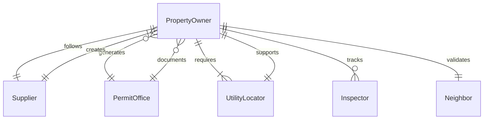
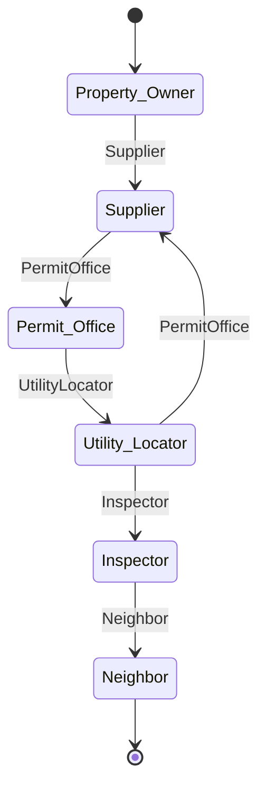
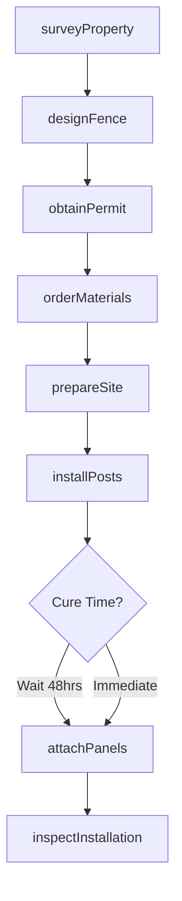
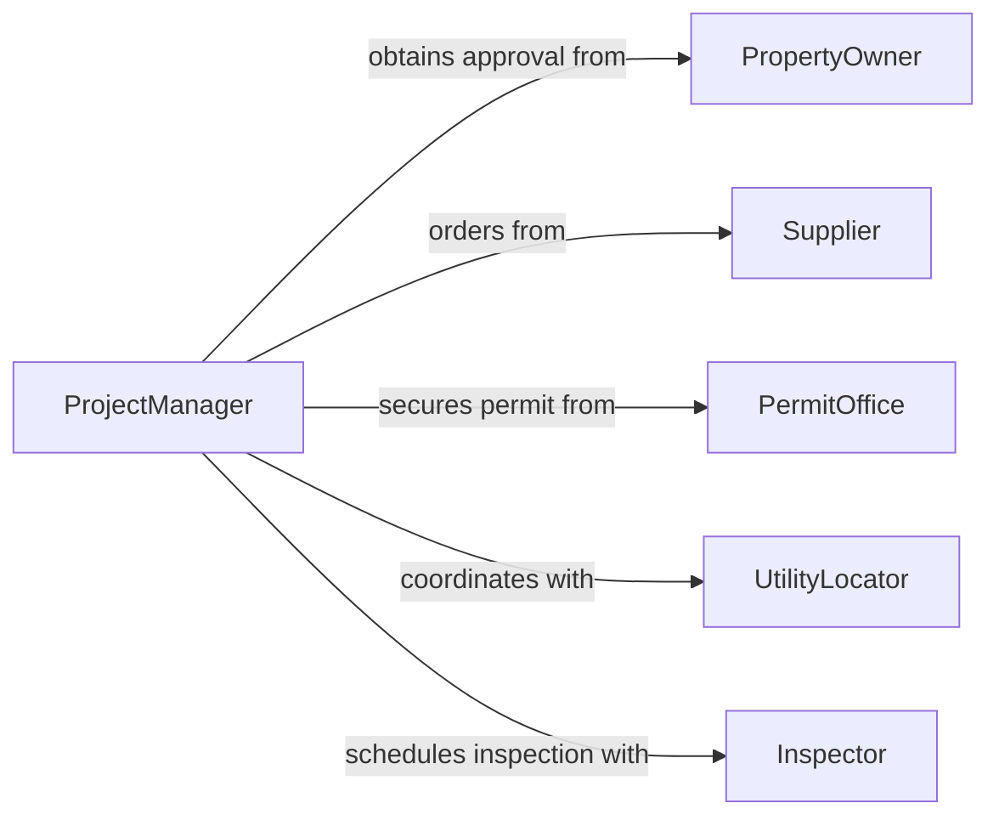

# Install Fencing Barriers

> Business-as-Code definition for fencing and barrier installation. Models the complete process from site survey through installation, inspection, and warranty management for perimeter security, property division, and safety containment.

## Overview

Fencing and barrier installation involves surveying property boundaries, designing appropriate barrier systems, preparing sites, and installing posts, panels, gates, and hardware. This definition exposes actions for each phase of fence installation, from permit acquisition through final inspection, supporting residential, commercial, industrial, and municipal applications.

## Actors

| Actor | Description |
|-------|-------------|
| PropertyOwner | Authorizes installation and maintains ownership |
| Supplier | Provides fencing materials and hardware |
| PermitOffice | Issues installation permits and approves plans |
| UtilityLocator | Identifies underground utilities before digging |
| Inspector | Verifies installation meets building codes |
| Neighbor | May need notification for shared boundary work |

## Roles

| Role | Description |
|------|-------------|
| ProjectManager | Oversees installation from quote to completion |
| Surveyor | Marks property lines and layout |
| Installer | Performs physical installation work |
| QualityAssurance | Inspects work before customer handoff |

## Entities

| Entity | Description |
|--------|-------------|
| FenceProject | Complete installation plan with specifications |
| PropertySurvey | Boundary measurements and utility locations |
| MaterialOrder | Fencing components, posts, and hardware |
| InstallationPermit | Authorization from municipal authorities |
| WorkOrder | Scheduled installation with crew assignment |
| InspectionReport | Quality and compliance verification |

## Actions

| Action | Description |
|--------|-------------|
| surveyProperty | Measure boundaries and identify obstacles |
| designFence | Specify materials, height, and gate locations |
| obtainPermit | Submit plans and secure municipal approval |
| orderMaterials | Request posts, panels, gates, and hardware |
| prepareSite | Clear area and mark post locations |
| installPosts | Set posts in concrete or ground anchors |
| attachPanels | Mount fencing material between posts |

## Events

| Event | Description |
|-------|-------------|
| propertySurveyed | Boundary measurements are complete |
| fenceDesigned | Specifications have been finalized |
| permitObtained | Municipal approval has been granted |
| materialsOrdered | Components have been requisitioned |
| sitePrepared | Area is cleared and marked for installation |
| postsInstalled | Posts are set and cured |
| fenceCompleted | All panels, gates, and hardware are installed |

## Searches

| Search | Description |
|--------|-------------|
| findProjects | List projects by status, location, or customer |
| getMaterials | Retrieve material lists by project or supplier |
| getPermits | Query permit status and approval dates |
| getInstallations | Find installations by date range or crew |
## Entity Relationships




## State Diagram




## Workflow



## Actor Relationships



## Usage

### Calling Actions

```typescript
import { installFencingBarriers } from '@headlessly/install-fencing-barriers'

const fencing = installFencingBarriers()

// Survey property and design fence
const survey = await fencing.surveyProperty({
  address: '123 Oak Street',
  propertyLines: [
    { from: { lat: 40.7128, lng: -74.0060 }, to: { lat: 40.7130, lng: -74.0062 } }
  ],
  utilityCheck: true
})

const design = await fencing.designFence({
  surveyId: survey.id,
  material: 'vinyl',
  height: '6-ft',
  length: 150,
  gates: [{ location: 'rear', width: '4-ft', type: 'double' }],
  color: 'white'
})

// Obtain permit and schedule installation
const permit = await fencing.obtainPermit({
  designId: design.id,
  municipality: 'township-planning',
  applicant: 'homeowner',
  planSet: design.drawings
})

await fencing.prepareSite({
  projectId: design.id,
  clearVegetation: true,
  markPostLocations: true,
  spacing: '8-ft'
})
```

### Event-Driven Automation

```typescript
// Auto-order materials after permit approval
fencing.permitObtained(async ({ projectId, permitNumber }) => {
  const design = await fencing.getDesign(projectId)

  await fencing.orderMaterials({
    projectId,
    items: design.materialList,
    supplier: 'fence-supply-warehouse',
    delivery: design.address
  })
})

// Schedule panel installation after posts cure
fencing.postsInstalled(async ({ projectId, installDate }) => {
  const cureDate = new Date(installDate)
  cureDate.setDate(cureDate.getDate() + 2)

  await scheduleWork({
    projectId,
    task: 'panel-installation',
    startDate: cureDate.toISOString(),
    crew: 'installation-team-2'
  })
})
```
