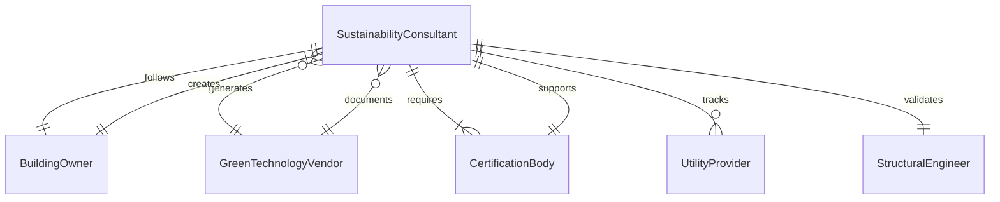
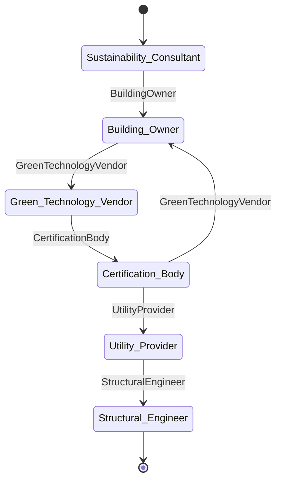
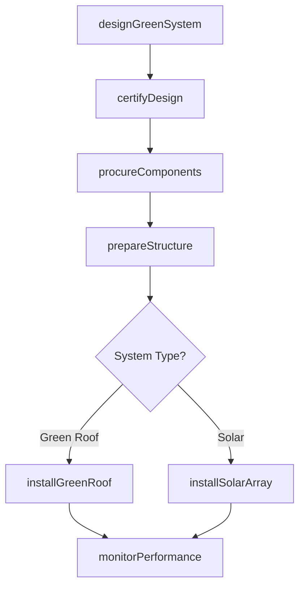
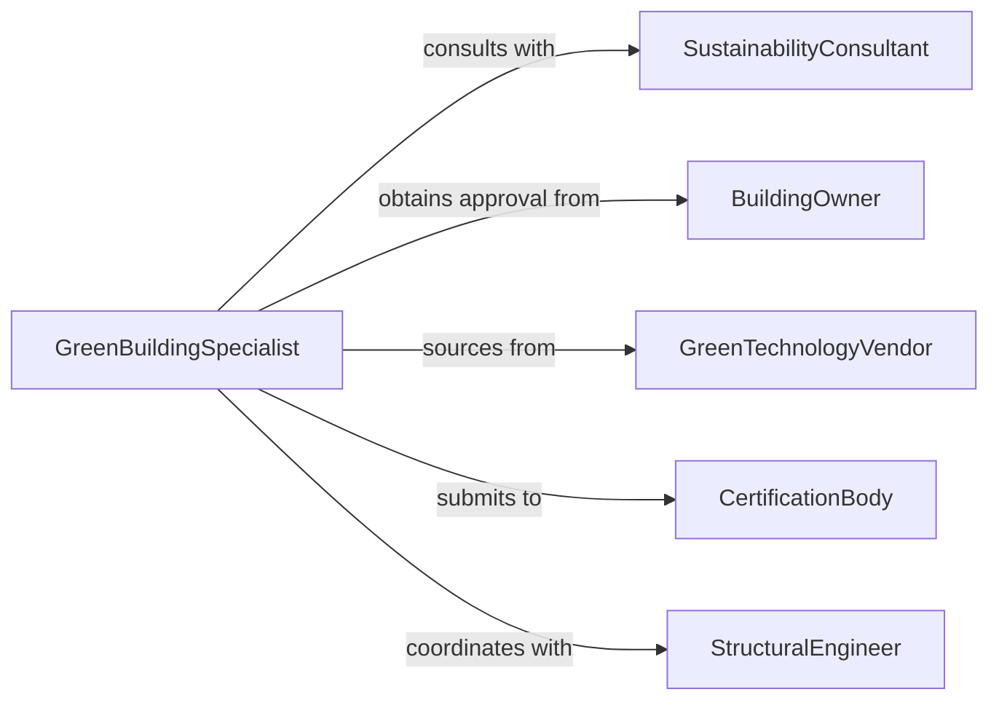

# Install Green Structural Components Equipment

> Business-as-Code definition for sustainable building component and equipment installation. Models the complete process from LEED certification planning through green roof systems, solar integration, rainwater harvesting, and energy-efficient building envelope installation.

## Overview

Green structural component and equipment installation involves integrating sustainable technologies into building construction, including living walls, green roofs, photovoltaic systems, geothermal infrastructure, and high-performance insulation. This definition exposes actions for sustainable design specification, certification coordination, installation management, and performance monitoring to achieve environmental building standards.

## Actors

| Actor | Description |
|-------|-------------|
| SustainabilityConsultant | Advises on green building strategies and certifications |
| BuildingOwner | Authorizes sustainable installations and seeks certifications |
| GreenTechnologyVendor | Supplies eco-friendly materials and systems |
| CertificationBody | Evaluates compliance with LEED or other standards |
| UtilityProvider | Connects renewable energy systems to grid |
| StructuralEngineer | Verifies load capacity for green roof or solar arrays |

## Roles

| Role | Description |
|------|-------------|
| GreenBuildingSpecialist | Plans and coordinates sustainable installations |
| InstallationTechnician | Performs specialized green technology installation |
| CertificationCoordinator | Manages documentation for environmental standards |
| PerformanceAnalyst | Monitors energy and environmental performance |

## Entities

| Entity | Description |
|--------|-------------|
| GreenBuildingPlan | Comprehensive sustainability strategy and specifications |
| ComponentSpecification | Detailed requirements for green materials and systems |
| CertificationApplication | Documentation for LEED or other green standards |
| InstallationSchedule | Timeline coordinating multiple green systems |
| PerformanceMetric | Energy savings, water conservation, or carbon reduction data |
| ComplianceReport | Verification of environmental standard achievement |

## Actions

| Action | Description |
|--------|-------------|
| designGreenSystem | Specify sustainable components based on building goals |
| certifyDesign | Submit plans for LEED or environmental standard review |
| procureComponents | Order green roofs, solar panels, or efficient materials |
| prepareStructure | Reinforce framing for additional loads or penetrations |
| installGreenRoof | Mount vegetation systems, drainage, and irrigation |
| installSolarArray | Connect photovoltaic panels and inverters |
| monitorPerformance | Track energy, water, and environmental impact metrics |

## Events

| Event | Description |
|-------|-------------|
| systemDesigned | Green building specifications are complete |
| designCertified | LEED or environmental standard approval obtained |
| componentsProcured | Sustainable materials have been delivered |
| structurePrepared | Building is ready for green technology installation |
| greenRoofInstalled | Vegetation and drainage systems are operational |
| solarArrayInstalled | Photovoltaic system is grid-connected |
| performanceVerified | Environmental targets have been achieved |

## Searches

| Search | Description |
|--------|-------------|
| findGreenProjects | List projects by certification level or system type |
| getComponents | Retrieve specifications for green materials and equipment |
| getCertifications | Query certification status and approval dates |
| getPerformanceData | Find energy savings and environmental impact metrics |
## Entity Relationships




## State Diagram




## Workflow



## Actor Relationships



## Usage

### Calling Actions

```typescript
import { installGreenStructuralComponentsEquipment } from '@headlessly/install-green-structural-components-equipment'

const greenBuilding = installGreenStructuralComponentsEquipment()

// Design integrated green systems for commercial building
const system = await greenBuilding.designGreenSystem({
  buildingId: 'office-tower-downtown',
  targetCertification: 'LEED-Gold',
  systems: [
    { type: 'green-roof', area: 15000, vegetation: 'sedum-mix' },
    { type: 'solar-array', capacity: '250-kW', orientation: 'south' },
    { type: 'rainwater-harvesting', storage: 10000 }
  ],
  energyTarget: '40-percent-reduction'
})

// Submit for LEED certification
const certification = await greenBuilding.certifyDesign({
  systemId: system.id,
  standard: 'LEED-v4.1',
  category: 'New-Construction',
  documentation: system.drawings
})

// Install green roof after structural prep
await greenBuilding.prepareStructure({
  systemId: system.id,
  reinforcement: 'load-bearing-upgrade',
  waterproofing: 'root-barrier-membrane'
})

await greenBuilding.installGreenRoof({
  systemId: system.id,
  drainage: 'modular-tray',
  growing-medium: '4-inch-depth',
  irrigation: 'drip-system'
})
```

### Event-Driven Automation

```typescript
// Auto-monitor performance after installation
greenBuilding.solarArrayInstalled(async ({ systemId, capacity }) => {
  await greenBuilding.monitorPerformance({
    systemId,
    metrics: ['energy-production', 'carbon-offset', 'grid-feed'],
    interval: 'hourly',
    alertThreshold: 0.85
  })
})

// Schedule certification inspection after all systems complete
greenBuilding.greenRoofInstalled(async ({ systemId }) => {
  const allSystems = await checkSystemsComplete(systemId)

  if (allSystems) {
    await scheduleCertificationInspection({
      systemId,
      inspector: 'leed-ap',
      documentation: 'final-package'
    })
  }
})
```
