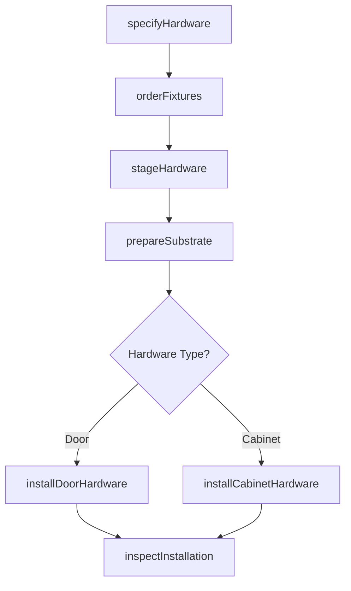
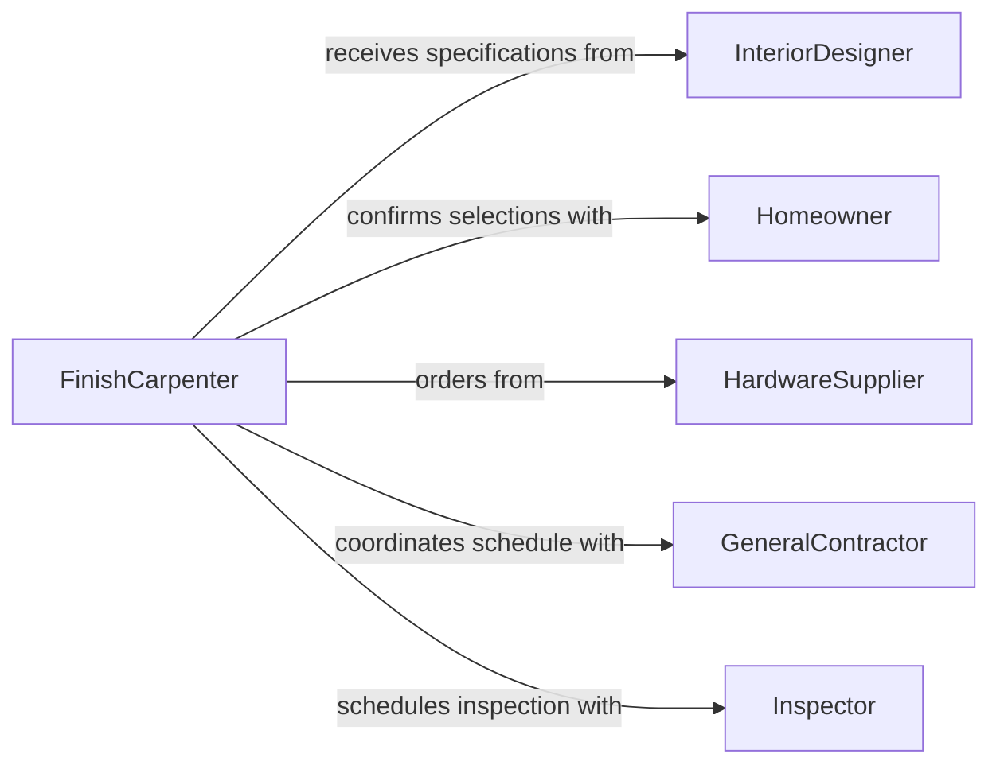

# Install Hardware Interior Fixtures

> Business-as-Code definition for interior hardware and fixture installation. Models the complete process from specification and procurement through installation and finishing for door hardware, cabinetry, shelving, bathroom fixtures, and decorative trim.

## Overview

Interior hardware and fixture installation involves selecting and mounting functional and decorative components including door handles, cabinet pulls, towel bars, shelving systems, closet organizers, and trim elements. This definition exposes actions for hardware specification, inventory management, installation scheduling, and quality verification to support residential and commercial finish carpentry and interior design.

## Actors

| Actor | Description |
|-------|-------------|
| InteriorDesigner | Specifies hardware styles and finishes |
| Homeowner | Approves selections and authorizes installation |
| HardwareSupplier | Provides door, cabinet, and bathroom hardware |
| GeneralContractor | Coordinates installation with construction schedule |
| Inspector | Verifies ADA compliance and safety standards |
| Architect | Provides specifications and fixture locations |

## Roles

| Role | Description |
|------|-------------|
| FinishCarpenter | Installs hardware and coordinates with other trades |
| ProjectCoordinator | Manages procurement and scheduling |
| QualityInspector | Verifies installation quality and functionality |
| WarehouseManager | Tracks inventory and organizes staging |

## Entities

| Entity | Description |
|--------|-------------|
| HardwareSchedule | Complete list of fixtures organized by room and type |
| FixtureSpecification | Detailed product information including finish and dimensions |
| InstallationPackage | Hardware grouped by location with mounting instructions |
| WorkOrder | Scheduled installation with crew assignment |
| PunchList | Items requiring adjustment or replacement |
| ComplianceReport | Verification of ADA and code requirements |

## Actions

| Action | Description |
|--------|-------------|
| specifyHardware | Select products based on design and functional requirements |
| orderFixtures | Request hardware from suppliers with delivery coordination |
| stageHardware | Organize fixtures by location for efficient installation |
| prepareSubstrate | Drill holes and mount backing for fixture attachment |
| installDoorHardware | Mount hinges, handles, locks, and closers |
| installCabinetHardware | Attach pulls, knobs, and functional components |
| inspectInstallation | Verify functionality, alignment, and finish quality |

## Events

| Event | Description |
|-------|-------------|
| hardwareSpecified | Product selections have been finalized |
| fixturesOrdered | Hardware has been requisitioned from suppliers |
| hardwareStaged | Fixtures are organized and ready for installation |
| substratePrepared | Mounting surfaces are ready for hardware |
| doorHardwareInstalled | Hinges, handles, and locks are mounted |
| cabinetHardwareInstalled | Cabinet pulls and functional hardware are attached |
| installationInspected | Quality and compliance verification is complete |

## Searches

| Search | Description |
|--------|-------------|
| findHardwareSchedules | List schedules by project, room, or status |
| getFixtures | Retrieve hardware by type, finish, or supplier |
| getInstallations | Query completed work by date or installer |
| getPunchList | Find items requiring correction or adjustment |

## Workflow



## Actor Relationships



## Usage

### Calling Actions

```typescript
import { installHardwareInteriorFixtures } from '@headlessly/install-hardware-interior-fixtures'

const interiorHardware = installHardwareInteriorFixtures()

// Specify hardware for residential renovation
const schedule = await interiorHardware.specifyHardware({
  projectId: 'renovation-oak-street',
  rooms: [
    {
      name: 'master-bath',
      fixtures: [
        { type: 'towel-bar', finish: 'brushed-nickel', quantity: 3 },
        { type: 'toilet-paper-holder', finish: 'brushed-nickel', quantity: 2 },
        { type: 'robe-hook', finish: 'brushed-nickel', quantity: 2 }
      ]
    },
    {
      name: 'kitchen',
      fixtures: [
        { type: 'cabinet-pull', finish: 'matte-black', quantity: 24 },
        { type: 'cabinet-knob', finish: 'matte-black', quantity: 12 }
      ]
    }
  ]
})

// Order and stage hardware
await interiorHardware.orderFixtures({
  scheduleId: schedule.id,
  supplier: 'builders-hardware-supply',
  delivery: 'contractor-warehouse',
  urgency: 'standard'
})

await interiorHardware.stageHardware({
  scheduleId: schedule.id,
  organization: 'by-room',
  location: 'job-site-staging'
})
```

### Event-Driven Automation

```typescript
// Auto-prepare substrate after hardware arrives
interiorHardware.hardwareStaged(async ({ scheduleId, location }) => {
  const schedule = await interiorHardware.getSchedule(scheduleId)

  await interiorHardware.prepareSubstrate({
    scheduleId,
    tasks: schedule.fixtures.map(f => ({
      type: f.type,
      locations: f.mountingPoints,
      backing: f.requiresBacking
    }))
  })
})

// Create punch list from inspection findings
interiorHardware.installationInspected(async ({ scheduleId, issues }) => {
  if (issues.length > 0) {
    await createPunchList({
      projectId: scheduleId,
      items: issues,
      priority: 'before-closeout',
      assignedTo: 'finish-crew'
    })
  }
})
```
