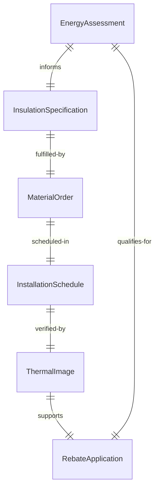
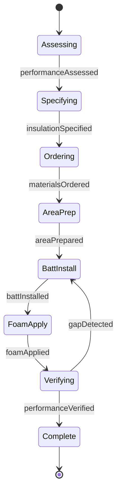
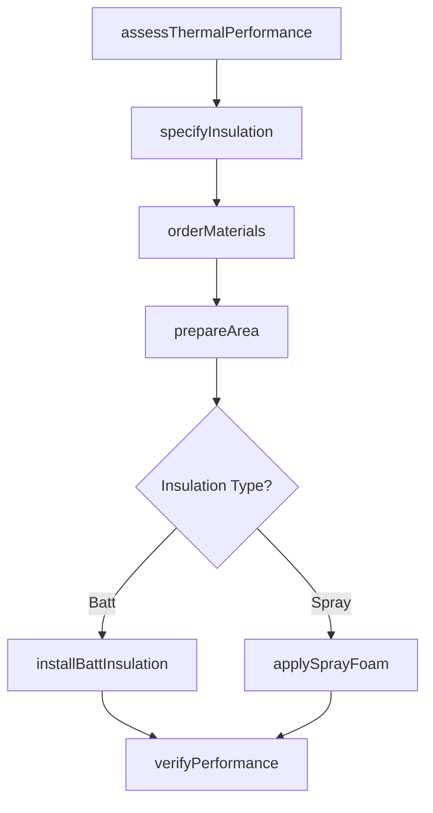
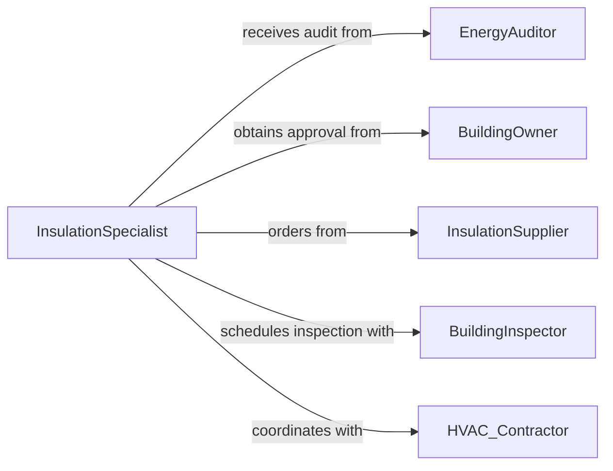

# Install Insulation Equipment Structures

> Business-as-Code definition for thermal and acoustic insulation installation. Models the complete process from energy analysis through material selection, installation, and performance testing for residential, commercial, and industrial applications.

## Overview

Insulation installation involves assessing thermal performance requirements, selecting appropriate insulation materials, preparing cavities and surfaces, and installing fiberglass batts, spray foam, rigid board, or blown-in insulation. This definition exposes actions for energy auditing, R-value specification, installation coordination, and thermal imaging verification to achieve building energy efficiency and acoustic control.

## Actors

| Actor | Description |
|-------|-------------|
| EnergyAuditor | Assesses thermal performance and recommends improvements |
| BuildingOwner | Authorizes installation and seeks energy savings |
| InsulationSupplier | Provides materials including batts, foam, and equipment |
| BuildingInspector | Verifies code compliance and R-value requirements |
| HVAC Contractor | Coordinates insulation with mechanical systems |
| UtilityCompany | Offers rebates for energy efficiency improvements |

## Roles

| Role | Description |
|------|-------------|
| InsulationSpecialist | Plans installation and selects materials |
| InstallationTechnician | Performs physical insulation work |
| QualityInspector | Verifies coverage and thermal performance |
| SafetyCoordinator | Ensures proper ventilation and PPE compliance |

## Entities

| Entity | Description |
|--------|-------------|
| EnergyAssessment | Thermal performance analysis and improvement plan |
| InsulationSpecification | Material types, R-values, and installation methods |
| MaterialOrder | Batts, foam, blown-in, or rigid board insulation |
| InstallationSchedule | Work sequence coordinating with other trades |
| ThermalImage | Infrared scan verifying installation effectiveness |
| RebateApplication | Documentation for utility energy efficiency incentives |

## Actions

| Action | Description |
|--------|-------------|
| assessThermalPerformance | Conduct energy audit and identify improvement areas |
| specifyInsulation | Select materials based on R-value and application |
| orderMaterials | Request insulation products and installation supplies |
| prepareArea | Seal air leaks and clear obstructions in cavities |
| installBattInsulation | Place fiberglass or mineral wool in wall and ceiling cavities |
| applySprayFoam | Spray polyurethane or cellulose insulation |
| verifyPerformance | Conduct thermal imaging to confirm coverage and effectiveness |

## Events

| Event | Description |
|-------|-------------|
| performanceAssessed | Energy audit and thermal analysis is complete |
| insulationSpecified | Material selections and R-values have been determined |
| materialsOrdered | Insulation products have been requisitioned |
| areaPrepared | Installation surfaces are ready for insulation |
| battInstalled | Cavity insulation is in place |
| foamApplied | Spray foam or blown-in insulation is complete |
| performanceVerified | Thermal imaging confirms installation quality |

## Searches

| Search | Description |
|--------|-------------|
| findAssessments | List energy audits by building, date, or findings |
| getSpecifications | Retrieve insulation types and R-values by project |
| getInstallations | Query completed work by installer or date |
| getPerformanceData | Find thermal imaging results and efficiency gains |
## Entity Relationships




## State Diagram




## Workflow



## Actor Relationships



## Usage

### Calling Actions

```typescript
import { installInsulationEquipmentStructures } from '@headlessly/install-insulation-equipment-structures'

const insulation = installInsulationEquipmentStructures()

// Conduct energy audit and specify insulation
const assessment = await insulation.assessThermalPerformance({
  buildingId: 'residential-1950s-ranch',
  areas: ['attic', 'walls', 'basement'],
  currentRValue: { attic: 11, walls: 0, basement: 0 },
  targetRValue: { attic: 49, walls: 21, basement: 19 }
})

const specification = await insulation.specifyInsulation({
  assessmentId: assessment.id,
  materials: [
    { area: 'attic', type: 'blown-fiberglass', targetR: 49, depth: '16-inches' },
    { area: 'walls', type: 'spray-foam-closed-cell', targetR: 21, thickness: '3.5-inches' },
    { area: 'basement', type: 'rigid-foam-board', targetR: 19, thickness: '3-inches' }
  ]
})

// Schedule installation and verify performance
await insulation.orderMaterials({
  specificationId: specification.id,
  supplier: 'insulation-distributors',
  delivery: 'job-site',
  installDate: '2026-04-10'
})

await insulation.applySprayFoam({
  area: 'wall-cavities',
  type: 'closed-cell-polyurethane',
  thickness: '3.5-inches',
  coverage: 1200
})
```

### Event-Driven Automation

```typescript
// Auto-schedule thermal imaging after installation
insulation.foamApplied(async ({ projectId, area }) => {
  const cureTime = new Date()
  cureTime.setHours(cureTime.getHours() + 24)

  await insulation.verifyPerformance({
    projectId,
    area,
    method: 'thermal-imaging',
    scheduledDate: cureTime.toISOString(),
    inspector: 'certified-thermographer'
  })
})

// Submit rebate application after verification
insulation.performanceVerified(async ({ projectId, performanceGain }) => {
  if (performanceGain >= 0.30) {
    await submitRebateApplication({
      projectId,
      utilityProgram: 'energy-efficiency-incentive',
      improvement: performanceGain,
      documentation: 'thermal-images'
    })
  }
})
```
