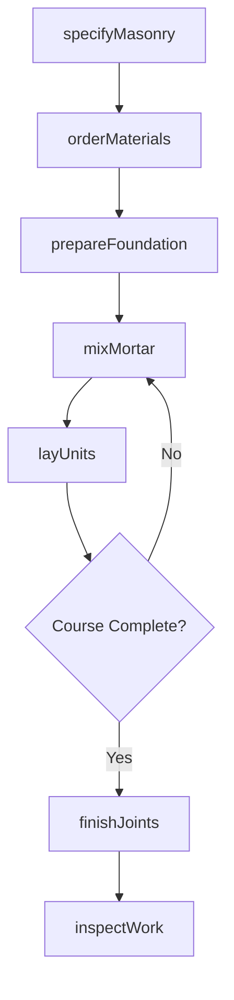
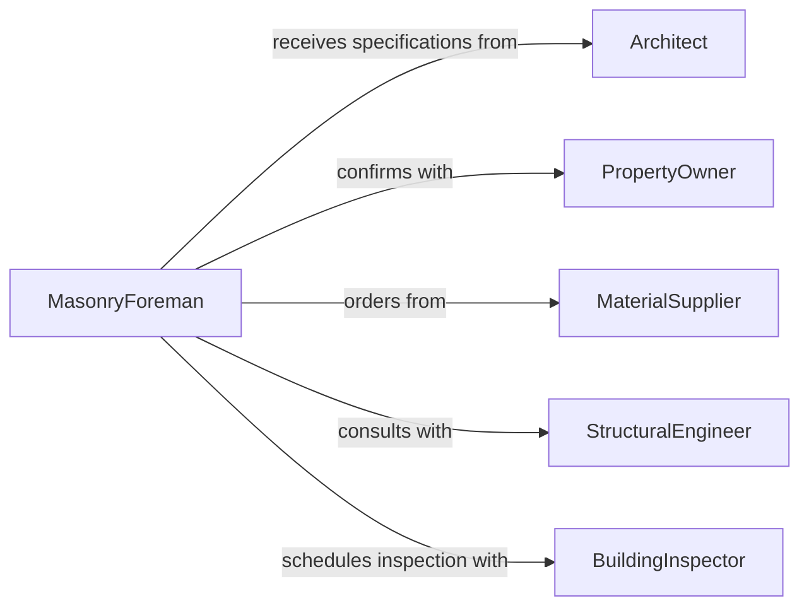

# Install Masonry Materials

> Business-as-Code definition for masonry installation and construction. Models the complete process from material selection through laying brick, block, or stone, including mortar mixing, joint finishing, and structural verification.

## Overview

Masonry installation involves selecting appropriate brick, block, or stone materials, preparing foundations, mixing mortar, laying units in specified patterns, and finishing joints. This definition exposes actions for material specification, foundation preparation, unit installation, and quality inspection to support residential, commercial, and industrial masonry construction.

## Actors

| Actor | Description |
|-------|-------------|
| Architect | Specifies masonry types, patterns, and structural requirements |
| PropertyOwner | Approves selections and authorizes construction |
| MaterialSupplier | Provides brick, block, stone, mortar, and reinforcement |
| StructuralEngineer | Verifies load-bearing capacity and specifications |
| BuildingInspector | Ensures code compliance and workmanship quality |
| GeneralContractor | Coordinates masonry with overall construction schedule |

## Roles

| Role | Description |
|------|-------------|
| MasonryForeman | Oversees crew and ensures quality standards |
| BrickMason | Performs physical laying and finishing work |
| LaborTechnician | Prepares mortar and supplies materials to masons |
| QualityInspector | Verifies alignment, bonding, and joint consistency |

## Entities

| Entity | Description |
|--------|-------------|
| MasonryPlan | Complete specifications including materials and patterns |
| MaterialOrder | Brick, block, stone, mortar, and reinforcement supplies |
| FoundationPrep | Footing or base ready for masonry installation |
| WorkArea | Staged materials and scaffolding for crew access |
| CourseProgress | Tracking of completed rows and vertical alignment |
| InspectionReport | Verification of workmanship and code compliance |

## Actions

| Action | Description |
|--------|-------------|
| specifyMasonry | Select materials, bond patterns, and mortar types |
| orderMaterials | Request brick, block, stone, and mortar supplies |
| prepareFoundation | Verify footing level and apply moisture barrier |
| mixMortar | Prepare cement, sand, and lime mixture to proper consistency |
| layUnits | Position and align brick, block, or stone with mortar |
| finishJoints | Tool mortar joints for appearance and weather resistance |
| inspectWork | Verify plumb, level, and bond quality |

## Events

| Event | Description |
|-------|-------------|
| masonrySpecified | Material and pattern selections are finalized |
| materialsOrdered | Brick, block, stone, and supplies have been requisitioned |
| foundationPrepared | Base surface is ready for masonry installation |
| mortarMixed | Cement mixture is prepared and ready for use |
| unitsLaid | Courses of masonry have been positioned and bonded |
| jointsFinished | Mortar joints are tooled and cleaned |
| workInspected | Quality and compliance verification is complete |

## Searches

| Search | Description |
|--------|-------------|
| findMasonryPlans | List plans by project, material type, or status |
| getMaterials | Retrieve brick, block, or stone specifications |
| getProgress | Query course completion by crew or date |
| getInspections | Find inspection results and compliance status |

## Workflow



## Actor Relationships



## Usage

### Calling Actions

```typescript
import { installMasonryMaterials } from '@headlessly/install-masonry-materials'

const masonry = installMasonryMaterials()

// Specify masonry for commercial building facade
const plan = await masonry.specifyMasonry({
  projectId: 'downtown-office-building',
  areas: [
    {
      location: 'south-facade',
      material: 'clay-brick',
      color: 'heritage-red',
      pattern: 'running-bond',
      mortar: 'type-n',
      reinforcement: 'every-third-course'
    }
  ],
  squareFeet: 4500
})

// Order materials and prepare for installation
await masonry.orderMaterials({
  planId: plan.id,
  brick: { quantity: 18000, supplier: 'regional-brick-supply' },
  mortar: { type: 'type-n', bags: 350 },
  reinforcement: { type: 'truss-wire', linearFeet: 1500 }
})

await masonry.prepareFoundation({
  projectId: plan.id,
  location: 'south-wall',
  verifyLevel: true,
  moistureBarrier: 'peel-and-stick-membrane'
})

// Mix mortar and lay brick courses
await masonry.mixMortar({
  type: 'type-n',
  volume: '6-cubic-feet',
  consistency: 'working'
})

await masonry.layUnits({
  planId: plan.id,
  course: 1,
  startPoint: { x: 0, y: 0 },
  endPoint: { x: 150, y: 0 },
  pattern: 'running-bond'
})
```

### Event-Driven Automation

```typescript
// Auto-mix mortar when crew begins new work area
masonry.foundationPrepared(async ({ projectId, location }) => {
  await masonry.mixMortar({
    projectId,
    type: 'type-n',
    volume: '8-cubic-feet',
    workArea: location
  })
})

// Schedule inspection after wall section completion
masonry.jointsFinished(async ({ projectId, area }) => {
  const cureTime = new Date()
  cureTime.setDate(cureTime.getDate() + 1)

  await masonry.inspectWork({
    projectId,
    area,
    scheduledDate: cureTime.toISOString(),
    inspector: 'building-department',
    checkList: ['plumb', 'level', 'bond-pattern', 'joint-quality']
  })
})
```
