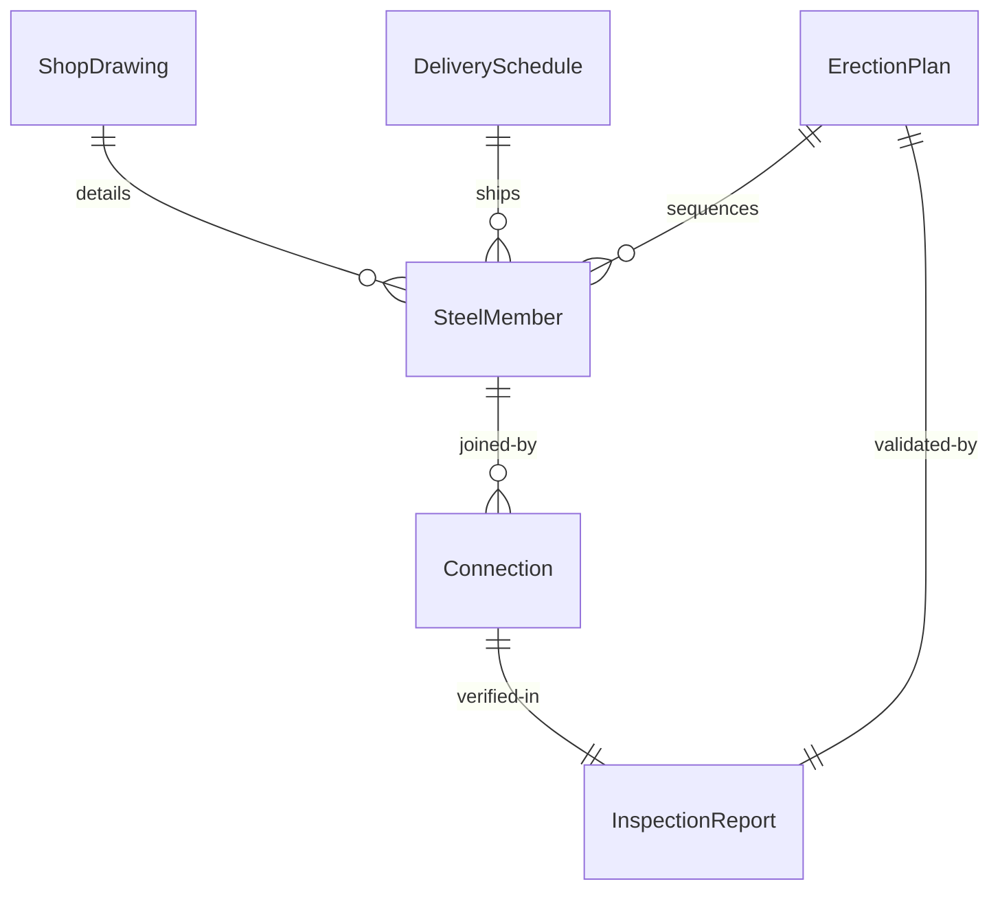
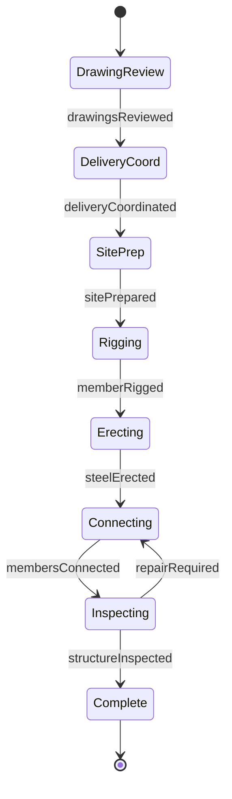
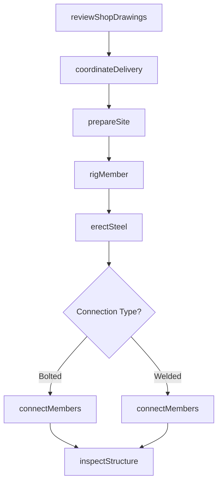
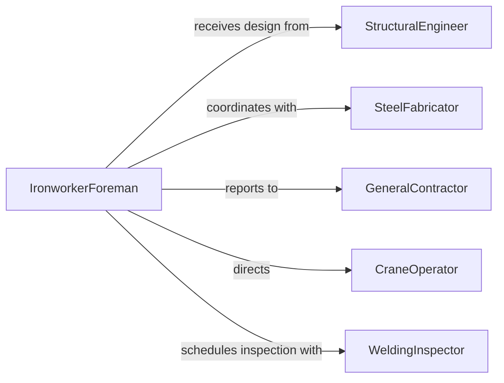

# Install Metal Structural Components

> Business-as-Code definition for structural steel and metal component installation. Models the complete process from shop drawing review through erection, welding, bolting, and inspection for commercial, industrial, and infrastructure construction.

## Overview

Metal structural component installation involves reviewing fabrication drawings, coordinating deliveries, erecting steel beams, columns, joists, and decking, connecting components through welding or bolting, and verifying alignment and load-bearing capacity. This definition exposes actions for structural coordination, rigging, assembly, connection, and quality verification to support safe and compliant steel construction.

## Actors

| Actor | Description |
|-------|-------------|
| StructuralEngineer | Designs and certifies steel structural systems |
| SteelFabricator | Manufactures beams, columns, and custom components |
| GeneralContractor | Coordinates steel erection with overall construction |
| CraneOperator | Lifts and positions heavy steel members |
| WeldingInspector | Certifies welding quality and structural connections |
| BuildingInspector | Verifies code compliance and safety standards |

## Roles

| Role | Description |
|------|-------------|
| IronworkerForeman | Supervises erection crew and ensures safety |
| StructuralIronworker | Performs rigging, positioning, and connecting |
| CertifiedWelder | Executes welded connections per specifications |
| QualityInspector | Verifies alignment, plumb, and connection integrity |

## Entities

| Entity | Description |
|--------|-------------|
| ShopDrawing | Fabrication details with dimensions and connections |
| DeliverySchedule | Steel shipment timing coordinated with erection |
| ErectionPlan | Sequence and crane positioning for assembly |
| SteelMember | Individual beam, column, joist, or brace |
| Connection | Bolted or welded joint between structural elements |
| InspectionReport | Verification of alignment, plumb, and connection quality |

## Actions

| Action | Description |
|--------|-------------|
| reviewShopDrawings | Verify fabrication details match structural design |
| coordinateDelivery | Schedule steel shipments with erection sequence |
| prepareSite | Position cranes and establish safe work zones |
| rigMember | Attach lifting equipment to steel components |
| erectSteel | Lift and position beams, columns, or joists |
| connectMembers | Bolt or weld components per connection specifications |
| inspectStructure | Verify plumb, alignment, and connection integrity |

## Events

| Event | Description |
|-------|-------------|
| drawingsReviewed | Shop drawings have been approved for fabrication |
| deliveryCoordinated | Steel shipment schedule is confirmed |
| sitePrepared | Cranes and work zones are ready for erection |
| memberRigged | Steel component is attached to lifting equipment |
| steelErected | Structural member is positioned and temporarily braced |
| membersConnected | Bolted or welded connections are complete |
| structureInspected | Quality and compliance verification is complete |

## Searches

| Search | Description |
|--------|-------------|
| findErectionPlans | List plans by project, phase, or status |
| getDeliveries | Retrieve steel shipment schedules and tracking |
| getMembers | Query steel components by location or installation status |
| getInspections | Find inspection results and compliance documentation |
## Entity Relationships




## State Diagram




## Workflow



## Actor Relationships



## Usage

### Calling Actions

```typescript
import { installMetalStructuralComponents } from '@headlessly/install-metal-structural-components'

const steel = installMetalStructuralComponents()

// Review shop drawings and plan erection
const drawings = await steel.reviewShopDrawings({
  projectId: 'commercial-office-tower',
  fabricator: 'precision-steel-works',
  sheets: ['S-101', 'S-102', 'S-201'],
  reviewFocus: ['dimensions', 'connection-details', 'material-grades']
})

const delivery = await steel.coordinateDelivery({
  projectId: drawings.projectId,
  shipments: [
    { sequence: 1, members: ['columns-1-5'], date: '2026-05-10' },
    { sequence: 2, members: ['beams-level-2'], date: '2026-05-12' },
    { sequence: 3, members: ['joists-level-2'], date: '2026-05-14' }
  ]
})

// Prepare site and erect steel column
await steel.prepareSite({
  projectId: drawings.projectId,
  cranes: [{ type: 'crawler', capacity: '300-ton', position: { x: 100, y: 150 } }],
  safetyZone: '50-ft-radius'
})

await steel.rigMember({
  memberId: 'column-C3',
  liftingPoints: 2,
  slings: 'choker-hitch',
  weight: 8400
})

await steel.erectSteel({
  memberId: 'column-C3',
  location: { gridLine: 'C-3', elevation: 24 },
  plumbTolerance: '1-in-500',
  temporaryBracing: true
})
```

### Event-Driven Automation

```typescript
// Auto-prepare site when delivery is confirmed
steel.deliveryCoordinated(async ({ projectId, shipmentDate }) => {
  const prepDate = new Date(shipmentDate)
  prepDate.setDate(prepDate.getDate() - 1)

  await steel.prepareSite({
    projectId,
    date: prepDate.toISOString(),
    cranes: 'per-erection-plan',
    inspection: 'pre-lift'
  })
})

// Schedule inspection after connections complete
steel.membersConnected(async ({ projectId, memberIds, connectionType }) => {
  await steel.inspectStructure({
    projectId,
    members: memberIds,
    inspector: connectionType === 'welded' ? 'certified-welding-inspector' : 'structural-inspector',
    checklist: ['alignment', 'plumb', 'connection-integrity']
  })
})
```
