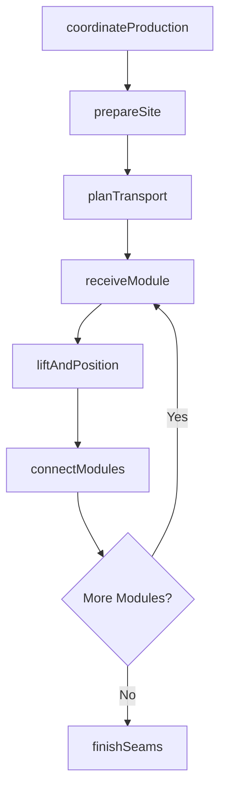
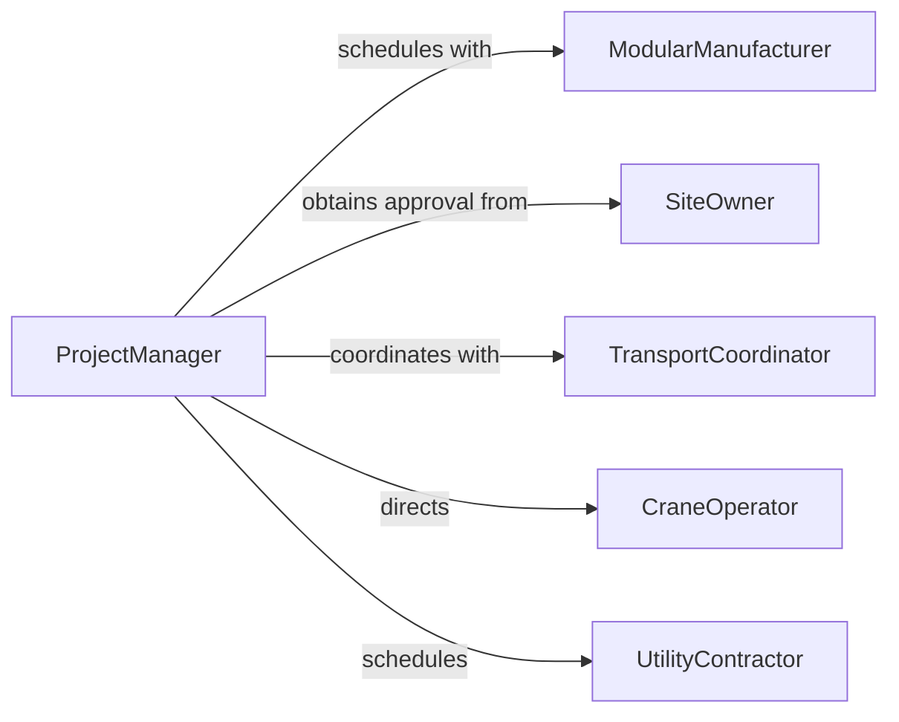

# Install Prefabricated Manufactured Structures

> Business-as-Code definition for modular and prefabricated building component installation. Models the complete process from factory coordination through site preparation, module delivery, crane setting, and connection integration for rapid construction deployment.

## Overview

Prefabricated structure installation involves coordinating factory production, preparing foundations, transporting modules or panels, lifting and positioning components, connecting utilities, and finishing seams and interfaces. This definition exposes actions for modular coordination, site logistics, crane operations, assembly, and system integration to support residential, commercial, and temporary structure construction.

## Actors

| Actor | Description |
|-------|-------------|
| ModularManufacturer | Fabricates building modules or panels in controlled factory |
| SiteOwner | Authorizes installation and provides site access |
| TransportCoordinator | Manages oversize load permits and route planning |
| CraneOperator | Lifts and positions prefabricated components |
| UtilityContractor | Connects plumbing, electrical, and HVAC systems |
| BuildingInspector | Verifies assembly meets building codes |

## Roles

| Role | Description |
|------|-------------|
| ProjectManager | Coordinates factory schedule with site readiness |
| SiteForeman | Supervises module placement and connection work |
| RiggingSpecialist | Plans lifting and ensures safe crane operations |
| ConnectionTechnician | Performs mechanical, electrical, and structural connections |

## Entities

| Entity | Description |
|--------|-------------|
| ProductionSchedule | Timeline for factory completion and delivery |
| ModuleSpecification | Dimensions, weight, and connection requirements |
| SitePreparation | Foundation and utility rough-in readiness |
| TransportPlan | Route, permits, and escort requirements for delivery |
| LiftingPlan | Crane positioning and rigging strategy |
| ConnectionSchedule | Sequence for mechanical, electrical, and structural ties |

## Actions

| Action | Description |
|--------|-------------|
| coordinateProduction | Align factory schedule with site preparation timeline |
| prepareSite | Complete foundations, utility stubs, and crane access |
| planTransport | Secure permits and coordinate oversize load delivery |
| receiveModule | Offload and stage prefabricated components |
| liftAndPosition | Crane-set modules onto foundations or structural supports |
| connectModules | Join structural, mechanical, electrical, and envelope systems |
| finishSeams | Seal and finish joints between prefabricated units |

## Events

| Event | Description |
|-------|-------------|
| productionCoordinated | Factory schedule and site timeline are aligned |
| sitePrepared | Foundations and utilities are ready for module installation |
| transportPlanned | Permits and delivery logistics are confirmed |
| moduleReceived | Prefabricated component has arrived on site |
| modulePositioned | Unit is crane-set and temporarily secured |
| modulesConnected | Structural, mechanical, and utility connections are complete |
| seamsFinished | Joints are sealed and construction is weather-tight |

## Searches

| Search | Description |
|--------|-------------|
| findProjects | List installations by status, location, or manufacturer |
| getModules | Retrieve specifications by unit number or delivery date |
| getTransport | Query delivery schedules and permit status |
| getConnections | Find connection work by trade or completion status |

## Workflow



## Actor Relationships



## Usage

### Calling Actions

```typescript
import { installPrefabricatedManufacturedStructures } from '@headlessly/install-prefabricated-manufactured-structures'

const modular = installPrefabricatedManufacturedStructures()

// Coordinate production and site readiness
const production = await modular.coordinateProduction({
  projectId: 'multi-family-housing-phase-2',
  manufacturer: 'precision-modular-builders',
  modules: [
    { unitId: 'building-a-unit-1', size: '14x60', deliveryWeek: 18 },
    { unitId: 'building-a-unit-2', size: '14x60', deliveryWeek: 18 },
    { unitId: 'building-a-unit-3', size: '14x60', deliveryWeek: 19 }
  ],
  siteReadyDate: '2026-04-25'
})

await modular.prepareSite({
  projectId: production.projectId,
  foundations: 'pier-and-beam',
  utilities: ['water-stub', 'sewer-stub', 'electrical-service', 'gas-stub'],
  craneAccess: 'leveled-gravel-pad'
})

// Plan transport and receive modules
const transport = await modular.planTransport({
  moduleId: 'building-a-unit-1',
  origin: 'factory-location',
  destination: 'site-coordinates',
  permits: ['oversize-load', 'route-approval'],
  escort: 'required'
})

await modular.receiveModule({
  moduleId: 'building-a-unit-1',
  arrivalDate: '2026-05-01T08:00:00Z',
  inspection: ['damage-check', 'dimension-verification'],
  staging: 'adjacent-to-foundation'
})
```

### Event-Driven Automation

```typescript
// Auto-plan transport when factory confirms completion
modular.productionCoordinated(async ({ projectId, modules }) => {
  for (const module of modules) {
    if (module.status === 'factory-complete') {
      await modular.planTransport({
        moduleId: module.id,
        deliveryDate: module.scheduledDelivery,
        routeType: 'oversize-permitted'
      })
    }
  }
})

// Schedule connections immediately after positioning
modular.modulePositioned(async ({ moduleId, location }) => {
  await modular.connectModules({
    moduleId,
    connections: [
      { type: 'structural', task: 'anchor-bolts' },
      { type: 'plumbing', task: 'connect-supply-drain' },
      { type: 'electrical', task: 'connect-service-panel' },
      { type: 'hvac', task: 'connect-ductwork' }
    ],
    priority: 'critical-path'
  })
})
```
