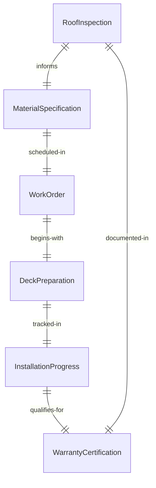
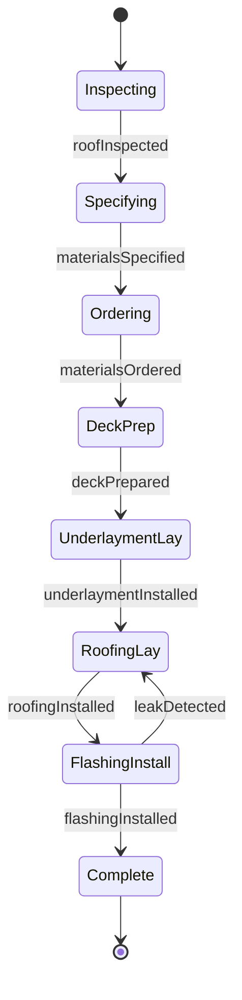
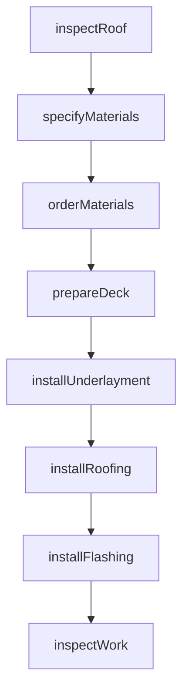
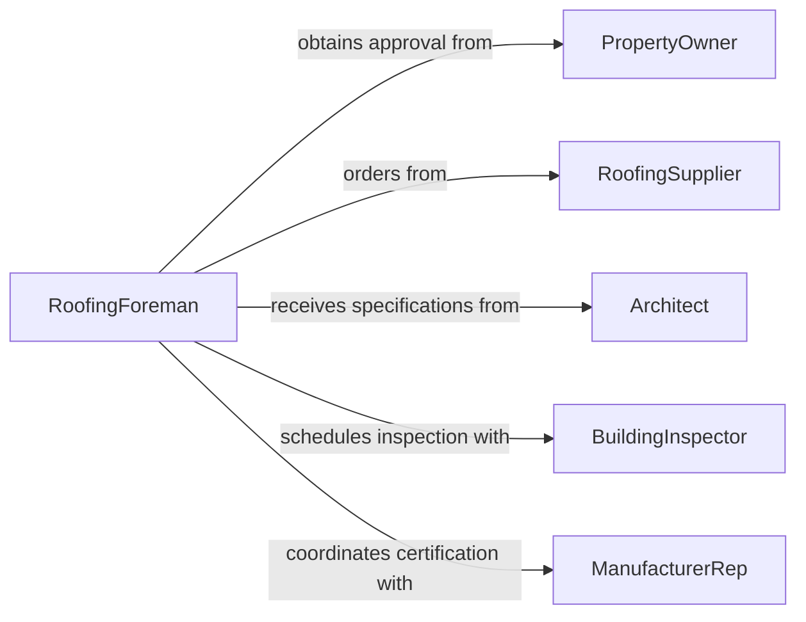

# Install Roofing Materials

> Business-as-Code definition for roofing system installation. Models the complete process from inspection and specification through deck preparation, underlayment, material installation, flashing, and warranty activation for residential and commercial applications.

## Overview

Roofing material installation involves assessing existing conditions, specifying appropriate systems, preparing roof decks, installing underlayment and ice barriers, laying shingles or membrane materials, installing flashing and ventilation, and ensuring proper sealing and drainage. This definition exposes actions for roof evaluation, material specification, installation coordination, and quality verification to deliver weather-tight, code-compliant roofing systems.

## Actors

| Actor | Description |
|-------|-------------|
| PropertyOwner | Authorizes roofing work and maintains warranty |
| RoofingSupplier | Provides shingles, underlayment, flashing, and accessories |
| Architect | Specifies roofing systems for new construction |
| BuildingInspector | Verifies installation meets building codes |
| ManufacturerRep | Inspects work for warranty certification |
| InsuranceAdjuster | Assesses damage and approves replacement scope |

## Roles

| Role | Description |
|------|-------------|
| RoofingForeman | Supervises crew and ensures installation quality |
| RoofingMechanic | Performs physical installation work |
| SafetyCoordinator | Ensures fall protection and work zone safety |
| QualityInspector | Verifies material application and sealing |

## Entities

| Entity | Description |
|--------|-------------|
| RoofInspection | Assessment of condition and replacement needs |
| MaterialSpecification | Shingle type, color, underlayment, and accessories |
| WorkOrder | Scheduled installation with crew and materials |
| DeckPreparation | Repairs, cleaning, and priming of substrate |
| InstallationProgress | Tracking of completed areas and quality checkpoints |
| WarrantyCertification | Manufacturer approval and coverage documentation |

## Actions

| Action | Description |
|--------|-------------|
| inspectRoof | Assess condition and document replacement needs |
| specifyMaterials | Select shingles, underlayment, flashing based on requirements |
| orderMaterials | Request roofing products and delivery to site |
| prepareDeck | Repair substrate, install drip edge, and clean surface |
| installUnderlayment | Apply felt or synthetic barrier and ice shield |
| installRoofing | Lay shingles, tiles, or membrane per specifications |
| installFlashing | Seal valleys, penetrations, and transitions |

## Events

| Event | Description |
|-------|-------------|
| roofInspected | Condition assessment and scope determination is complete |
| materialsSpecified | Product selections have been finalized |
| materialsOrdered | Roofing supplies have been requisitioned |
| deckPrepared | Substrate is repaired and ready for roofing |
| underlaymentInstalled | Moisture barrier and ice protection are in place |
| roofingInstalled | Primary roofing material is applied |
| flashingInstalled | All penetrations and transitions are sealed |

## Searches

| Search | Description |
|--------|-------------|
| findInspections | List assessments by property, date, or findings |
| getMaterials | Retrieve specifications by project or product type |
| getWorkOrders | Query scheduled installations by crew or date |
| getWarranties | Find warranty certifications and coverage terms |
## Entity Relationships




## State Diagram




## Workflow



## Actor Relationships



## Usage

### Calling Actions

```typescript
import { installRoofingMaterials } from '@headlessly/install-roofing-materials'

const roofing = installRoofingMaterials()

// Inspect existing roof and specify replacement
const inspection = await roofing.inspectRoof({
  propertyId: 'residential-123-maple-st',
  buildingType: 'single-family',
  roofAge: 22,
  findings: ['shingle-curling', 'missing-tabs', 'flashing-deterioration'],
  recommendation: 'full-replacement'
})

const specification = await roofing.specifyMaterials({
  inspectionId: inspection.id,
  system: {
    shingles: { type: 'architectural', brand: 'certainteed-landmark', color: 'weathered-wood' },
    underlayment: { type: 'synthetic', brand: 'titanium-udl' },
    iceBarrier: { coverage: 'eaves-and-valleys' },
    ventilation: { type: 'ridge-vent', linearFeet: 65 }
  },
  warranty: '50-year-limited'
})

// Order materials and prepare for installation
await roofing.orderMaterials({
  specificationId: specification.id,
  supplier: 'abc-roofing-supply',
  delivery: 'ground-level-drop',
  installDate: '2026-05-15'
})

await roofing.prepareDeck({
  propertyId: inspection.propertyId,
  tasks: ['remove-old-shingles', 'inspect-decking', 'replace-damaged-boards', 'install-drip-edge']
})
```

### Event-Driven Automation

```typescript
// Auto-schedule deck prep when materials arrive
roofing.materialsOrdered(async ({ specificationId, deliveryDate }) => {
  const prepDate = new Date(deliveryDate)
  prepDate.setDate(prepDate.getDate() - 1)

  await roofing.prepareDeck({
    specificationId,
    scheduledDate: prepDate.toISOString(),
    crew: 'tear-off-team'
  })
})

// Request manufacturer inspection after completion
roofing.flashingInstalled(async ({ specificationId, completionDate }) => {
  await scheduleWarrantyInspection({
    specificationId,
    inspector: 'manufacturer-certified',
    purpose: 'warranty-activation',
    requestDate: completionDate
  })
})
```
