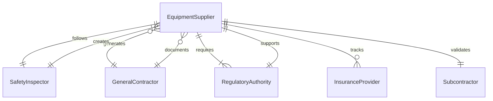
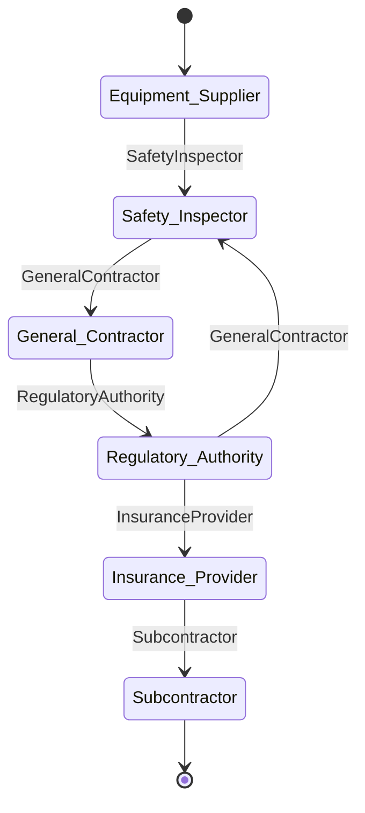
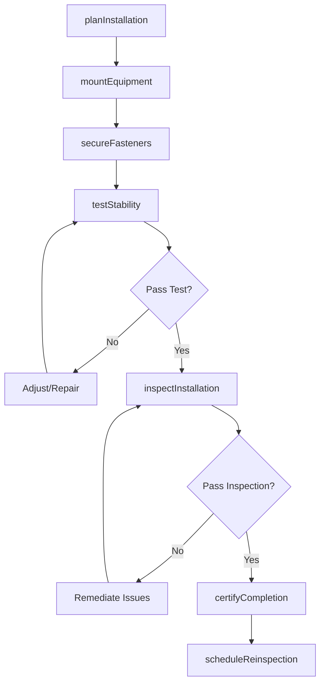
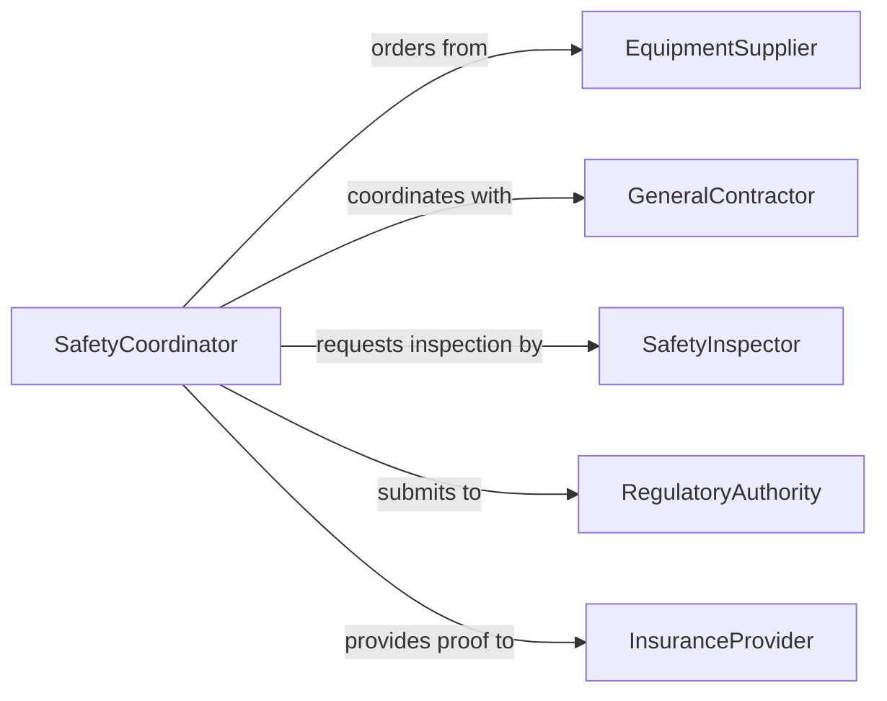

# Install Safety Support Equipment

> Business-as-Code definition for installing safety and support equipment in construction and industrial environments. Models the complete installation lifecycle from planning through inspection and certification.

## Overview

Installing safety or support equipment involves mounting, securing, and testing protective systems such as guardrails, scaffolding, harnesses, fall protection, and structural bracing. This definition exposes actions for installation planning, execution, and verification, with events for compliance tracking and automated safety audits.

## Actors

| Actor | Description |
|-------|-------------|
| EquipmentSupplier | Provides safety equipment and installation hardware |
| SafetyInspector | Conducts compliance inspections and certifications |
| GeneralContractor | Coordinates installation scheduling and site access |
| RegulatoryAuthority | Enforces building codes and safety regulations |
| InsuranceProvider | Assesses risk and validates safety compliance |
| Subcontractor | Performs specialized installation work |

## Roles

| Role | Description |
|------|-------------|
| SafetyCoordinator | Oversees safety equipment installation program |
| InstallationTechnician | Executes physical installation work |
| QualityInspector | Verifies installation meets specifications |
| ComplianceOfficer | Ensures adherence to safety regulations |

## Entities

| Entity | Description |
|--------|-------------|
| SafetyEquipment | Physical protective device or system |
| InstallationPlan | Detailed procedure for equipment placement |
| MountingHardware | Anchors, bolts, and fasteners for installation |
| InspectionReport | Documentation of compliance verification |
| Certification | Official approval of installation quality |
| WorkOrder | Scheduled installation task assignment |

## Actions

| Action | Description |
|--------|-------------|
| planInstallation | Create installation schedule and resource plan |
| mountEquipment | Physically attach safety equipment to structure |
| secureFasteners | Tighten and verify all mounting hardware |
| testStability | Perform load tests on installed equipment |
| inspectInstallation | Verify compliance with safety standards |
| certifyCompletion | Issue certification for completed installation |
| scheduleReinspection | Plan periodic safety verification |

## Events

| Event | Description |
|-------|-------------|
| installationPlanned | Installation schedule has been created |
| equipmentMounted | Safety equipment attached to structure |
| fastenersSecured | All mounting hardware properly tightened |
| stabilityTested | Load testing completed successfully |
| installationInspected | Compliance inspection performed |
| completionCertified | Installation officially certified |
| reinspectionScheduled | Future inspection date set |

## Searches

| Search | Description |
|--------|-------------|
| findInstallations | List installations by location, type, or status |
| getInspections | Retrieve inspection history for equipment |
| getCertifications | Find valid certifications by date range |
| getReinspections | Get upcoming reinspection schedule |
## Entity Relationships




## State Diagram




## Workflow



## Actor Relationships



## Usage

### Calling Actions

```typescript
import { installSafetySupportEquipment } from '@headlessly/install-safety-support-equipment'

const safety = installSafetySupportEquipment()

// Plan guardrail installation for rooftop work area
const plan = await safety.planInstallation({
  location: 'Building A - Rooftop',
  equipmentType: 'Perimeter Guardrail System',
  installDate: '2026-02-15',
  technicians: ['tech-101', 'tech-102']
})

// Mount equipment and secure fasteners
await safety.mountEquipment({
  planId: plan.id,
  anchorPoints: ['A1', 'A2', 'A3', 'A4'],
  mountingMethod: 'Concrete Anchor Bolts'
})

await safety.secureFasteners({
  planId: plan.id,
  torqueSpecification: '50 ft-lbs',
  verificationMethod: 'Torque Wrench'
})

// Test and certify installation
const testResult = await safety.testStability({
  planId: plan.id,
  loadTest: { force: 200, unit: 'lbs', direction: 'outward' }
})

const inspection = await safety.inspectInstallation({
  planId: plan.id,
  inspector: 'inspector-001',
  standard: 'OSHA 1926.502'
})

await safety.certifyCompletion({
  planId: plan.id,
  inspectionId: inspection.id,
  validUntil: '2027-02-15'
})
```

### Event-Driven Automation

```typescript
// Alert on failed stability tests
safety.stabilityTested(async ({ planId, testResult }) => {
  if (!testResult.passed) {
    await notify({
      to: 'safety-team',
      priority: 'high',
      message: `Stability test failed for installation ${planId}`
    })
  }
})

// Schedule reinspection before certification expires
safety.completionCertified(async ({ planId, validUntil }) => {
  const reinspectionDate = new Date(validUntil)
  reinspectionDate.setDate(reinspectionDate.getDate() - 30)

  await safety.scheduleReinspection({
    planId,
    inspectionDate: reinspectionDate.toISOString()
  })
})
```
