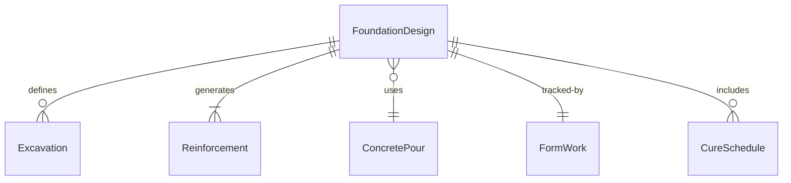
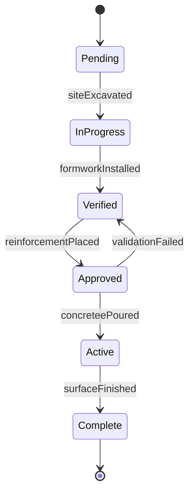
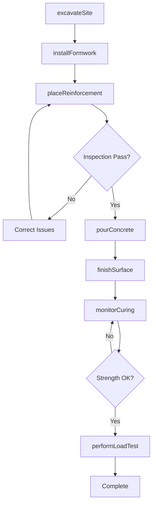
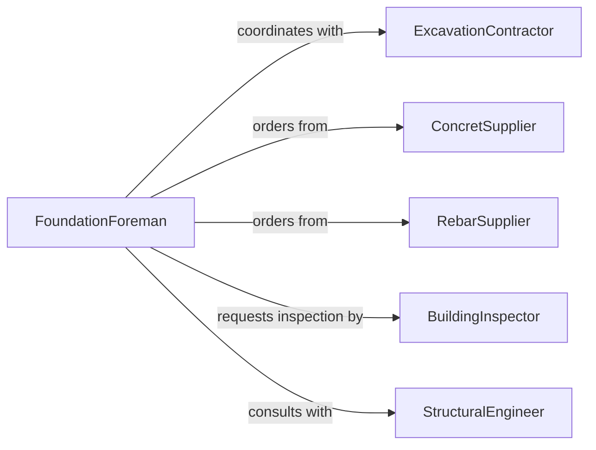

# Install Structural Foundations

> Business-as-Code definition for installing structural foundations in construction projects. Models the complete foundation installation process from excavation through curing and load testing.

## Overview

Installing structural foundations involves preparing sites, pouring concrete, placing reinforcement, and ensuring proper curing for building footings, slabs, piers, and grade beams. This definition exposes actions for each construction phase, events for quality tracking, and searches for project status monitoring.

## Actors

| Actor | Description |
|-------|-------------|
| ConcretSupplier | Provides ready-mix concrete and materials |
| SoilEngineer | Conducts soil testing and load bearing analysis |
| BuildingInspector | Verifies compliance with building codes |
| RebarSupplier | Provides steel reinforcement materials |
| ExcavationContractor | Prepares site and performs earthwork |
| StructuralEngineer | Designs foundation specifications |

## Roles

| Role | Description |
|------|-------------|
| FoundationForeman | Supervises foundation installation crew |
| ConcreteFinisher | Places and finishes concrete work |
| RebarInstaller | Positions and ties steel reinforcement |
| QualityInspector | Verifies installation meets specifications |

## Entities

| Entity | Description |
|--------|-------------|
| FoundationDesign | Engineering specifications for foundation |
| Excavation | Prepared ground area for foundation placement |
| Reinforcement | Steel rebar and mesh reinforcement system |
| ConcretePour | Scheduled concrete placement operation |
| FormWork | Temporary molds for concrete placement |
| CureSchedule | Timeline for concrete curing and strength gain |

## Actions

| Action | Description |
|--------|-------------|
| excavateSite | Prepare ground to required depth and dimensions |
| installFormwork | Place temporary molds for concrete containment |
| placeReinforcement | Position and secure steel rebar and mesh |
| pourConcrete | Place concrete mix into prepared forms |
| finishSurface | Level and smooth concrete surface |
| monitorCuring | Track concrete strength development over time |
| performLoadTest | Verify foundation meets load bearing requirements |

## Events

| Event | Description |
|-------|-------------|
| siteExcavated | Ground preparation completed to specification |
| formworkInstalled | Forms ready for reinforcement placement |
| reinforcementPlaced | Steel reinforcement positioned and secured |
| concreteePoured | Concrete placement completed |
| surfaceFinished | Concrete finishing work completed |
| curingMonitored | Strength test results recorded |
| loadTestPassed | Foundation certified for structural load |

## Searches

| Search | Description |
|--------|-------------|
| findFoundations | List foundations by project, type, or status |
| getCureTimes | Retrieve curing schedules and strength tests |
| getInspections | Find inspection records by date or inspector |
| getLoadTests | Get load test results and certifications |

## Entity Relationships



## State Diagram



## Workflow



## Actor Relationships



## Usage

### Calling Actions

```typescript
import { installStructuralFoundations } from '@headlessly/install-structural-foundations'

const foundation = installStructuralFoundations()

// Excavate site for foundation placement
const excavation = await foundation.excavateSite({
  projectId: 'proj-2026-001',
  depth: 48,
  dimensions: { length: 40, width: 30, unit: 'feet' },
  soilType: 'clay'
})

// Install formwork and place reinforcement
await foundation.installFormwork({
  excavationId: excavation.id,
  formType: 'steel-frame',
  dimensions: { height: 12, unit: 'inches' }
})

await foundation.placeReinforcement({
  excavationId: excavation.id,
  rebarSize: '#5',
  spacing: 12,
  mesh: 'WWF 6x6 W1.4xW1.4'
})

// Pour and finish concrete
const pour = await foundation.pourConcrete({
  excavationId: excavation.id,
  mixDesign: '3000 PSI',
  volume: 35,
  volumeUnit: 'cubic yards',
  slump: 4
})

await foundation.finishSurface({
  pourId: pour.id,
  finishType: 'trowel-smooth',
  grade: 'level'
})
```

### Event-Driven Automation

```typescript
// Monitor curing and schedule load tests
foundation.surfaceFinished(async ({ pourId, projectId }) => {
  await foundation.monitorCuring({
    pourId,
    testSchedule: [
      { day: 3, targetStrength: 40 },
      { day: 7, targetStrength: 70 },
      { day: 28, targetStrength: 100 }
    ]
  })
})

// Alert on curing strength issues
foundation.curingMonitored(async ({ pourId, testResult }) => {
  if (testResult.strengthPercent < testResult.targetPercent - 10) {
    await notify({
      to: 'engineering-team',
      priority: 'high',
      message: `Foundation ${pourId} strength below target: ${testResult.strengthPercent}%`
    })
  }
})
```
